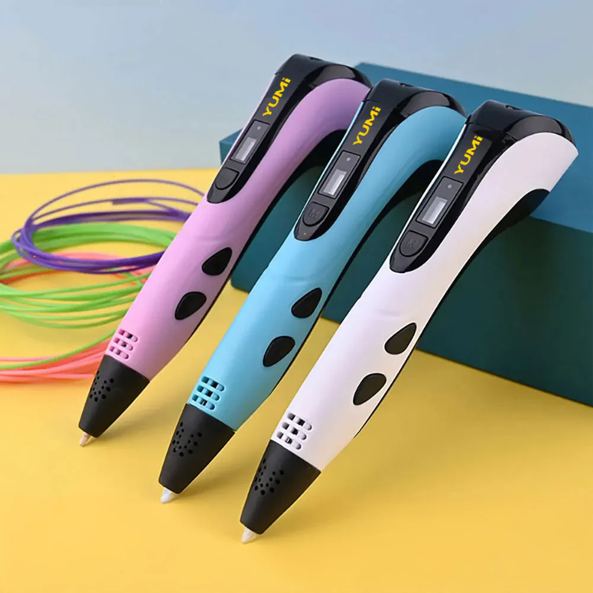
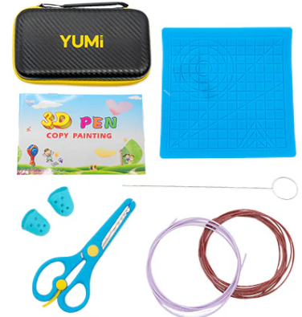
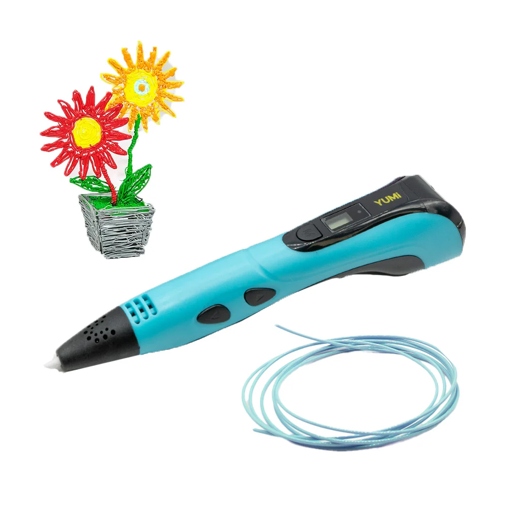

# YUMI 3D PEN

##  1. Overview

The [YUMI 3D Pen](https://wanhao-europe.com/en/products/yumi-stylo-3d-3d-pen-enfant-children?variant=49236914995540) is the ultimate tool for creators of all ages, from curious children to DIY enthusiasts and artists. With its ergonomic design and advanced features, the YUMI 3D Pen provides an easy and enjoyable 3D drawing experience for beginners and experts alike. 

Available in Blue, White, and Pink, the YUMI 3D Pen suits all personalities and tastes.

## 2. Key Features

- **Ergonomic and Lightweight Design (60g)**: The YUMI 3D Pen is designed for comfort, even during extended use. Its lightweight construction makes it accessible for everyone, from small children's hands to adult hands. Suitable for both right-handed and left-handed users.

- **Modern Charging Port:** Equipped with a USB-C 5V port for quick and easy connection.

- **Assisted Filament Insertion:** With a motorized loading system and three adjustable speeds makes filament insertion effortless. 

- **Compatibility:** Supports 1.75 mm PLA and ABS filaments, providing great flexibility for your creations.

- **Heating Temperature:** Heats between 185°C and 210°C with a 0.7 mm ceramic nozzle suitable for all uses.

- **LED Temperature Indicator:** Red LED for heating and blue LED when the desired temperature is reached.

- **Adjustable Extrusion Speed:** Three speeds to accommodate both beginners and experienced users.

## 3. YUMI 3D Pen pack includes:

- **YUMI 3D Pen**  
- **Instruction manual** 
- **Child-safe scissors**  
- **Filament sample pack**  
- **USB-B to USB-C cable**  
- **Silicone mat for children**  
- **Silicone finger protectors** 
- **Copy painting book with 14 activities** 
- **Nozzle cleaner**   
- **YUMI black and yellow travel bag**  

## 4. Example of First Use

**Step 1: Preparation**

- **Connect**: Plug the YUMI 3D Pen into a power source via USB-C or use an external battery for total mobility.
- **Choose the Filament**: Select a PLA or ABS filament and insert it into the pen. The motorized system takes care of the rest.

**Step 2: Temperature Adjustment**

- **Select**: Adjust the temperature based on your chosen filament. PLA usually requires a setting of 190°C. Once the blue LED lights up, you're ready to go!

**Step 3: Creation**

- **Trace on the Silicone Mat**: For a first project, start by creating a simple keychain. Follow a template from the activity book or let your imagination run wild.
- **Adjust the Speed**: Start slowly to master the extrusion, then increase the speed for more complex details.

**Step 4: Finishing**

- **Cool and Finalize**: Once your creation is complete, let it cool on the mat. Use the scissors to adjust any details, and voilà! Your first 3D object is ready.

## Specifications

| **Feature**                  | **Description**                     |
|------------------------------|-------------------------------------|
| **Brand**                    | YUMI                                |
| **Available Colors**         | Blue, White, Pink                   |
| **Weight**                   | 60g                                 |
| **Charging Port**            | USB-C 5V                            |
| **Filament Insertion**       | Assisted by motor with 3 adjustable speeds |
| **Filament Compatibility**   | PLA, ABS (1.75 mm)                  |
| **Nozzle**                   | 0.7 mm ceramic                      |
| **Heating Temperature**      | 185°C - 210°C                       |
| **LED Indicator**            | Red (heating), Blue (temperature reached) |
| **Temperature Display**      | Real-time display                   |
| **Extrusion Speed**          | 3 adjustable speeds                 |
| **Usage**                    | Ambidextrous                        |

## Where to Buy the YUMI 3D Pen
- **[Official Store - Wanhao Europe](https://wanhao-europe.com/)**  
  Buy directly from the official Wanhao Europe.