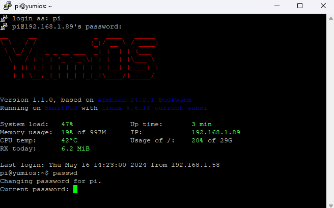

# 1.3 How to change password on SMARTPAD (Yumios)

To change your password on smartpad using SSH (Secure Shell), you can follow these steps. This tutorial assumes you have already set up SSH access to your Smartpad and can connect to it.

### What You Need:

1. **SSH Client**: If you're on Windows, you can use [PuTTY](https://www.chiark.greenend.org.uk/~sgtatham/putty/latest.html) or Windows Subsystem for Linux. On macOS or Linux, you can use the terminal.

2. **Smartpad's IP address**: You need to know the IP address of your Smartpad to connect to it.

3. **Username: `pi` and Password: `yumi`**

### 1 Connect to Smartpad via SSH

- **Windows**: [PuTTY](https://github.com/Yumi-Lab/yumi-wiki/blob/main/docs/SmartPI/SmartPI_Connect_Ssh.md#131-windows-with-putty) - [Terminal](https://github.com/Yumi-Lab/yumi-wiki/blob/main/docs/SmartPI/SmartPI_Connect_Ssh.md#132-windows-terminal-command-prompt-or-powershell)

- **Linux**: [Terminal](https://github.com/Yumi-Lab/yumi-wiki/blob/main/docs/SmartPI/SmartPI_Connect_Ssh.md#132-windows-terminal-command-prompt-or-powershell)

- **macOS**: [Terminal](https://github.com/Yumi-Lab/yumi-wiki/blob/main/docs/SmartPI/SmartPI_Connect_Ssh.md#134-macos-terminal)


### 2. Changing the Password

Once logged in:
- Run the command:

```
`passwd`
```

- You will be prompted to enter the current password once more.



- Then, you'll be asked to enter the new password. Type the new password and press `Enter`.


- You'll need to retype the new password for confirmation. Enter it again and press Enter.

The system will update the password and confirm back with **`passwd: password updated successfully`** or a similar message.

### 3. Test the New Password

It’s a good practice to test the new password:
- Exit the SSH session by typing **`exit`**.
- Reconnect using SSH with the new password to ensure it works correctly.

