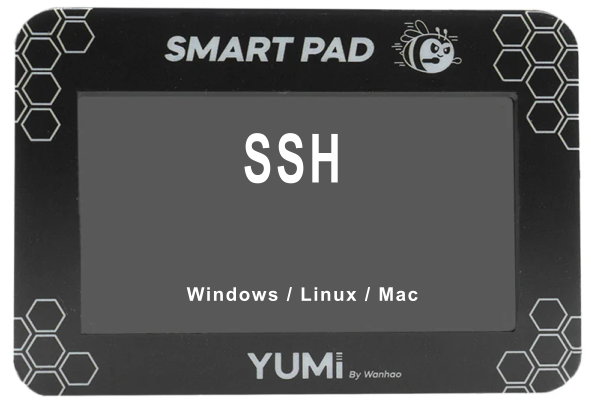
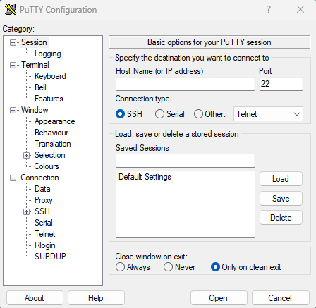
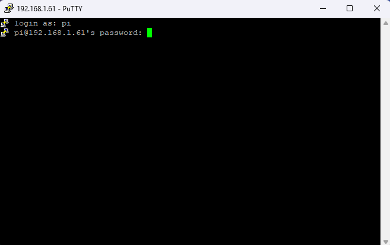
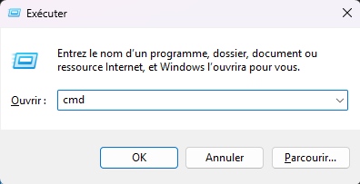
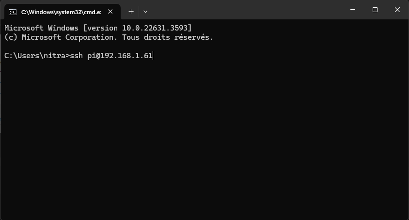
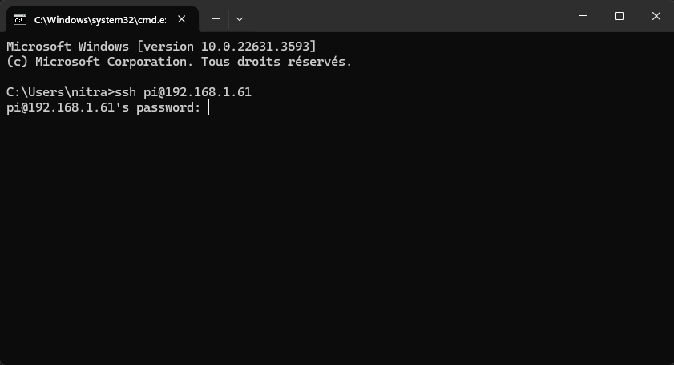

# 1.2 How to connect via SSH on Windows, Mac, and Linux



This guide should help you establish an SSH connection to your remote machine from Windows, Mac, and Linux systems. If you encounter any issues, ensure that the SSH server is running on the remote machine and that the firewall allows SSH connections.

SSH (Secure Shell) is a protocol used to securely connect to remote systems. Here’s how you can connect to a remote machine using the SSH protocol on Windows, Mac, and Linux.

### Prerequisites
- A remote smartpad with SSH server enabled.
- The remote machine's IP address (e.g., **`192.168.1.61`**).
- SSH credentials (Username: **`pi`**, Password: **`yumi`**).

## 1.2.1 Windows
Windows does not come with an SSH client by default, but you can use third-party tools like PuTTY or the built-in OpenSSH client on Windows 10 or later.

#### Method 1: Using PuTTY

1. **Download and Install PuTTY**:

- Visit the [PuTTY download page](https://www.chiark.greenend.org.uk/~sgtatham/putty/latest.html).
- Download and install the appropriate version for your system.

2. **Open PuTTY**:

- Launch PuTTY from the Start menu.



3. **Configure PuTTY**:

- In the **"Host Name (or IP address)"** field, enter the IP address of the remote machine (e.g., **`192.168.1.61`**).
- Ensure the **"Port"** field is set to **`22`**.
- Ensure the **"Connection type"** is set to **`SSH`**.


4. **Connect**:

- Click on the **"Open"** button.
- A terminal window will open asking for a username. Enter **`pi`**.
- When prompted for a password, enter **`yumi`**.



#### Method 2: Using Windows 10 Built-in SSH

1. **Open Command Prompt or PowerShell**:

- Press **`Win + R`**, type **`cmd`** or **`powershell`**, and press **`Enter`**.



2. **Use SSH Command**:

- Type the following command **"ssh pi@192.168.1.61"** and press **`Enter`**:



- When prompted, enter the password **`yumi`**.



## 1.2.2 Mac
MacOS comes with an SSH client pre-installed, accessible through the Terminal.

1. **Open Terminal**:

- Press **`Cmd + Space`** to open Spotlight, type **`Terminal`**, and press **`Enter`**.

2. **Use SSH Command**:

- Type the following command and press **`Enter`**:
```
ssh pi@192.168.1.61
```
- When prompted, enter the password **`yumi`**.

## 1.2.3 Linux
Most Linux distributions come with an SSH client pre-installed. You can use the terminal to connect via SSH.

1. **Open Terminal**:

- Depending on your Linux distribution, open the Terminal from your applications menu or press **`Ctrl + Alt + T`**.

2. **Use SSH Command**:

- Type the following command and press **`Enter`**:
```
ssh pi@192.168.1.61
```
- When prompted, enter the password **`yumi`**.

### Additional Tips

- **Key-based Authentication**: For enhanced security, consider using SSH key-based authentication instead of password authentication.
- **SSH Config File**: You can simplify repeated SSH connections by adding configuration details to the SSH config file (**`~/.ssh/config`**).

