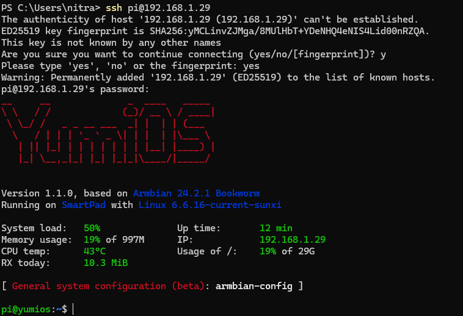

# 1.4 How to rotate the screen of Smartpad

This tutorial will guide you through the steps to rotate the screen of your Smartpad Yumi when it is connected to an external display via HDMI using the `rotate_screen.sh` script from the GitHub repository.


## Prerequisites

- Smartpad Yumi
- External display with HDMI connection
- Necessary permissions to execute scripts on your Smartpad Yumi
- SSH access to your Smartpad Yumi

## Steps

### 1. Connect Smartpad Yumi to External Display

- Power on your Smartpad Yumi.
- Connect the Smartpad Yumi to the external display using an HDMI cable.
- Ensure the external display is turned on and set to the correct HDMI input.

### 2. Connect to Smartpad Yumi via SSH

- Obtain the IP address of your Smartpad Yumi.
- Open a terminal on your local machine and connect to the Smartpad Yumi via SSH:

   ```bash
   ssh pi@smartpad_ip_address
   ```

   Replace `smartpad_ip_address` with the actual IP address of your Smartpad Yumi.

   

### 3. Clone the GitHub Repository

Once connected via SSH, clone the repository using the following command:

```bash
git clone https://github.com/adnroboticsfr/smartpad_screen_rotation.git
```

This command will download the repository to your Smartpad Yumi.

### 4. Navigate to the Directory

Change your working directory to the cloned repository:

```bash
cd smartpad_screen_rotation
```

### 5. Make the Script Executable

Before you can run the script, you need to make it executable. Use the following command to change the script permissions:

```bash
chmod +x rotate_screen.sh
```

### 6. Execute the Script

Run the script to rotate the screen of your Smartpad Yumi:

```bash
sudo ./rotate_screen.sh
```

You can easily reset the rotation to default by running the **"sudo ./rotation_screen.sh"** command. 

## Troubleshooting

- Ensure that the Smartpad Yumi is properly connected to the external display.
- Verify that the external display is set to the correct HDMI input.
- Check for any error messages in the terminal and resolve any permission issues or missing dependencies.
- If the smartpad does not restart after running the script. Unplug it and plug it back in.

