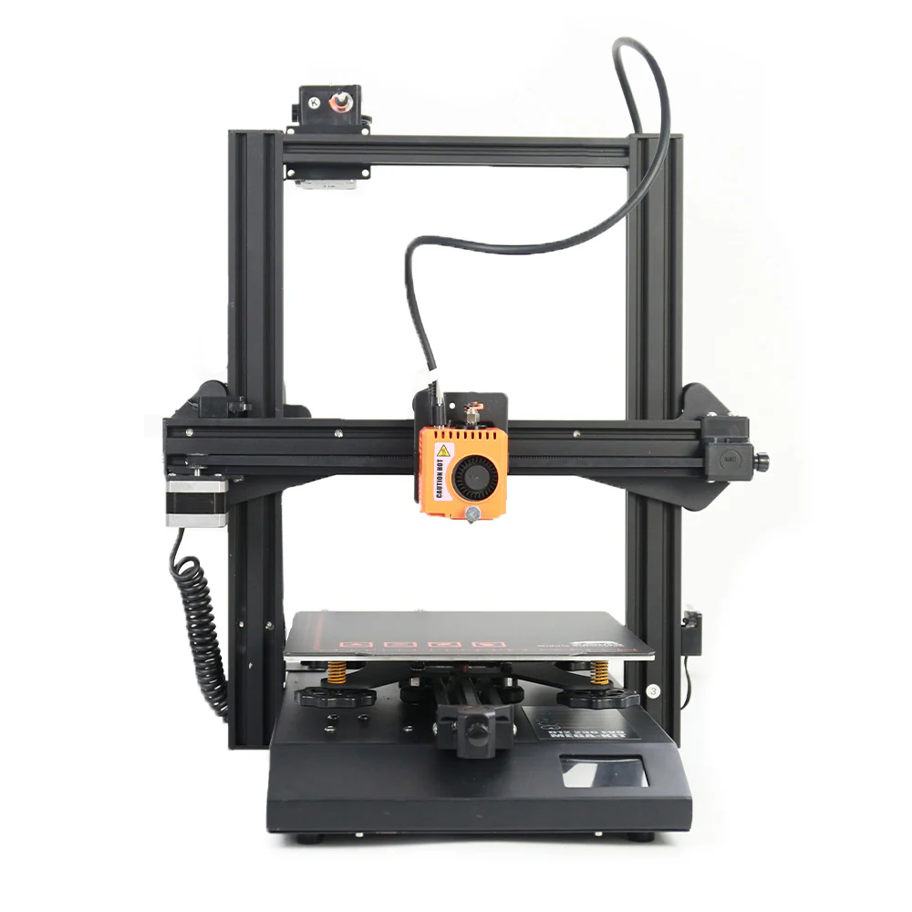
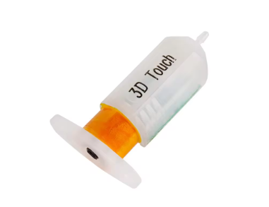
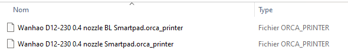

## **Klipper D12-230 Evo Mega-Kit Installation**

### **Important: Please Read the Procedure Before Starting**
You are responsible for any operations performed on your hardware. This guide explains how to install KLIPPER on your 3D printer. It has been tested and is fully functional. We disclaim any responsibility for improper handling. Please note that installing the wrong firmware can brick your printer.

### **Required Materials:**
1. **SmartPad** (Preconfigured with **[YumiOS](https://github.com/Yumi-Lab/YumiOS)**). **Note:** Ensure the SmartPad is configured to connect to your Wi-Fi network or is directly connected to the smartpad via an Ethernet cable.
2. **USB Cable** (Type A male to Type B male). **Recommendation:** Use a shielded USB cable to avoid interference and ensure a stable connection.

3. **MicroSD Card** (For firmware update).

### **Step 1: Download and Prepare the Firmware**
1. Download the firmware and the `printer.cfg` file from the GitHub repository [Yumi-Lab/yumi-config](https://github.com/Yumi-Lab/yumi-config/tree/main/smartpad-wanhao-D12230-Evo-Mega-Kit-MKS3.0).

2. The firmware file is named `Robin_nano.bin`. **Important:** Before proceeding, read the `readme.txt` file included in the repository. It will guide you on how to properly rename the `.bin` file according to your printer version.

### **Step 2: Update the Firmware**
1. After renaming the file according to the instructions in the `readme.txt`, copy the `.bin` file to the root directory of your MicroSD card.
2. Insert the MicroSD card into your printer and power it on.
3. The firmware update will start automatically. **Do not turn off the printer** during this process.

4. Once the update is complete, remove the MicroSD card and restart your printer to apply the changes.

### ** *Optional - 3D Touch Configuration* **

If your printer is equipped with a 3D Touch sensor, make sure to download and use the corresponding `printer.cfg` file available in the GitHub repository [Yumi-Lab/yumi-config](https://github.com/Yumi-Lab/yumi-config/tree/main/smartpad-wanhao-D12230-Evo-Mega-Kit-MKS3.0).

### **Step 3: Connect the SmartPad**
1. Use the USB cable to connect the SmartPad to your printer. Ensure the SmartPad is either connected to the Wi-Fi network or directly connected to the Smartpad via an Ethernet cable.
2. Once connected, access the Klipper interface by navigating to `http://yumios.local` or `http://[SmartPad IP address]` in your web browser.

### **Step 4: Configure Printer Settings**
1. In the Klipper web interface, go to the **Machine** tab.

2. Replace the existing `printer.cfg` file with the one you downloaded from GitHub.
3. Click **Save** and then restart the printer for the changes to take effect.

### **Step 5: Slicer Configuration (OrcaSlicer)**
1. Download OrcaSlicer from the following link: [Download OrcaSlicer](https://github.com/SoftFever/OrcaSlicer/releases).
2. Add the Wanhao D12 300 profile to the predefined printer profiles in OrcaSlicer.
3. Next, import the D12-230 profile available for download at the following link: [D12-230 Profile](https://github.com/Yumi-Lab/yumi-wiki/raw/main/Profile_Slicer/Orcaslicer/WanhaoD12Orcaslicer.zip). There are two versions: one with 3D Touch and one without.

4. The profile is optimized for general use, but remember to adjust it to suit your specific 3D models.

### **Final Steps: Calibration and Adjustments**
Before performing your first print, it’s crucial to properly calibrate your printer for optimal results. Follow these steps:

1. **Extruder Calibration**  
   - This calibration ensures that the extruder is accurately pushing the correct amount of filament. Follow this [guide on extruder calibration](https://wiki.yumi-lab.com/KlipperSmartPad/Calibration/Extruder_calibration/).

2. **Z-Offset Adjustment**  
   - Proper Z-offset calibration is essential for a good first layer. You can follow this [detailed Z-offset calibration guide](https://wiki.yumi-lab.com/KlipperSmartPad/Calibration/Z_Offset_calibration/).

3. **PID Tuning (Proportional-Integral-Derivative)**  
   - Perform PID tuning for both the extruder and bed to maintain stable temperatures during printing. Use this [guide for PID tuning](https://wiki.yumi-lab.com/KlipperSmartPad/Calibration/PID_calibration/).

4. **ADXL Configuration (if applicable)**  
   - If your printer is equipped with an ADXL345 sensor for vibration analysis, follow this [vibration measurement and compensation guide](https://wiki.yumi-lab.com/KlipperSmartPad/Calibration/Adxl_calibration/).

### **Recommended Tests Before Your First Print**
1. **First Layer Test**  

    

   - Run a first layer test to fine-tune your Z-offset and bed leveling. A well-calibrated first layer is key to successful prints.

2. **Calibration Cube**  
 
    

   - Print a 20x20x20mm calibration cube to check dimensional accuracy and extrusion settings. Calibration cube models can be found on the same platforms.

    Test models for this are available on [Thingiverse](https://www.thingiverse.com/) and [Printables](https://www.printables.com/).

