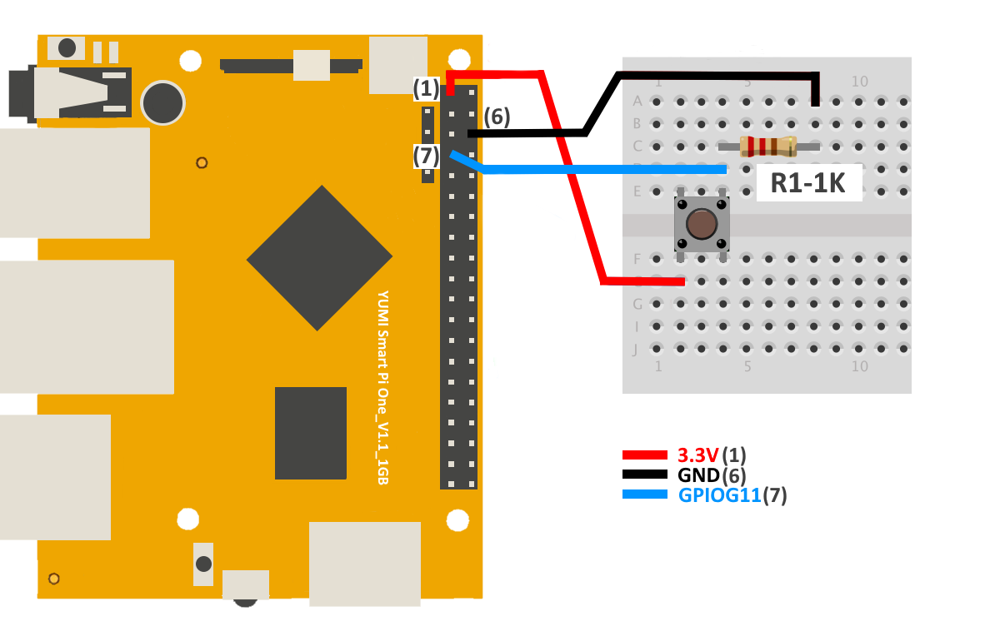

# Button with Smart Pi One

In this guide, we will demonstrate how to display a message when a button connected to the **Smart Pi One** is pressed, using the **SmartPi-GPIO** library and a **pull-down resistor** connected to the **3.3V** pin.


We will cover the following methods:
- **CLI commands**
- **Python script**

## Required Materials

- Smart Pi One
- button (with resistor 10kΩ if necessary)
- Connecting wires
- Breadboard (optional for easier connections)

## Prerequisites: Configuration of smartpi-gpio

To install **SmartPi-GPIO** on your Smart Pi One, follow these steps:

1. **Update system**:
   ```bash
   sudo apt update 
   sudo apt-get install -y python3-dev python3-pip libjpeg-dev zlib1g-dev libtiff-dev
   sudo mv /usr/lib/python3.11/EXTERNALLY-MANAGED /usr/lib/python3.11/EXTERNALLY-MANAGED.old
   ```

2. **Clone the repository**:
   ```bash
   git clone https://github.com/ADNroboticsfr/smartpi-gpio.git
   cd smartpi-gpio
   ```

3. **Install the library**:
   ```bash
   sudo python3 setup.py sdist bdist_wheel
   sudo pip3 install dist/smartpi_gpio-1.0.0-py3-none-any.whl
   ```

4. **Activate GPIO interfaces**:
   ```bash
   sudo activate_interfaces.sh
   ``` 

   


### Wiring Diagram

The button is connected to **GPIOG11 (Pin 7)** as the input pin for detecting the button press. A **10kΩ pull-down resistor** is placed between **GPIOG11** and **Ground**. This setup ensures the pin reads **LOW** when the button is not pressed and **HIGH** when the button is pressed due to the connection to **3.3V (Pin 1)**.

| **Pin Number** | **Pin Name**          | **Function**           |
|----------------|-----------------------|------------------------|
| 1              | 3.3V                  | Power Supply            |
| 7              | GPIOG11               | Button Input            |
| 6              | GROUND                | GROUND           |



## Displaying a Message via CLI

You can detect button presses using CLI and print a message accordingly.

### Steps:

1. **Configure the button pin as input**:
   ```bash
   sudo gpio 7 mode in pull-down
   ```

   

2. **Read the button state**:
   ```bash
   sudo gpio 7 read
   ```

   

   This will print **"Pin 7: 1"** when the button is pressed.

## Using Python

## Displaying a Message with Python

With **SmartPi-GPIO** and Python, you can write a simple script to detect the button press and display a message.

### Steps:

1. **Create a Python file**:
   ```bash
   nano button_message.py
   ```

2. **Write the following code**:

   ```python
   from smartpi_gpio.gpio import GPIO
   import time

   # Initialize GPIO instance
   gpio = GPIO()

   # GPIO pin number for the button (GPIOG11)
   button_pin = 7

   # Configure the button pin as input with pull-down resistor
   gpio.set_direction(button_pin, "in", "pull-down")

   print("Press the button to display a message...")

   while True:
       # Read the button state
       button_state = gpio.read(button_pin)
       
       if button_state == '1':  # If button is pressed
           print("Button Pressed!")
           break

       time.sleep(0.1)
   ```

3. **Save and exit** (`CTRL+X`, `Y`, and `Enter`).

4. **Run the Python script**:
   ```bash
   sudo python3 button_message.py
   ```

When the button is pressed, the message **"Button Pressed!"** will be displayed.

