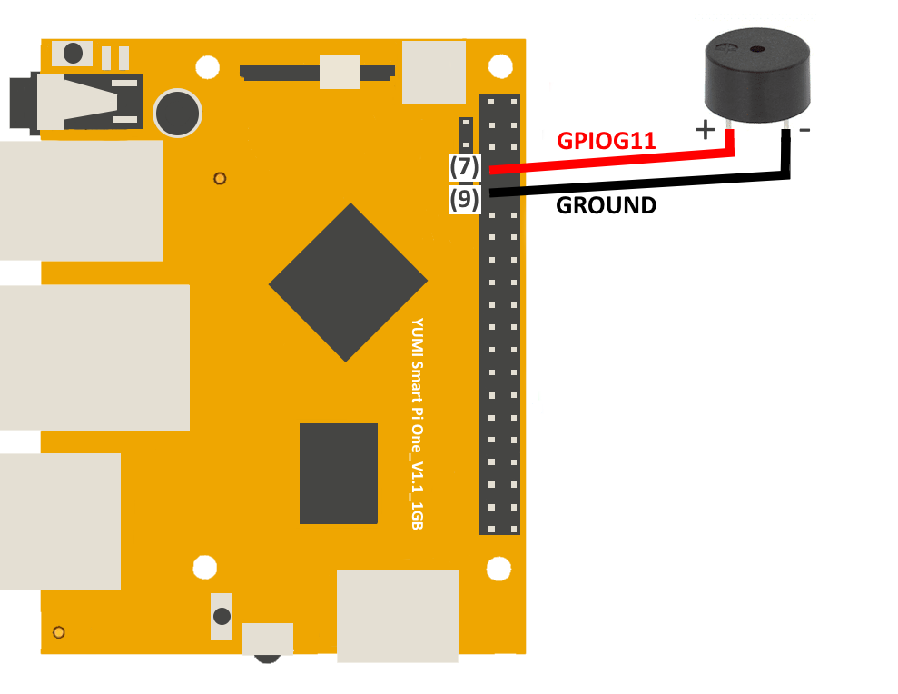

# Using a Buzzer with Smart Pi One

This page describes how to connect and use a buzzer with the Smart Pi One, including wiring instructions, and code examples in both Python and C.


## Required Materials

- Smart Pi One
- Active or passive buzzer
- Connecting wires
- Breadboard (optional for easier connections)

## Wiring Diagram

Below is a sample wiring diagram for connecting a buzzer to the Smart Pi One:



| **Component** | **Smart Pi One Pin** | **Description** |
|---------------|----------------------|-----------------|
| Buzzer (+) | GPIO7 | Connect to the positive terminal of the buzzer |
| Buzzer (-) | GND | Connect to the ground (GND) pin |

**Connecting the Buzzer:**
   - Connect the positive terminal of the buzzer to a GPIO pin on the Smart Pi One (e.g., GPIO7).
   - Connect the negative terminal of the buzzer to the ground (GND) pin on the Smart Pi One.

--8<-- "_snippets/smartpi-gpio-prerequisites.md"

## Using Python

## Creating the Python Script

1. Open a terminal on your Smart Pi One.
2. Create a new Python file using `nano`:

   ```bash
   nano buzzer_control.py
   ```

3. Copy and paste the following Python code into the file:

   ```python
   import time
   from smartpi_gpio.gpio import GPIO

   # Initialize GPIO
   gpio = GPIO()
   BUZZER_PIN = 7

   # Set GPIO7 as output for the buzzer
   gpio.setup(BUZZER_PIN, gpio.OUT)

   try:
       while True:
           # Turn the buzzer on
           gpio.output(BUZZER_PIN, gpio.HIGH)
           print("Buzzer ON")
           time.sleep(1)  # Buzzer stays on for 1 second
           
           # Turn the buzzer off
           gpio.output(BUZZER_PIN, gpio.LOW)
           print("Buzzer OFF")
           time.sleep(1)  # Buzzer stays off for 1 second
   except KeyboardInterrupt:
       pass
   finally:
       gpio.cleanup()  # Clean up GPIO
   ```

4. Save the file by pressing `CTRL + X`, then `Y`, and finally `Enter`.

## Running the Python Script

To run the Python script, use the following command:

```bash
sudo python3 buzzer_control.py
```


