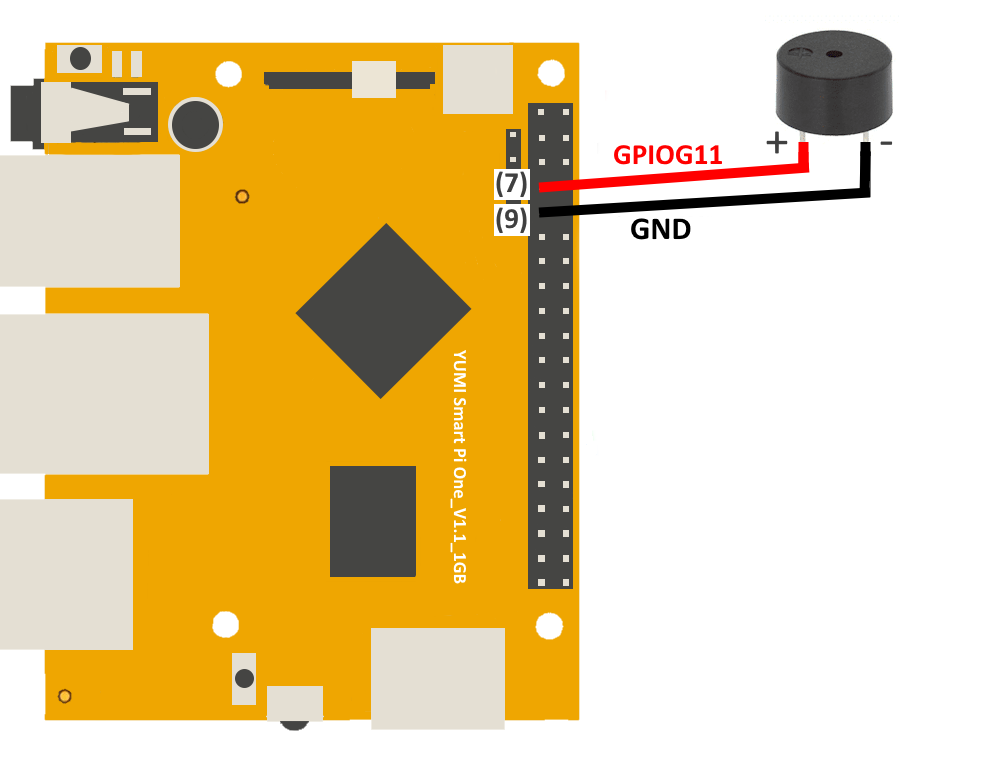

# Using a Buzzer with Smart Pi One

This page describes how to connect and use a buzzer with the Smart Pi One, including wiring instructions, and code examples in both Python and C.


## Required Materials

- Smart Pi One
- Active or passive buzzer
- Connecting wires
- Breadboard (optional for easier connections)

## Wiring Diagram

Below is a sample wiring diagram for connecting a buzzer to the Smart Pi One:



| **Component** | **Smart Pi One Pin** | **Description** |
|---------------|----------------------|-----------------|
| Buzzer (positive terminal) | GPIO7 | Connect to the positive terminal of the buzzer |
| Buzzer (negative terminal) | GND | Connect to the ground (GND) pin |


### Connecting the Buzzer

1. **Connect the Buzzer:**
   - Connect the positive terminal of the buzzer to a GPIO pin on the Smart Pi One (e.g., GPIO7).
   - Connect the negative terminal of the buzzer to the ground (GND) pin on the Smart Pi One.

## Using Python

### Prerequisites: Configuration of smartpi-gpio

To install **SmartPi-GPIO** on your Smart Pi One, follow these steps:

1. **Update system**:
   ```bash
   sudo apt update 
   sudo apt-get install -y python3-dev python3-pip libjpeg-dev zlib1g-dev libtiff-dev
   sudo mv /usr/lib/python3.11/EXTERNALLY-MANAGED /usr/lib/python3.11/EXTERNALLY-MANAGED.old

2. **Clone the repository**:
   ```bash
   git clone https://github.com/ADNroboticsfr/smartpi-gpio.git
   cd smartpi-gpio

3. **Install the library**:
   ```bash
   sudo python3 setup.py sdist bdist_wheel
   sudo pip3 install dist/smartpi_gpio-1.0.0-py3-none-any.whl


4. **Activate GPIO interfaces**:
   ```bash
   sudo activate_interfaces.sh
    ```

## Creating the Python Script

1. Open a terminal on your Smart Pi One.
2. Create a new Python file using `nano`:

   ```bash
   nano buzzer_control.py
   ```

3. Copy and paste the following Python code into the file:

   ```python
   import time
   from smartpi_gpio.gpio import GPIO

   # Initialize GPIO
   gpio = GPIO()
   BUZZER_PIN = 7

   # Set GPIO7 as output for the buzzer
   gpio.setup(BUZZER_PIN, gpio.OUT)

   try:
       while True:
           # Turn the buzzer on
           gpio.output(BUZZER_PIN, gpio.HIGH)
           print("Buzzer ON")
           time.sleep(1)  # Buzzer stays on for 1 second
           
           # Turn the buzzer off
           gpio.output(BUZZER_PIN, gpio.LOW)
           print("Buzzer OFF")
           time.sleep(1)  # Buzzer stays off for 1 second
   except KeyboardInterrupt:
       pass
   finally:
       gpio.cleanup()  # Clean up GPIO
   ```

4. Save the file by pressing `CTRL + X`, then `Y`, and finally `Enter`.

## Running the Python Script

To run the Python script, use the following command:

```bash
python3 buzzer_control.py
```

## Using a C Program

## Creating the C Program

1. Open a terminal on your Smart Pi One.
2. Create a new C file using `nano`:

   ```bash
   nano buzzer_control.c
   ```

3. Copy and paste the following C code into the file:

   ```c
   #include <stdio.h>
   #include <stdlib.h>
   #include <unistd.h>
   #include "smartpi_gpio.h"

   int main() {
       // Initialize GPIO
       smartpi_gpio_init();
       int BUZZER_PIN = 7;

       // Set GPIO7 as output for the buzzer
       smartpi_gpio_set_mode(BUZZER_PIN, OUTPUT);

       while (1) {
           // Turn the buzzer on
           smartpi_gpio_write(BUZZER_PIN, HIGH);
           printf("Buzzer ON\n");
           sleep(1);  // Buzzer stays on for 1 second
           
           // Turn the buzzer off
           smartpi_gpio_write(BUZZER_PIN, LOW);
           printf("Buzzer OFF\n");
           sleep(1);  // Buzzer stays off for 1 second
       }

       // Release GPIO resources (this will never be reached)
       smartpi_gpio_cleanup();
       return 0;
   }
   ```

4. Save the file by pressing `CTRL + X`, then `Y`, and finally `Enter`.

## Compiling and Running the C Program

To compile and run the C program, use the following commands:

```bash
gcc -o buzzer_control buzzer_control.c -I/path/to/smartpi_gpio/include -L/path/to/smartpi_gpio/lib -lsmartpi_gpio
./buzzer_control
```
