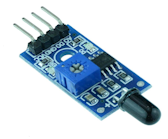
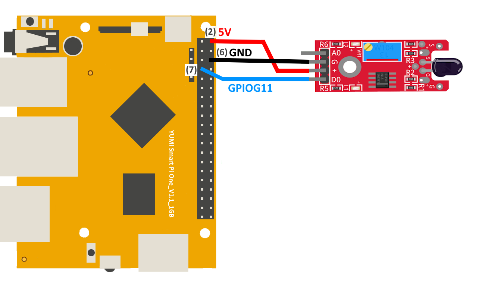
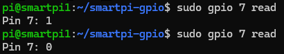
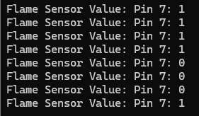
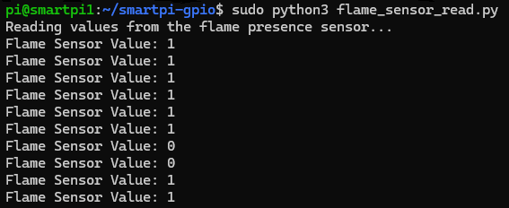

# Flame Presence Sensor with Smart Pi One

In this guide, we will demonstrate how to read the values from a flame presence sensor connected to the **Smart Pi One**, using the **SmartPi-GPIO** library.



We will cover the following methods:
- **CLI commands**
- **Python script**

## Required Materials

- Smart Pi One
- Flame presence sensor (e.g., DFRobot DFR0090 or similar)
- Connecting wires
- Breadboard (optional for easier connections)

## Wiring Diagram

The flame presence sensor typically has three pins: **VCC**, **GND**, and **DOUT** (digital output).

- **VCC** connects to **5V (Pin 1)**.
- **GND** connects to **Ground (Pin 6)**.
- **DOUT** connects to **GPIOG11(Pin 7)** to read the presence of flame.



| **Pin Number** | **Pin Name**          | **Function**          |
|----------------|-----------------------|-----------------------|
| 2              | 5V                  | Power Supply          |
| 7              | GPIOG11                | Flame Sensor Output (D0)   |
| 6              | GND                   | Ground                |


## Prerequisites: Configuration of smartpi-gpio

To install **SmartPi-GPIO** on your Smart Pi One, follow these steps:

1. **Update system**:

   ```bash
   sudo apt update 
   sudo apt-get install -y python3-dev python3-pip libjpeg-dev zlib1g-dev libtiff-dev
   sudo mv /usr/lib/python3.11/EXTERNALLY-MANAGED /usr/lib/python3.11/EXTERNALLY-MANAGED.old
   ```

2. **Clone the repository**:

   ```bash
   git clone https://github.com/ADNroboticsfr/smartpi-gpio.git
   cd smartpi-gpio
   ```

3. **Install the library**:

   ```bash
   sudo python3 setup.py sdist bdist_wheel
   sudo pip3 install dist/smartpi_gpio-1.0.0-py3-none-any.whl
   ```

4. **Activate GPIO interfaces**:

   ```bash
   sudo activate_interfaces.sh
   ``` 

   

## Reading Values via CLI

You can read the values from the flame presence sensor using the CLI.

### Steps:

1. **Configure the pin for digital input**:

   ```bash
   sudo gpio 7 mode in
   ```

2. **Read the value from the flame sensor**:

   ```bash
   sudo gpio 7 read
   ```



3. **Example to read and display values continuously**:

   Use a loop to read the state of the flame sensor and print its value:

   ```bash
   while true; do
     value=$(sudo gpio 7 read)
     echo "Flame Sensor Value: $value"
     sleep 1
   done
   ```

   

This will display the current value read by the flame sensor every second.


## Using Python

## Reading Values with Python

With **SmartPi-GPIO** and Python, you can write a simple script to read the value from the flame presence sensor.

### Steps:

1. **Create a Python file**:

   ```bash
   nano flame_sensor_read.py
   ```

2. **Write the following code**:

   ```python
   from smartpi_gpio.gpio import GPIO
   import time

   # Initialize GPIO instance
   gpio = GPIO()

   # GPIO pin number for the flame sensor (GPIO7)
   flame_sensor_pin = 7

   # Configure the pin as input
   gpio.set_direction(flame_sensor_pin, "in")

   print("Reading values from the flame presence sensor...")

   while True:
       # Read the value from the flame sensor
       value = gpio.read(flame_sensor_pin)
       print(f"Flame Sensor Value: {value}")
       time.sleep(1)  # Read every second
   ```

3. **Save and exit** (`CTRL+X`, `Y`, and `Enter`).

4. **Run the Python script**:

   ```bash
   sudo python3 flame_sensor_read.py
   ```

   

This will continuously display the current value read by the flame presence sensor every second.
