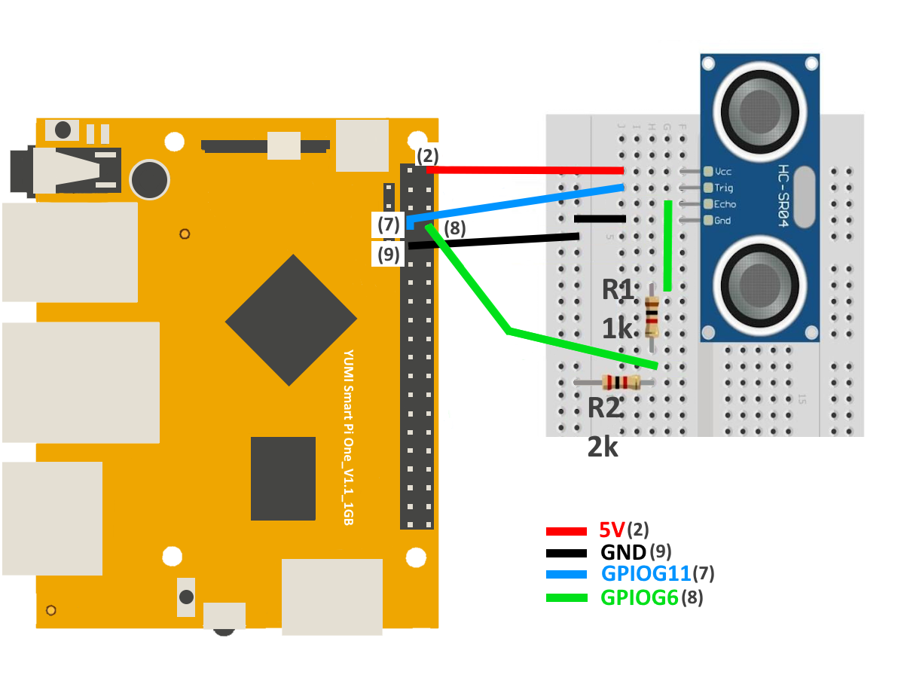

# Using an Ultrasonic Sensor with Smart Pi One

This page describes how to use an ultrasonic sensor (e.g., HC-SR04) with the Smart Pi One, providing detailed steps, wiring instructions, and code examples in both Python and C.


## Required Materials

- Smart Pi One
- Ultrasonic sensor (e.g., HC-SR04)
- Connecting wires
- Breadboard (optional for easier connections)
- 1kΩ and 2kΩ resistors (for voltage divider)

## Wiring Diagram

Below is a sample wiring diagram for connecting an ultrasonic sensor to the Smart Pi One:



| HC-SR04 Pin  | Smart Pi One Pin |  Description                                     |
|--------------|------------------|--------------------------------|
| VCC          | 5V               |  Powers the sensor (5V supply)                   |
| GND          | GND              |  Ground connection                               |
| TRIG         | GPIO7            | Trigger pin connected to GPIO                   |
| ECHO         | GPIO8            |  Resistors used to step down voltage from 5V to 3.3V to protect the GPIO pin -  1kΩ + 2kΩ (Voltage Divider) |

### Important Note:
- **ECHO pin (GPIO8)** requires a voltage divider to step down the 5V output signal from the sensor to 3.3V, which is safe for the GPIO pin on the Smart Pi One. 
  - Connect a 1kΩ resistor between the ECHO pin and the GPIO pin.
  - Connect a 2kΩ resistor between the GPIO pin and GND to complete the voltage divider.

## Using Python

### Prerequisites: Configuration of smartpi-gpio

1. Open a terminal on your Smart Pi One.
2. Create a new Python file using `nano`:

   ```bash
   nano ultrasonic_sensor.py
   ```

3. Copy and paste the following Python code into the file:

   ```python
   import time
   from smartpi_gpio.gpio import GPIO

   # Initialize GPIO
   gpio = GPIO()
   TRIG = 7
   ECHO = 8

   # Set GPIO pins
   gpio.setup(TRIG, gpio.OUT)
   gpio.setup(ECHO, gpio.IN)

   try:
       while True:
           # Send a pulse
           gpio.output(TRIG, gpio.HIGH)
           time.sleep(0.00001)  # 10 microseconds
           gpio.output(TRIG, gpio.LOW)

           # Wait for the echo to start
           while gpio.input(ECHO) == gpio.LOW:
               start_time = time.time()

           # Wait for the echo to stop
           while gpio.input(ECHO) == gpio.HIGH:
               end_time = time.time()

           # Calculate distance
           duration = end_time - start_time
           distance = (duration * 34300) / 2  # Speed of sound is 34300 cm/s

           print(f"Distance: {distance:.2f} cm")
           time.sleep(1)  # Wait 1 second before next measurement
   except KeyboardInterrupt:
       pass
   finally:
       gpio.cleanup()  # Clean up GPIO
   ```

4. Save the file by pressing `CTRL + X`, then `Y`, and finally `Enter`.

## Running the Python Script

To run the Python script, use the following command:

```bash
python3 ultrasonic_sensor.py
```


## Using a C Program

### Creating the C Program

1. Open a terminal on your Smart Pi One.
2. Create a new C file using `nano`:

   ```bash
   nano ultrasonic_sensor.c
   ```

3. Copy and paste the following C code into the file:

   ```c
   #include <stdio.h>
   #include <stdlib.h>
   #include <unistd.h>
   #include <time.h>
   #include "smartpi_gpio.h"

   int main() {
       // Initialize GPIO
       smartpi_gpio_init();
       int TRIG = 7;
       int ECHO = 8;

       // Set GPIO pins
       smartpi_gpio_set_mode(TRIG, OUTPUT);
       smartpi_gpio_set_mode(ECHO, INPUT);

       while (1) {
           // Send a pulse
           smartpi_gpio_write(TRIG, HIGH);
           usleep(10);  // 10 microseconds
           smartpi_gpio_write(TRIG, LOW);

           // Wait for the echo to start
           while (smartpi_gpio_read(ECHO) == LOW);
           struct timespec start, end;
           clock_gettime(CLOCK_MONOTONIC, &start);

           // Wait for the echo to stop
           while (smartpi_gpio_read(ECHO) == HIGH);
           clock_gettime(CLOCK_MONOTONIC, &end);

           // Calculate distance
           double duration = (end.tv_sec - start.tv_sec) + (end.tv_nsec - start.tv_nsec) / 1e9;
           double distance = (duration * 34300) / 2;  // Speed of sound is 34300 cm/s

           printf("Distance: %.2f cm\n", distance);
           sleep(1);  // Wait 1 second before next measurement
       }

       // Release GPIO resources (this will never be reached)
       smartpi_gpio_cleanup();
       return 0;
   }
   ```

4. Save the file by pressing `CTRL + X`, then `Y`, and finally `Enter`.

## Compiling and Running the C Program

To compile and run the C program, use the following commands:

```bash
gcc -o ultrasonic_sensor ultrasonic_sensor.c -I/path/to/smartpi_gpio/include -L/path/to/smartpi_gpio/lib -lsmartpi_gpio
./ultrasonic_sensor
```

