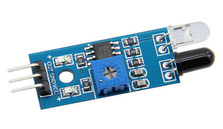
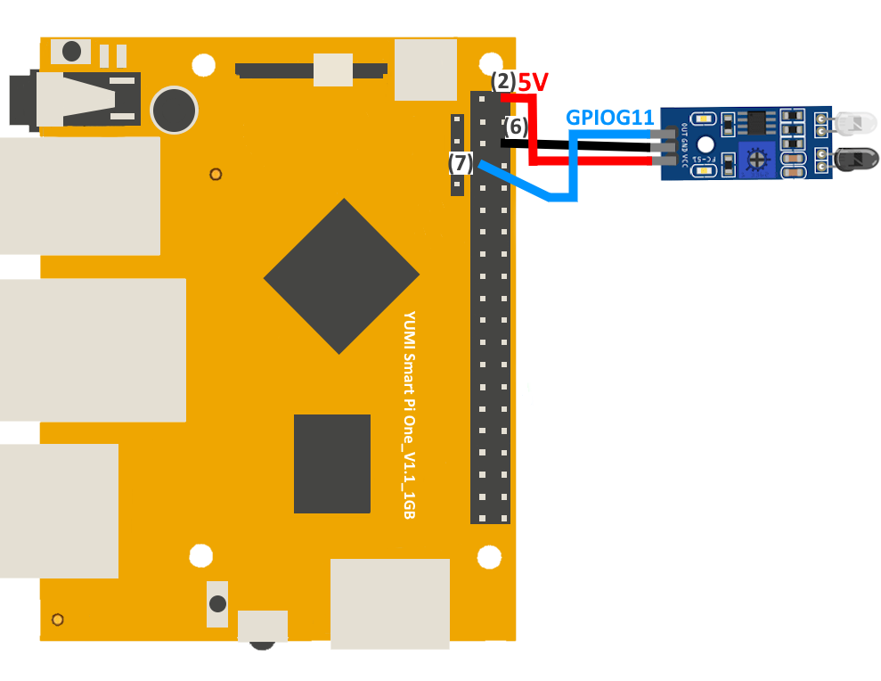
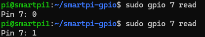
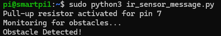

# Obstacle IR Sensor with Smart Pi One

In this guide, we will demonstrate how to display a message when an obstacle is detected by an **IR obstacle sensor** connected to the **Smart Pi One**, using the **SmartPi-GPIO** library.



We will cover the following methods:
- **CLI commands**
- **Python script**

## Required Materials

- Smart Pi One
- IR obstacle sensor
- Connecting wires
- Breadboard (optional for easier connections)


## Wiring Diagram

The IR obstacle sensor is connected to **GPIOG11 (Pin 7)** as the input pin for detecting obstacles. When an obstacle is detected, the sensor outputs a **LOW** signal (0). 



| **Pin Number** | **Pin Name**          | **Function**           |
|----------------|-----------------------|------------------------|
| 1              | 3.3V                  | Power Supply            |
| 7              | GPIOG11               | Obstacle Sensor Input   |
| 6              | GND                   | Ground                  |


## Prerequisites: Configuration of smartpi-gpio

To install **SmartPi-GPIO** on your Smart Pi One, follow these steps:

1. **Update system**:

   ```bash
   sudo apt update 
   sudo apt-get install -y python3-dev python3-pip libjpeg-dev zlib1g-dev libtiff-dev
   sudo mv /usr/lib/python3.11/EXTERNALLY-MANAGED /usr/lib/python3.11/EXTERNALLY-MANAGED.old
   ```

2. **Clone the repository**:

   ```bash
   git clone https://github.com/ADNroboticsfr/smartpi-gpio.git
   cd smartpi-gpio
   ```

3. **Install the library**:

   ```bash
   sudo python3 setup.py sdist bdist_wheel
   sudo pip3 install dist/smartpi_gpio-1.0.0-py3-none-any.whl
   ```

4. **Activate GPIO interfaces**:

   ```bash
   sudo activate_interfaces.sh
   ``` 

   

## Displaying a Message via CLI

You can detect obstacles using the CLI and print a message accordingly.

### Steps:

1. **Configure the sensor pin as input**:

   ```bash
   sudo gpio 7 mode in pull-up
   ```

2. **Read the sensor state**:

   ```bash
   sudo gpio 7 read
   ```

   


3. **Example to display a message**:
   Use a loop to continuously check the sensor status and display a message when an obstacle is detected:

   ```bash
   while true; do
     value=$(sudo gpio 7 read)
     echo "Obstacle IR value: $value"
     sleep 1
   done
   ```

   

This will display the current value read by the Obstacle IR every second..


## Using Python

## Displaying a Message with Python

With **SmartPi-GPIO** and Python, you can write a simple script to detect obstacles and display a message.

### Steps:

1. **Create a Python file**:

   ```bash
   nano ir_sensor_message.py
   ```

2. **Write the following code**:

   ```python
   from smartpi_gpio.gpio import GPIO
   import time

   # Initialize GPIO instance
   gpio = GPIO()

   # GPIO pin number for the IR sensor (GPIOG11)
   sensor_pin = 7

   # Configure the sensor pin as input with pull-up resistor
   gpio.set_direction(sensor_pin, "in", "pull-up")

   print("Monitoring for obstacles...")

   while True:
       # Read the sensor state
       sensor_state = gpio.read(sensor_pin)
       
       if sensor_state == '0':  # If an obstacle is detected
           print("Obstacle Detected!")
           break

       time.sleep(0.1)
   ```

3. **Save and exit** (`CTRL + X`, `Y`, and `Enter`).

4. **Run the Python script**:

   ```bash
   sudo python3 ir_sensor_message.py
   ```

   

When an obstacle is detected, the message "Obstacle Detected!" will be displayed.

