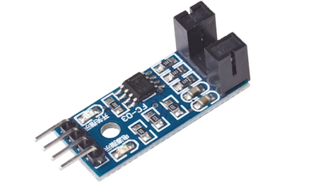

# Motor Measuring Comparator IR Optocoupler with Smart Pi One

In this guide, we will demonstrate how to use a **Motor Measuring Comparator IR Optocoupler** module with the **Smart Pi One** to measure speed by detecting object interruptions (e.g., wheel rotation), using the **SmartPi-GPIO** library.



We will cover the following methods:
- **CLI commands**
- **Python script**
- **C program**

## Required Materials

- Smart Pi One
- IR Optocoupler module (with comparator, typically using LM393 or similar)
- Connecting wires
- Breadboard (optional for easier connections)

### Wiring Diagram

The IR Optocoupler module typically has three connections: **VCC**, **GND**, and **DOUT** (digital output).

- **VCC** connects to **3.3V (Pin 1)**.
- **GND** connects to **Ground (Pin 7)**.
- **DOUT** connects to **GPIO7 (Pin 7)** for reading the sensor's digital signal.

| **Pin Number** | **Pin Name**          | **Function**           |
|----------------|-----------------------|------------------------|
| 1              | 3.3V                  | Power Supply           |
| 7              | GPIO7                 | Output Signal          |
| 7              | GND                   | Ground                 |


## Detecting Speed via CLI

You can detect speed by reading the output signal from the IR Optocoupler using CLI commands.

### Steps:

1. **Configure the pin for digital input**:
   ```bash
   sudo gpio 7 mode in
   ```

2. **Read the sensor state**:
   ```bash
   sudo gpio read 7
   ```

3. **Example to display speed measurement**:
   Use a loop to continuously check for speed changes:
   ```bash
   while true; do
     value=$(sudo gpio read 7)
     if [ "$value" -eq 1 ]; then
       echo "Speed Detected!"
     fi
     sleep 0.1
   done
   ```

This will print "Speed Detected!" whenever the sensor detects an interruption (e.g., passing of a rotating object).

## Using Python

### Prerequisites: Configuration of smartpi-gpio

To install **SmartPi-GPIO** on your Smart Pi One, follow these steps:

1. **Update system**:
   ```bash
   sudo apt update 
   sudo apt-get install -y python3-dev python3-pip libjpeg-dev zlib1g-dev libtiff-dev
   sudo mv /usr/lib/python3.11/EXTERNALLY-MANAGED /usr/lib/python3.11/EXTERNALLY-MANAGED.old
   ```

2. **Clone the repository**:
   ```bash
   git clone https://github.com/ADNroboticsfr/smartpi-gpio.git
   cd smartpi-gpio
   ```

3. **Install the library**:
   ```bash
   sudo python3 setup.py sdist bdist_wheel
   sudo pip3 install dist/smartpi_gpio-1.0.0-py3-none-any.whl
   ```

4. **Activate GPIO interfaces**:
   ```bash
   sudo activate_interfaces.sh
   ```

## Detecting Speed with Python

Using **SmartPi-GPIO** in Python, you can write a script to detect the interruptions that correspond to speed measurements.

### Steps:

1. **Create a Python file**:
   ```bash
   nano ir_optocoupler.py
   ```

2. **Write the following code**:

   ```python
   from smartpi_gpio.gpio import GPIO
   import time

   # Initialize GPIO instance
   gpio = GPIO()

   # GPIO pin number for the speed detection module (GPIO7)
   speed_sensor_pin = 7

   # Configure the pin as input
   gpio.set_direction(speed_sensor_pin, "in")

   print("Detecting speed from the IR Optocoupler sensor...")

   try:
       while True:
           # Read the value from the speed detection sensor
           value = gpio.read(speed_sensor_pin)
           if value == '1':  # Speed detected
               print("Speed Detected!")
           time.sleep(0.1)  # Read every 100 ms
   except KeyboardInterrupt:
       print("Exiting...")
   ```

3. **Save and exit** (`CTRL+X`, `Y`, and `Enter`).

4. **Run the Python script**:
   ```bash
   python3 ir_optocoupler.py
   ```


