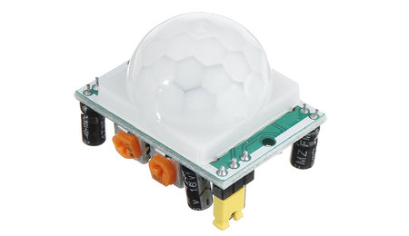
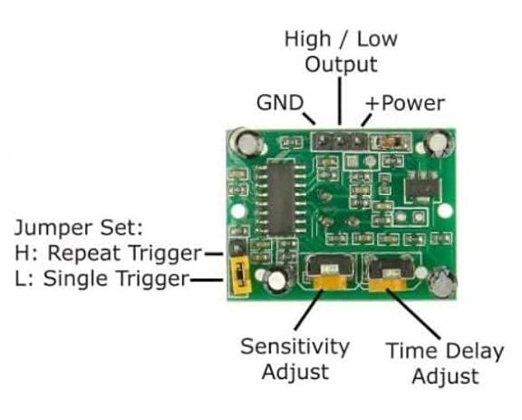
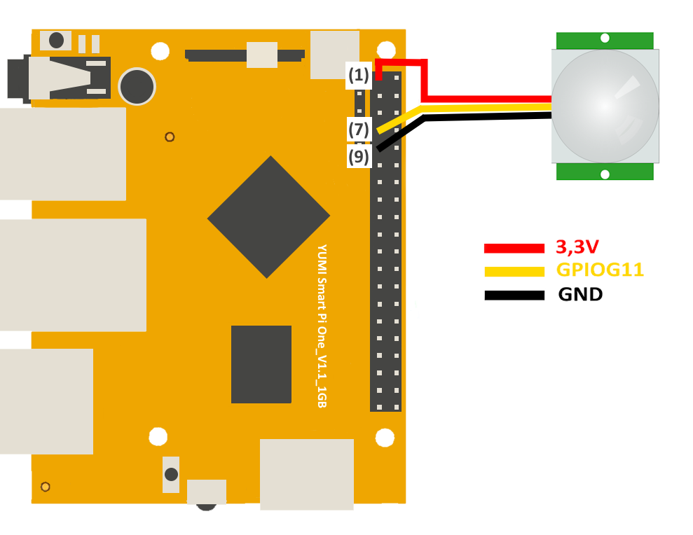
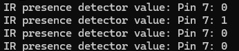

# IR Presence Detector with Smart Pi One

In this guide, we will demonstrate how to read the values from an IR presence detector connected to the **Smart Pi One**, using the **SmartPi-GPIO** library.



We will cover the following methods:
- **CLI commands**
- **Python script**


## Required Materials

- Smart Pi One
- IR presence detector (e.g., HC-SR501 or similar)
- Connecting wires
- Breadboard (optional for easier connections)

## Wiring Diagram

The IR presence detector typically has three pins: **VCC**, **GND**, and **DOUT** (digital output).




- **VCC** connects to **3.3V (Pin 1)**.
- **GND** connects to **Ground (Pin 6)**.
- **DOUT** connects to **GPIOG11 (Pin 7)** to read the presence detection signal.



| **Pin Number** | **Pin Name**          | **Function**          |
|----------------|-----------------------|-----------------------|
| 1              | 3.3V                  | Power Supply          |
| 7              | GPIOG11                | IR Presence Output     |
| 6              | GND                   | Ground                |


## Prerequisites: Configuration of smartpi-gpio

To install **SmartPi-GPIO** on your Smart Pi One, follow these steps:

1. **Update system**:

   ```bash
   sudo apt update 
   sudo apt-get install -y python3-dev python3-pip libjpeg-dev zlib1g-dev libtiff-dev
   sudo mv /usr/lib/python3.11/EXTERNALLY-MANAGED /usr/lib/python3.11/EXTERNALLY-MANAGED.old
   ```

2. **Clone the repository**:

   ```bash
   git clone https://github.com/ADNroboticsfr/smartpi-gpio.git
   cd smartpi-gpio
   ```

3. **Install the library**:

   ```bash
   sudo python3 setup.py sdist bdist_wheel
   sudo pip3 install dist/smartpi_gpio-1.0.0-py3-none-any.whl
   ```

4. **Activate GPIO interfaces**:

   ```bash
   sudo activate_interfaces.sh
   ``` 

   

## Reading Values via CLI

You can read the values from the IR presence detector using the CLI.

### Steps:

1. **Configure the pin for digital input**:

   ```bash
   sudo gpio 7 mode in
   ```

2. **Example to read and display values continuously**:
   Use a loop to read the state of the IR presence detector and print a message only when presence is detected:
 
   ```bash
   while true; do
     value=$(sudo gpio 7 read)
     echo "IR presence detector value: $value"
     sleep 1
   done
   ```

   

This will display "IR presence detector value: Pin 7: 1" when the detector senses something.

## Using Python

## Reading Values with Python

With **SmartPi-GPIO** and Python, you can write a simple script to read the value from the IR presence detector.

### Steps:

1. **Create a Python file**:

   ```bash
   nano ir_presence_detector_read.py
   ```

2. **Write the following code**:

   ```python
   from smartpi_gpio.gpio import GPIO
   import time

   # Initialize GPIO instance
   gpio = GPIO()

   # GPIO pin number for the IR presence detector (GPIO7)
   ir_detector_pin = 7

   # Configure the pin as input
   gpio.set_direction(ir_detector_pin, "in")

   print("Reading values from the IR presence detector...")

   try:
       while True:
           # Read the value from the IR presence detector
           value = gpio.read(ir_detector_pin)
           if value == '1':  # Presence detected
               print("Presence Detected!")
           time.sleep(1)  # Read every second
   except KeyboardInterrupt:
       print("Exiting...")
   ```

3. **Save and exit** (`CTRL+X`, `Y`, and `Enter`).

4. **Run the Python script**:

   ```bash
   sudo python3 ir_presence_detector_read.py
   ```

   

This will continuously display "Presence Detected!" when detection occurs.

