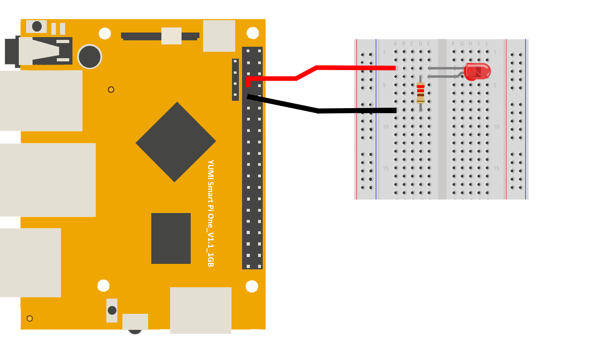
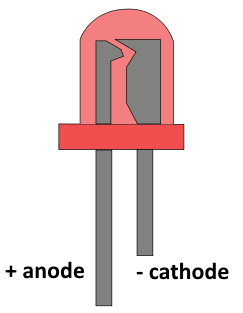

# Controlling an LED via GPIO on Smart Pi One

This page describes how to control an LED using GPIO on the Smart Pi One, with detailed steps, wiring instructions, a wiring diagram, and code examples in both Python and C.


## Required Materials

- Smart Pi One
- LED (with resistor around 220Ω to 1kΩ if necessary)
- Connecting wires
- Breadboard (optional for easier connections)

## Wiring Diagram

Below is the wiring diagram for connecting an LED to GPIO on the Smart Pi One



## Connecting the LED



**Connect the LED:**
   - Connect the longer leg of the LED (**anode**) to GPIO (**GPIOG11**/**PIN: 7**).
   - Connect the shorter leg of the LED (**cathode**) to ground (**GND**/**PIN:9**).
   - If necessary, place a resistor in series with the LED to limit the current (**typically around 220Ω to 1kΩ**).

--8<-- "_snippets/smartpi-gpio-prerequisites.md"

## Turning on an LED via Command Line (CLI)

### Step 1: Turn on the LED

To turn on the LED on GPIO 7:

```bash
sudo gpio 7 mode out
sudo gpio 7 write 1
```


### Step 2: Turn off the LED

To turn off the LED:

```bash
sudo gpio 7 write 0
```


## Using Python

## Creating the Python Script

1. Open a terminal on your Smart Pi One.
2. Create a new Python file using `nano`:

   ```bash
   nano led_control.py
   ```

3. Copy and paste the following Python code into the file:

   ```python
   import time
   from smartpi_gpio.gpio import GPIO

   # Initialize GPIO
   gpio = GPIO()

   # Set GPIO7 as output for the LED
   gpio.setup(7, gpio.OUT)

   try:
       while True:
           # Turn on the LED
           gpio.output(7, gpio.HIGH)
           print("LED is ON")
           time.sleep(2)  # Keep it on for 2 seconds
           
           # Turn off the LED
           gpio.output(7, gpio.LOW)
           print("LED is OFF")
           time.sleep(2)  # Keep it off for 2 seconds
   except KeyboardInterrupt:
       pass
   finally:
       gpio.cleanup()  # Clean up GPIO
   ```

4. Save the file by pressing `CTRL + X`, then `Y`, and finally `Enter`.

## Running the Python Script

To run the Python script, use the following command:

```bash
sudo python3 led_control.py
```


