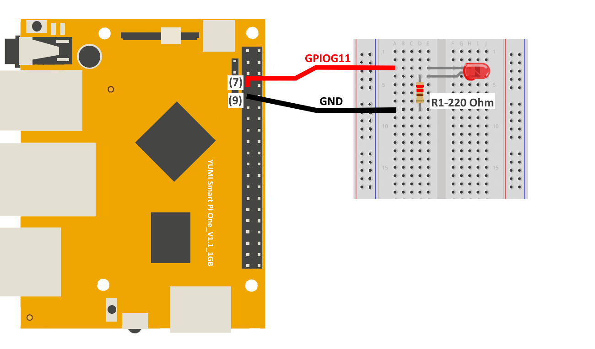

# Controlling an LED via GPIO on Smart Pi One

This page describes how to control an LED using GPIO on the Smart Pi One, with detailed steps, wiring instructions, a wiring diagram, and code examples in both Python and C.


## Required Materials

- Smart Pi One
- LED (with resistoraround 220Ω to 1kΩ if necessary)
- Connecting wires
- Breadboard (optional for easier connections)

## Wiring Diagram

Below is the wiring diagram for connecting an LED to GPIO on the Smart Pi One:





### Connecting the LED

1. **Connect the LED:**
   - Connect the longer leg of the LED (**anode**) to GPIO (**GPIO7**).
   - Connect the shorter leg of the LED (**cathode**) to ground (**GND**).
   - If necessary, place a resistor in series with the LED to limit the current (**typically around 220Ω to 1kΩ**).

## Turning on an LED via Command Line (CLI)

### Step 1: Turn on the LED

To turn on the LED on GPIO 7:

```bash
gpio -g mode 7 out
gpio -g write 7 1
```

### Step 2: Turn off the LED

To turn off the LED:

```bash
gpio -g write 7 0
```

## Using Python

### Prerequisites: Configuration of smartpi-gpio

To install **SmartPi-GPIO** on your Smart Pi One, follow these steps:

1. **Update system**:
   ```bash
   sudo apt update 
   sudo apt-get install -y python3-dev python3-pip libjpeg-dev zlib1g-dev libtiff-dev
   sudo mv /usr/lib/python3.11/EXTERNALLY-MANAGED /usr/lib/python3.11/EXTERNALLY-MANAGED.old

2. **Clone the repository**:
   ```bash
   git clone https://github.com/ADNroboticsfr/smartpi-gpio.git
   cd smartpi-gpio

3. **Install the library**:
   ```bash
   sudo python3 setup.py sdist bdist_wheel
   sudo pip3 install dist/smartpi_gpio-1.0.0-py3-none-any.whl


4. **Activate GPIO interfaces**:
   ```bash
   sudo activate_interfaces.sh
    pip install smartpi-gpio
    ```

## Creating the Python Script

1. Open a terminal on your Smart Pi One.
2. Create a new Python file using `nano`:

   ```bash
   nano led_control.py
   ```

3. Copy and paste the following Python code into the file:

   ```python
   import time
   from smartpi_gpio import GPIO

   # Initialize GPIO
   gpio = GPIO()

   # Set GPIO7 as output for the LED
   gpio.setup(7, gpio.OUT)

   try:
       while True:
           # Turn on the LED
           gpio.output(7, gpio.HIGH)
           print("LED is ON")
           time.sleep(2)  # Keep it on for 2 seconds
           
           # Turn off the LED
           gpio.output(7, gpio.LOW)
           print("LED is OFF")
           time.sleep(2)  # Keep it off for 2 seconds
   except KeyboardInterrupt:
       pass
   finally:
       gpio.cleanup()  # Clean up GPIO
   ```

4. Save the file by pressing `CTRL + X`, then `Y`, and finally `Enter`.

## Running the Python Script

To run the Python script, use the following command:

```bash
sudo python3 led_control.py
```

## Using a C Program

### Creating the C Program

1. Open a terminal on your Smart Pi One.
2. Create a new C file using `nano`:

   ```bash
   nano led_control.c
   ```

3. Copy and paste the following C code into the file:

   ```c
   #include <stdio.h>
   #include <stdlib.h>
   #include <unistd.h>
   #include "smartpi_gpio.h"

   int main() {
       // Initialize GPIO
       smartpi_gpio_init();
       
       // Set GPIO7 as output for the LED
       smartpi_gpio_set_mode(7, OUTPUT);
       
       while (1) {
           // Turn on the LED
           smartpi_gpio_write(7, HIGH);
           printf("LED is ON\n");
           sleep(2);  // Keep it on for 2 seconds
           
           // Turn off the LED
           smartpi_gpio_write(7, LOW);
           printf("LED is OFF\n");
           sleep(2);  // Keep it off for 2 seconds
       }

       // Release GPIO resources (this will never be reached)
       smartpi_gpio_cleanup();
       return 0;
   }
   ```

4. Save the file by pressing `CTRL + X`, then `Y`, and finally `Enter`.

## Compiling and Running the C Program

To compile and run the C program, use the following commands:

```bash
gcc -o led_control led_control.c -I/path/to/smartpi_gpio/include -L/path/to/smartpi_gpio/lib -lsmartpi_gpio
sudo ./led_control
```

