# How to Test the MPU-6050 and ADXL345 Sensors on Smart Pi One (Python and C)

This guide explains how to connect and test the **MPU-6050** and **ADXL345** sensors with the **Smart Pi One** board, using both Python (`smartpi-mpu6050` package) and C. It also covers how to detect the sensors via I2C.

## General Prerequisites

### Hardware
- **Smart Pi One** board
- Jumper wires for connections
- **MPU-6050** sensor and/or **ADXL345** sensor

### Software
- Python 3.6 or higher
- `smartpi-mpu6050` Python package
- I2C enabled on the Smart Pi One
- `python3-smbus` installed (system library for I2C communication)
- `libi2c-dev` package for C development


## How to Test the MPU-6050 Sensor

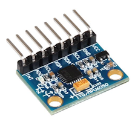

### Wiring Diagram

To connect the MPU-6050 sensor to the Smart Pi One, follow this wiring setup:

| MPU-6050 Pin | Smart Pi One Pin     | Description  |
|--------------|----------------------|--------------|
| VCC          | (1) 3.3V             | Power        |
| GND          | (6) GND              | Ground       |
| SCL          | (27) SCL (I2C1 Clock)| I2C Clock    |
| SDA          | (28) SDA (I2C1 Data) | I2C Data     |

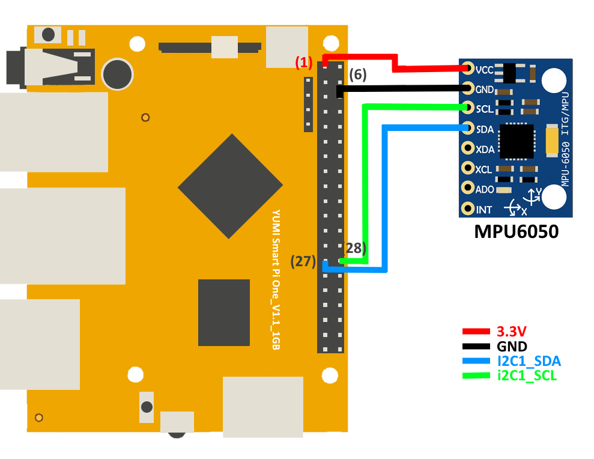

### 1. Detecting the MPU-6050 Using I2C

Before you begin programming, verify that the MPU-6050 sensor is connected correctly and can be detected via I2C. Run the following steps:

1. Open Armbian-Config via an SSH interface or a terminal window:

    ```bash
    sudo armbian-config
    ```

2. Choose **System**:

    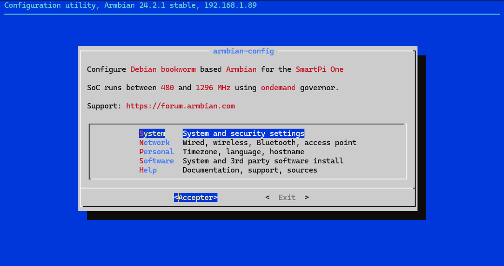

3. Select **Hardware**:

    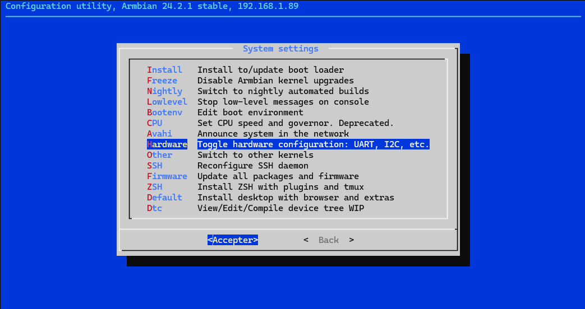

4. Enable **i2c1**, then **Save** and **Back**:

    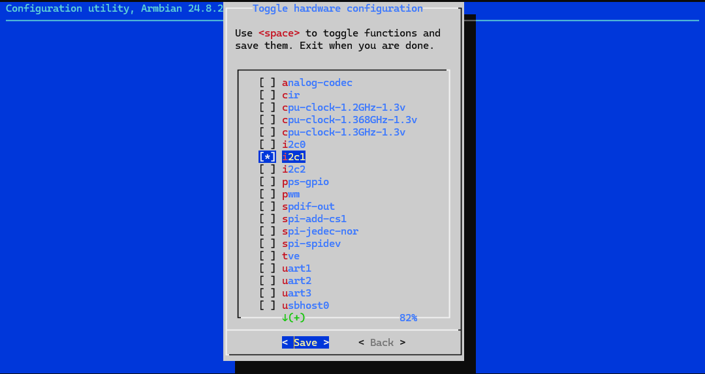

5. To finish, **Reboot** to apply the changes:

    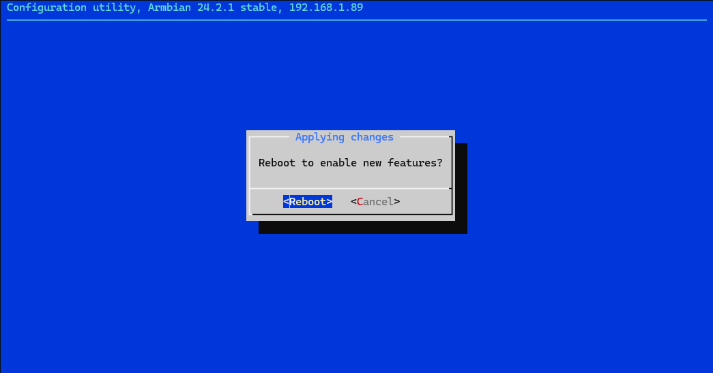

6. Check for sensor detection:
   ```bash
   sudo i2cdetect -y 1
   ```
   You should see the MPU-6050 detected at address `0x68`.

   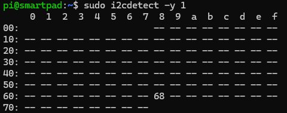

### 2. Using Python to Read MPU-6050 Data

### Prerequisites

Install the required system library for I2C communication:

```bash
sudo apt-get update
sudo apt-get install python3-smbus
```

Install the Python package:

```bash
sudo pip3 install smartpi-mpu6050
```

#### Python Script for Testing MPU-6050:

```python
from smartpi_mpu6050.mpu6050 import MPU6050

mpu = MPU6050(0x68)

temp = mpu.get_temp()
print(f"Temperature: {temp:.2f} °C")

accel_data = mpu.get_accel_data()
print(f"Accelerometer: X={accel_data['x']:.2f} m/s^2, Y={accel_data['y']:.2f} m/s^2, Z={accel_data['z']:.2f} m/s^2")

gyro_data = mpu.get_gyro_data()
print(f"Gyroscope: X={gyro_data['x']:.2f} °/s, Y={gyro_data['y']:.2f} °/s, Z={gyro_data['z']:.2f} °/s")
```

### Creating and Running the Script

1. Create a new Python file `test_mpu6050.py` and paste the code above.

    ```bash
    nano test_mpu6050.py
    ```
    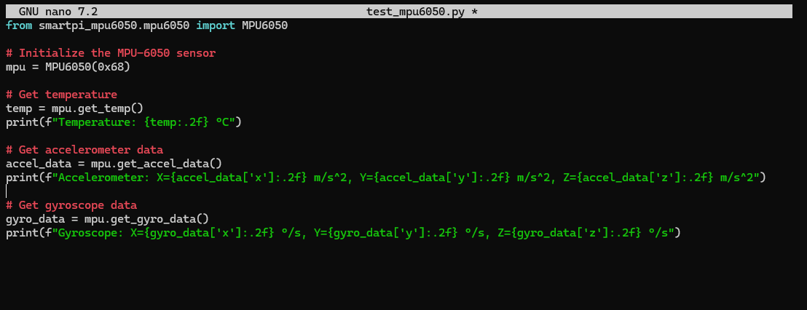

2. Save the script, then run it with the necessary permissions (you may need to use sudo):

    ```bash
    sudo python3 test_mpu6050.py
    ```

    You should see output showing the temperature, accelerometer, and gyroscope data.

    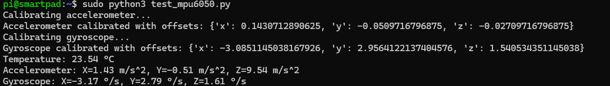

### 3. Using a C Program to Read MPU-6050 Data

### Prerequisites

Before compiling the C program, install the required I2C development package:

```bash
sudo apt-get install libi2c-dev
```

### Example C Program

Here’s the updated C program that includes the necessary headers for SMBus communication:

```c
#include <stdio.h>
#include <linux/i2c-dev.h>
#include <i2c/smbus.h>  // Include this header for SMBus functions
#include <sys/ioctl.h>
#include <fcntl.h>
#include <unistd.h>

#define MPU6050_ADDR 0x68
#define PWR_MGMT_1   0x6B
#define ACCEL_XOUT0  0x3B
#define TEMP_OUT0    0x41

int read_word_2c(int fd, int reg) {
    int high = i2c_smbus_read_byte_data(fd, reg);
    int low = i2c_smbus_read_byte_data(fd, reg + 1);
    int val = (high << 8) + low;
    if (val >= 0x8000) {
        val = -(65535 - val + 1);
    }
    return val;
}

int main() {
    int fd;
    char *filename = (char*)"/dev/i2c-1";

    if ((fd = open(filename, O_RDWR)) < 0) {
        printf("Failed to open the i2c bus\n");
        return 1;
    }

    if (ioctl(fd, I2C_SLAVE, MPU6050_ADDR) < 0) {
        printf("Failed to acquire bus access and/or talk to slave\n");
        return 1;
    }

    // Wake up the MPU-6050
    i2c_smbus_write_byte_data(fd, PWR_MGMT_1, 0x00);

    // Read accelerometer data
    int accel_x = read_word_2c(fd, ACCEL_XOUT0);
    int accel_y = read_word_2c(fd, ACCEL_XOUT0 + 2);
    int accel_z = read_word_2c(fd, ACCEL_XOUT0 + 4);

    // Read temperature data
    int temp_raw = read_word_2c(fd, TEMP_OUT0);
    float temp = (temp_raw / 340.0) + 36.53;

    printf("Temperature: %.2f C\n", temp);
    printf("Accelerometer: X=%d Y=%d Z=%d\n", accel_x, accel_y, accel_z);

    close(fd);
    return 0;
}
```

### Compile and Run the Program

1. Open a text editor to create the C file:

    ```bash
    nano test_mpu6050.c
    ```

2. Save the C program, then compile it using gcc:

    ```bash
    gcc -o test_mpu6050 test_mpu6050.c -li2c
    ```

3. Run the program:

    ```bash
    ./test_mpu6050
    ```

    You should see the temperature and accelerometer data printed to the terminal.

    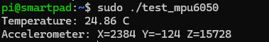

## How to Test the ADXL345 Sensor

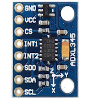

### Wiring Diagram

To connect the ADXL345 sensor to the Smart Pi One, follow this wiring setup:

| ADXL345 Pin | Smart Pi One Pin     | Description  |
|--------------|----------------------|--------------|
| VCC          | (1) 3.3V             | Power        |
| GND          | (6) GND              | Ground       |
| SCL          | (27) SCL (I2C1 Clock)| I2C Clock    |
| SDA          | (28) SDA (I2C1 Data) | I2C Data     |

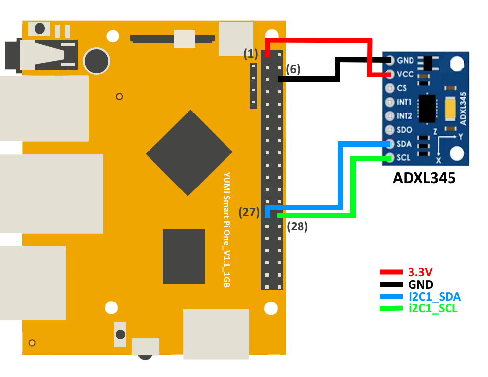

### 1. Detecting the ADXL345 Using I2C

Follow the same steps as for the MPU-6050 sensor to enable and check I2C detection. The ADXL345 sensor should appear at address `0x53` when running `i2cdetect -y 1`.

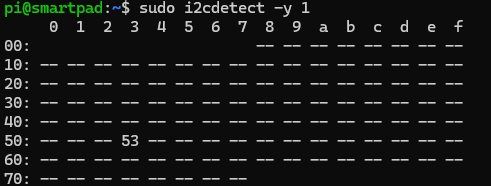

### 2. Using Python to Read ADXL345 Data

The installation process for the `smartpi-mpu6050` library remains the same. After installation, use the following script:

#### Python Script for Testing ADXL345:

```python
from smartpi_mpu6050.mpu6050 import MPU6050

mpu = MPU6050(0x53)

temp = mpu.get_temp()
print(f"Temperature: {temp:.2f} °C")

accel_data = mpu.get_accel_data()
print(f"Accelerometer: X={accel_data['x']:.2f} m/s^2, Y={accel_data['y']:.2f} m/s^2, Z={accel_data['z']:.2f} m/s^2")

gyro_data = mpu.get_gyro_data()
print(f"Gyroscope: X={gyro_data['x']:.2f} °/s, Y={gyro_data['y']:.2f} °/s, Z={gyro_data['z']:.2f} °/s")
```

### Creating and Running the Script

1. Create a new Python file `test_adxl345.py` and paste the code above.

```bash
nano test_adxl345.py
```


2. Save the script, then run it with the necessary permissions (you may need to use sudo):

```bash
sudo python3 test_adxl345.py
```

You should see output showing the temperature, accelerometer, and gyroscope data.


## 3. Using a C Program to Read ADXL345 Data

### Prerequisites

Before compiling the C program, install the required I2C development package:

```bash
sudo apt-get install libi2c-dev
```

### Example C Program

Here’s the updated C program that includes the necessary headers for SMBus communication:

```c
#include <stdio.h>
#include <linux/i2c-dev.h>
#include <i2c/smbus.h>  // Include this header for SMBus functions
#include <sys/ioctl.h>
#include <fcntl.h>
#include <unistd.h>

#define MPU6050_ADDR 0x53
#define PWR_MGMT_1   0x6B
#define ACCEL_XOUT0  0x3B
#define TEMP_OUT0    0x41

int read_word_2c(int fd, int reg) {
    int high = i2c_smbus_read_byte_data(fd, reg);
    int low = i2c_smbus_read_byte_data(fd, reg + 1);
    int val = (high << 8) + low;
    if (val >= 0x8000) {
        val = -(65535 - val + 1);
    }
    return val;
}

int main() {
    int fd;
    char *filename = (char*)"/dev/i2c-1";

    if ((fd = open(filename, O_RDWR)) < 0) {
        printf("Failed to open the i2c bus\n");
        return 1;
    }

    if (ioctl(fd, I2C_SLAVE, MPU6050_ADDR) < 0) {
        printf("Failed to acquire bus access and/or talk to slave\n");
        return 1;
    }

    // Wake up the ADXL345
    i2c_smbus_write_byte_data(fd, PWR_MGMT_1, 0x00);

    // Read accelerometer data
    int accel_x = read_word_2c(fd, ACCEL_XOUT0);
    int accel_y = read_word_2c(fd, ACCEL_XOUT0 + 2);
    int accel_z = read_word_2c(fd, ACCEL_XOUT0 + 4);

    // Read temperature data
    int temp_raw = read_word_2c(fd, TEMP_OUT0);
    float temp = (temp_raw / 340.0) + 36.53;

    printf("Temperature: %.2f C\n", temp);
    printf("Accelerometer: X=%d Y=%d Z=%d\n", accel_x, accel_y, accel_z);

    close(fd);
    return 0;
}
```

### Compile and Run the Program

1. Open a text editor to create the C file:

```bash
nano test_adxl345.c
```

2. Save the C program, then compile it using gcc:

```bash
gcc -o test_adxl345 test_adxl345.c -li2c
```

3. Run the program:

```bash
./test_adxl345
```

You should see the temperature and accelerometer data printed to the terminal.


