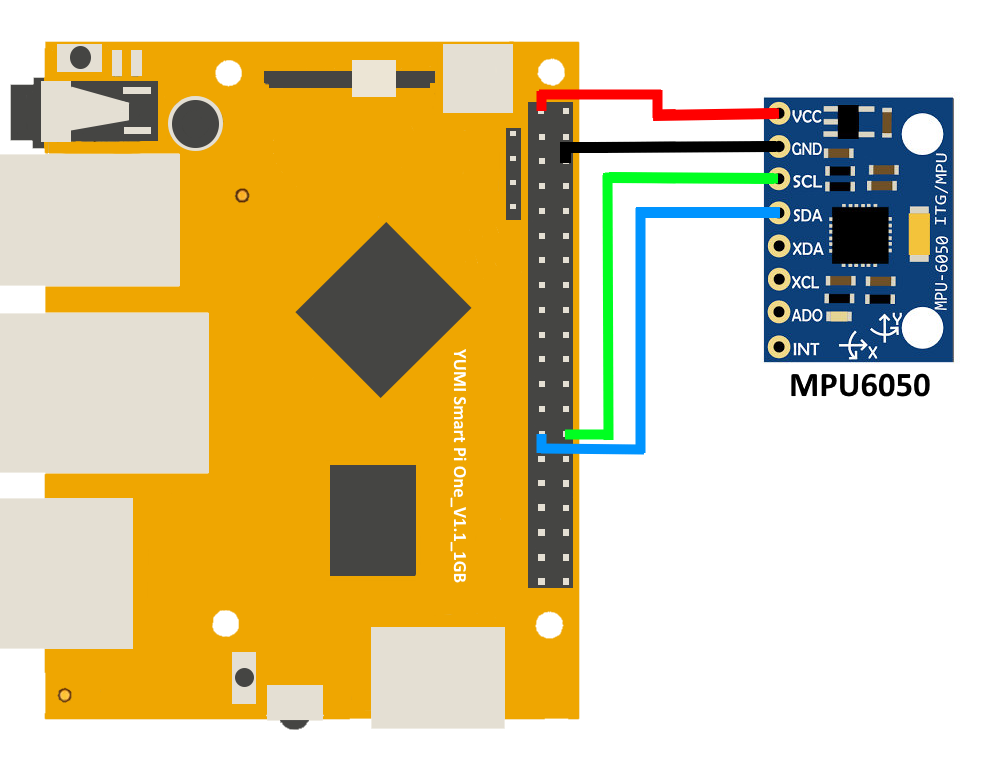
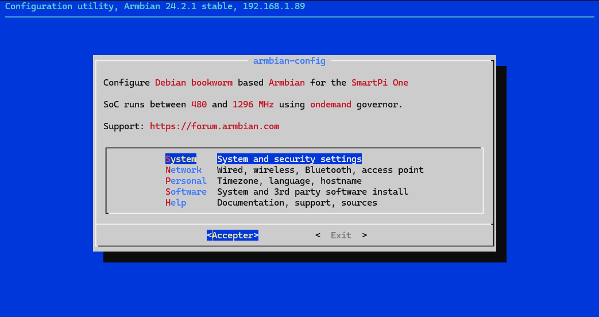
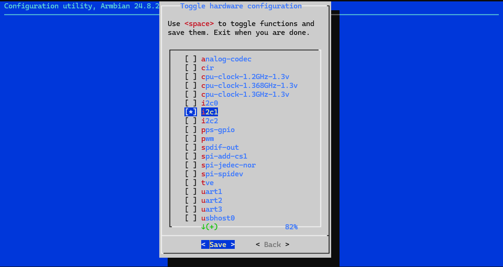

# How to Test the MPU-6050 Sensor on Smart Pi One (Python and C)

This guide explains how to connect and test the **MPU-6050** accelerometer and gyroscope sensor with the **Smart Pi One** board using both Python (`smartpi-mpu6050` package) and C. It also covers how to detect the sensor via I2C.


The **MPU-6050** is a 6-axis motion tracking device that provides accelerometer and gyroscope data, making it useful for projects requiring motion sensing, orientation detection, and balance control.

You will learn how to:
- Connect the MPU-6050 sensor to the Smart Pi One.
- Detect the MPU-6050 via I2C.
- Install and use the Python library `smartpi-mpu6050`.
- Test the sensor and retrieve data using Python and C.

## Prerequisites

### Hardware
- Smart Pi One board (Yumi)
- MPU-6050 sensor
- Jumper wires for connections


### Software
- Python 3.6 or higher
- `smartpi-mpu6050` Python package
- I2C enabled on Smart Pi One
- `python3-smbus` installed (system library for I2C communication)
- `libi2c-dev` package for C development

## Wiring Diagram

To connect the MPU-6050 sensor to the Smart Pi One, follow this wiring setup:

| MPU-6050 Pin | Smart Pi One Pin | Description  |
|--------------|------------------|--------------|
| VCC          |(1) 3.3V             | Power        |
| GND          |(6) GND              | Ground       |
| SCL          |(27) SCL (I2C1 Clock)  | I2C Clock    |
| SDA          |(28) SDA (I2C1 Data)   | I2C Data     |



## Detecting the MPU-6050 Using I2C

Before you begin programming, you need to verify that the MPU-6050 sensor is connected correctly and can be detected via I2C.

### Enable I2C on the Smart Pi One

1. Open Armbian-Config via an SSH interface or a terminal window:

```bash
sudo armbian-config
```

2. Choose **`System`**:



3. Select **`Hardware`**:



4. Then **`i2c1`**, **`Save`** and **`Back`**:


5. To finish: **`Reboot`** to apply the changes:


After enabling I2C, you can use the i2cdetect command to check if the sensor is connected and detect its address. Run the following command:

```bash
sudo i2cdetect -y 1
```

You should see an output similar to this:


In this case, the MPU-6050 is detected at address 0x68. This confirms that the sensor is correctly connected and ready for use.

## Using Python to Read MPU-6050 Data

Before starting, make sure the I2C interface is enabled on your Smart Pi One as explained above.

### Prerequisites
Install the required system library for I2C communication:

```bash
sudo apt-get update
sudo apt-get install python3-smbus
```

```bash
sudo pip3 install smartpi-mpu6050
```

## Running the Test 

After the installation, you can use the following Python script to test your MPU-6050 sensor. This script will print the temperature, accelerometer, and gyroscope data from the sensor.

### Example Python Script

Here’s a complete script to MPU6050 events from the sensor:

```python
from smartpi_mpu6050.mpu6050 import MPU6050

# Initialize the MPU-6050 sensor
mpu = MPU6050(0x68)

# Get temperature
temp = mpu.get_temp()
print(f"Temperature: {temp:.2f} °C")

# Get accelerometer data
accel_data = mpu.get_accel_data()
print(f"Accelerometer: X={accel_data['x']:.2f} m/s^2, Y={accel_data['y']:.2f} m/s^2, Z={accel_data['z']:.2f} m/s^2")

# Get gyroscope data
gyro_data = mpu.get_gyro_data()
print(f"Gyroscope: X={gyro_data['x']:.2f} °/s, Y={gyro_data['y']:.2f} °/s, Z={gyro_data['z']:.2f} °/s")
```

# Creating and Running the Script

1. Create a new Python file test_mpu6050.py and paste the code above.

```bash
nano test_mpu6050.py
```

2.Paste the script into the file and save it.

3. Execute the script with the necessary permissions (you may need to use sudo):

```bash
sudo python3 test_mpu6050.py
```

3. You should see output showing the temperature, accelerometer, and gyroscope data.

## Using a C Program to Read MPU-6050 Data

### Example C Program

```c
#include <stdio.h>
#include <linux/i2c-dev.h>
#include <sys/ioctl.h>
#include <fcntl.h>
#include <unistd.h>

#define MPU6050_ADDR 0x68
#define PWR_MGMT_1   0x6B
#define ACCEL_XOUT0  0x3B
#define TEMP_OUT0    0x41

int read_word_2c(int fd, int reg) {
    int high = i2c_smbus_read_byte_data(fd, reg);
    int low = i2c_smbus_read_byte_data(fd, reg + 1);
    int val = (high << 8) + low;
    if (val >= 0x8000) {
        val = -(65535 - val + 1);
    }
    return val;
}

int main() {
    int fd;
    char *filename = (char*)"/dev/i2c-1";

    if ((fd = open(filename, O_RDWR)) < 0) {
        printf("Failed to open the i2c bus\n");
        return 1;
    }

    if (ioctl(fd, I2C_SLAVE, MPU6050_ADDR) < 0) {
        printf("Failed to acquire bus access and/or talk to slave\n");
        return 1;
    }

    // Wake up the MPU-6050
    i2c_smbus_write_byte_data(fd, PWR_MGMT_1, 0x00);

    // Read accelerometer data
    int accel_x = read_word_2c(fd, ACCEL_XOUT0);
    int accel_y = read_word_2c(fd, ACCEL_XOUT0 + 2);
    int accel_z = read_word_2c(fd, ACCEL_XOUT0 + 4);

    // Read temperature data
    int temp_raw = read_word_2c(fd, TEMP_OUT0);
    float temp = (temp_raw / 340.0) + 36.53;

    printf("Temperature: %.2f C\n", temp);
    printf("Accelerometer: X=%d Y=%d Z=%d\n", accel_x, accel_y, accel_z);

    close(fd);
    return 0;
}
```

## Compile and Run the Program

1. Open a text editor, such as nano, to create the C file:

```bash
nano test_mpu6050.c

```

2. Paste the C program into the file and save it.

3. Compile the C program using gcc:

```bash
gcc -o test_mpu6050 test_mpu6050.c -li2c

```

4. Run the program:

```bash
./test_mpu6050

```

You should see the temperature and accelerometer data printed to the terminal.


## Troubleshooting

### Common Issues:

1. **I2C Device Not Detected**
   - Ensure I2C is enabled on the Smart Pi One using `sudo armbian-config`.
   - Verify the connections of the SDA and SCL pins.
   - Use the following command to check if the MPU-6050 is detected:
     ```bash
     sudo i2cdetect -y 1
     ```
   - You should see the address `0x68` in the output.

2. **No Data from Sensor**
   - Ensure the correct I2C address (`0x68`) is being used in the code.
   - Check power and ground connections.

3. **Library Installation Issues**
   - Ensure that `python3-smbus` or `libi2c-dev` is installed, depending on the language you're using.
