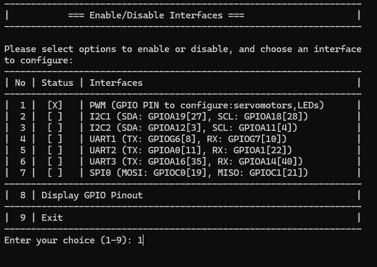

# Photoresistor with Smart Pi One

In this guide, we will demonstrate how to read values from a photoresistor connected to the **Smart Pi One**, using the **SmartPi-GPIO** library.


We will cover the following methods:
- **CLI commands**
- **Python script**
- **C program**

## Required Materials

- Smart Pi One
- Photoresistor
- Resistor (typically 10kΩ for voltage divider)
- Connecting wires
- Breadboard (optional for easier connections)

## Prerequisites: Configuration of smartpi-gpio

To install **SmartPi-GPIO** on your Smart Pi One, follow these steps:

1. **Update system**:
   ```bash
   sudo apt update 
   sudo apt-get install -y python3-dev python3-pip libjpeg-dev zlib1g-dev libtiff-dev
   sudo mv /usr/lib/python3.11/EXTERNALLY-MANAGED /usr/lib/python3.11/EXTERNALLY-MANAGED.old
   ```

2. **Clone the repository**:
   ```bash
   git clone https://github.com/ADNroboticsfr/smartpi-gpio.git
   cd smartpi-gpio
   ```

3. **Install the library**:
   ```bash
   sudo python3 setup.py sdist bdist_wheel
   sudo pip3 install dist/smartpi_gpio-1.0.0-py3-none-any.whl
   ```

4. **Activate GPIO interfaces**:
   ```bash
   sudo activate_interfaces.sh
   ``` 

   

### Wiring Diagram

The photoresistor is connected to **3.3V (Pin 1)**. The GND connected to **Ground (Pin 6)**. The Photoresistor Input is connected to **GPIOG11 (Pin 7)**, which will be used to read the voltage.

| **Pin Number** | **Pin Name**          | **Function**           |
|----------------|-----------------------|------------------------|
| 1              | 3.3V                  | Power Supply            |
| 7            | GPIOG11               | Photoresistor Input     |
| 6              | GND                   | Ground                  |


## Reading Values via CLI

You can read values from the photoresistor using CLI.

### Steps:

1. **Configure the pin for analog reading** (if necessary, depending on your configuration):
   ```bash
   sudo gpio 12 mode in
   ```

2. **Read the value from the photoresistor**:
   ```bash
   sudo gpio read 12
   ```

3. **Example to continuously read and display values**:
   Use a loop to read the photoresistor status and print its value:
   ```bash
   while true; do
     value=$(sudo gpio read 12)
     echo "Photoresistor Value: $value"
     sleep 1
   done
   ```

This will print the current value read from the photoresistor every second.

## Using Python

## Reading Values with Python

With **SmartPi-GPIO** and Python, you can write a simple script to read the value from the photoresistor.

### Steps:

1. **Create a Python file**:
   ```bash
   nano photoresistor_read.py
   ```

2. **Write the following code**:

   ```python
   from smartpi_gpio.gpio import GPIO
   import time

   # Initialize GPIO instance
   gpio = GPIO()

   # GPIO pin number for the photoresistor (GPIOA0)
   photoresistor_pin = 12

   # Configure the pin as input
   gpio.set_direction(photoresistor_pin, "in")

   print("Reading values from the photoresistor...")

   while True:
       # Read the value from the photoresistor
       value = gpio.read(photoresistor_pin)
       print(f"Photoresistor Value: {value}")
       time.sleep(1)  # Read every second
   ```

3. **Save and exit** (`CTRL+X`, `Y`, and `Enter`).

4. **Run the Python script**:
   ```bash
   python3 photoresistor_read.py
   ```

This will continuously print the current value read from the photoresistor every second.
