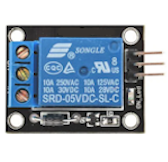
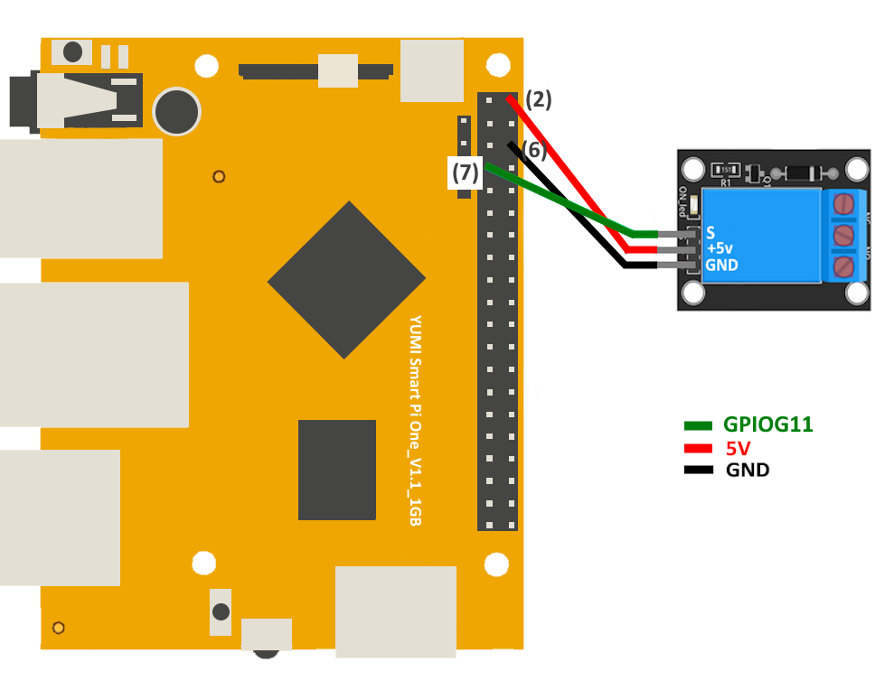

# Activating a Relay on Smart Pi One

This page describes how to activate a relay using the Smart Pi One, with detailed steps, wiring instructions, and code examples in both Python and C.




## Required Materials

- Smart Pi One
- Relay module (with optoisolator recommended)
- Connecting wires
- Breadboard (optional for easier connections)

## Wiring Diagram

Below is a sample wiring diagram for connecting a relay module to the Smart Pi One:



### Connecting the Relay

1. **Connect the Relay:**
   - Connect the input pin of the relay module (IN) to a GPIO pin on the Smart Pi One (**GPIO7**/**PIN: 7**).
   - Connect the VCC pin of the relay module to the (**5V**/**PIN:2**) on the Smart Pi One.
   - Connect the GND pin of the relay module to the ground (**GND**/**PIN:3**) pin on the Smart Pi One.

2. **Connect the Load:**
   - Connect the device you want to control (e.g., a lamp) to the relay's output terminals. Ensure proper electrical connections are made according to the relay's specifications.

## Turning on a RELAY via Command Line (CLI)

### Step 1: Turn on the LED

To turn on the LED on GPIO 7:

```bash
gpio -g mode 7 out
gpio -g write 7 1
```

### Step 2: Turn off the LED

To turn off the LED:

```bash
gpio -g write 7 0
```

## Using Python

### Prerequisites: Configuration of smartpi-gpio

To install **SmartPi-GPIO** on your Smart Pi One, follow these steps:

1. **Update system**:
   ```bash
   sudo apt update 
   sudo apt-get install -y python3-dev python3-pip libjpeg-dev zlib1g-dev libtiff-dev
   sudo mv /usr/lib/python3.11/EXTERNALLY-MANAGED /usr/lib/python3.11/EXTERNALLY-MANAGED.old

2. **Clone the repository**:
   ```bash
   git clone https://github.com/ADNroboticsfr/smartpi-gpio.git
   cd smartpi-gpio

3. **Install the library**:
   ```bash
   sudo python3 setup.py sdist bdist_wheel
   sudo pip3 install dist/smartpi_gpio-1.0.0-py3-none-any.whl


4. **Activate GPIO interfaces**:
   ```bash
   sudo activate_interfaces.sh
    pip install smartpi-gpio
    ```

## Creating the Python Script

1. Open a terminal on your Smart Pi One.
2. Create a new Python file using `nano`:

   ```bash
   nano relay_control.py
   ```

3. Copy and paste the following Python code into the file:

   ```python
   import time
   from smartpi_gpio import GPIO

   # Initialize GPIO
   gpio = GPIO()

   # Set GPIO7 as output for the relay
   gpio.setup(7, gpio.OUT)

   try:
       while True:
           # Activate the relay (turn on)
           gpio.output(7, gpio.HIGH)
           print("Relay is ON")
           time.sleep(2)  # Keep it on for 2 seconds
           
           # Deactivate the relay (turn off)
           gpio.output(7, gpio.LOW)
           print("Relay is OFF")
           time.sleep(2)  # Keep it off for 2 seconds
   except KeyboardInterrupt:
       pass
   finally:
       gpio.cleanup()  # Clean up GPIO
   ```

4. Save the file by pressing `CTRL + X`, then `Y`, and finally `Enter`.

## Running the Python Script

To run the Python script, use the following command:

```bash
python3 relay_control.py
```

## Using a C Program

### Creating the C Program

1. Open a terminal on your Smart Pi One.
2. Create a new C file using `nano`:

   ```bash
   nano relay_control.c
   ```

3. Copy and paste the following C code into the file:

   ```c
   #include <stdio.h>
   #include <stdlib.h>
   #include <unistd.h>
   #include "smartpi_gpio.h"

   int main() {
       // Initialize GPIO
       smartpi_gpio_init();
       
       // Set GPIO7 as output for the relay
       smartpi_gpio_set_mode(7, OUTPUT);
       
       while (1) {
           // Activate the relay (turn on)
           smartpi_gpio_write(7, HIGH);
           printf("Relay is ON\n");
           sleep(2);  // Keep it on for 2 seconds
           
           // Deactivate the relay (turn off)
           smartpi_gpio_write(7, LOW);
           printf("Relay is OFF\n");
           sleep(2);  // Keep it off for 2 seconds
       }

       // Release GPIO resources (this will never be reached)
       smartpi_gpio_cleanup();
       return 0;
   }
   ```

4. Save the file by pressing `CTRL + X`, then `Y`, and finally `Enter`.

## Compiling and Running the C Program

To compile and run the C program, use the following commands:

```bash
gcc -o relay_control relay_control.c -I/path/to/smartpi_gpio/include -L/path/to/smartpi_gpio/lib -lsmartpi_gpio
./relay_control
```
