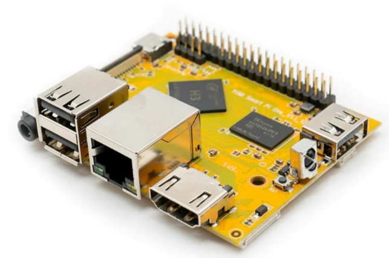

# 1.5 How to connect via SSH on Windows, Mac, and Linux

A detailed guide on how to connect to an Smart Pi One using SSH from a computer running Windows, Linux, or macOS.



## 1.5.1 Windows with PuTTY

**1. Download and Install PuTTY**:
   - Go to the official [PuTTY website](https://www.chiark.greenend.org.uk/~sgtatham/putty/latest.html).
   - Download the appropriate version of PuTTY for your system and install it.

**2. Obtain the IP Address of the Smart Pi One**:
   - Connect your Smart Pi One to the network and find its IP address using your router or a network scanning application like "Advanced IP Scanner".

**3. Launch PuTTY**:
   - Open PuTTY.
   - In the **"Host Name (or IP address)"** field, enter the IP address of your Smart Pi One.
   - Ensure the port is set to **`22`** and the connection type is **SSH**.
   - Click **"Open"**.

   

**4. Connect**:
   - A terminal window will open, prompting you to enter your username (default: **`root`**) and password.

## 1.5.2 Windows Terminal (Command Prompt or PowerShell)

**1. Obtain the IP Address of the Smart Pi One**:
   - Connect your Smart Pi One to the network and find its IP address using your router or a network scanning application like **"Advanced IP Scanner"**.

**2. Open Windows Terminal**:
   - You can use Command Prompt or PowerShell. To open either, press **`Win + X`** and select **"Windows Terminal"** (or open them individually via the Start menu).

**3. Connect via SSH**:
   - In the terminal, type the following command:
     ```powershell
     ssh root@your_smartpione_ip_address
     ```
   - Replace **"your_smartpione_ip_address"** with the actual IP address of your Smart Pi One.
   - Enter the password when prompted.


## 1.5.3 Linux (Terminal)

**1. Obtain the IP Address of the Smart Pi One**:
   - Connect your Smart Pi One to the network and find its IP address using your router or a network scanning application like **"Advanced IP Scanner"**.

**2. Open the Terminal**:
   - On your Linux computer, open the terminal.

**3. Connect via SSH**:
   - Type the following command:
     ```bash
     ssh root@your_smartpione_ip_address
     ```
   - Replace **"your_smartpione_ip_address"** with the actual IP address of your Smart Pi One.
   - Enter the password when prompted.

## 1.5.4 macOS (Terminal)

**1. Obtain the IP Address of the Smart Pi One**:
   - Connect your Smart Pi One to the network and find its IP address using your router or a network scanning application like "Advanced IP Scanner".

**2. Open the Terminal**:
   - On your Mac, open the Terminal application (you can find it in Applications > Utilities).

**3. Connect via SSH**:
   - Type the following command:
     ```bash
     ssh root@your_smartpione_ip_address
     ```
   - Replace **"your_smartpione_ip_address"** with the actual IP address of your Smart Pi One.
   - Enter the password when prompted.

## Troubleshooting Common Issues

- **Connection Refused**: Ensure the SSH service is enabled on your Smart Pi One. You can check this by connecting directly with a monitor and keyboard attached to the Smart Pi One and using the command **`sudo systemctl status ssh`**.
- **Firewall**: Make sure no firewall on your network is blocking port **22**.

