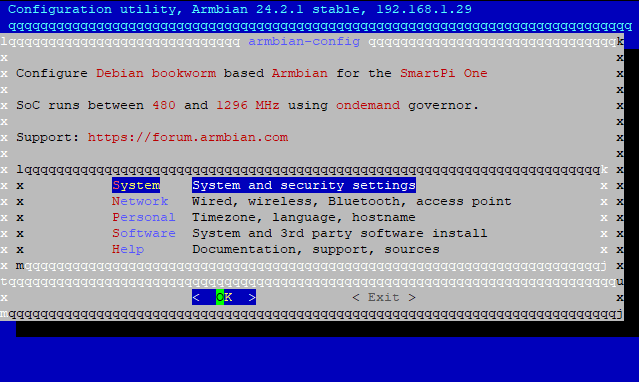
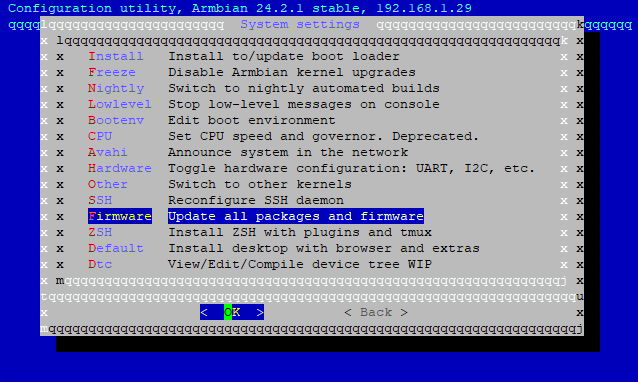
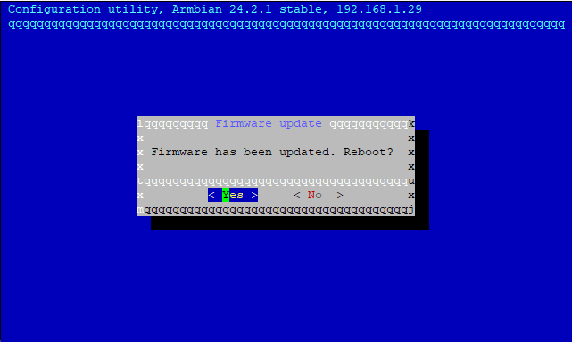
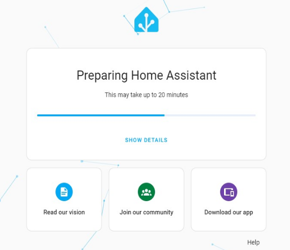
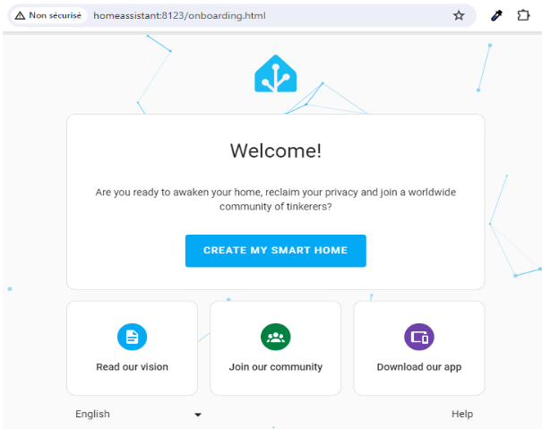

# 2.3 Home Assistant


# Install Home Assistant Supervised on a Smart Pi One

This guide will go over how to install Home Assistant (Supervised) on Debian based Linux Distributions. Remember only the latest version of Debian is supported.

## SD card with the image below

Prebuilt image link for 32GB or more : 

### The default logins are :

Access your account by using the default username **“root”** and **"pi"**, the default password **“pi”**.

# Prerequisites

- Micro SD Card: a 32 GB or bigger card is recommended.

- Installing a smartpi, YUMI SMART PI 1 BOOKWORM SERVER is recommanded.  

- During linux server installation please create user: pi 

Connect to the smartpi via ssh with mobaxterm or putty, for example.

## Update the smartpi

```
sudo apt-get update && sudo apt-get upgrade -y
```

# Firmware Update and restart

Use the **armbian-config** utility to update the firmware:

```
armbian-config
```

In the interactive menu, select **"System"**




And select **"Firmware"**



# Install Home Assistant Supervised

Installed logged in as root.

## Update the OS name
Only Debian is supported by HA supervised, so we need to fake the OS name, otherwise install will fail on check:

In **/etc/os-release** update **ARMBIAN_PRETTY_NAME** by:

```
ARMBIAN_PRETTY_NAME="Debian GNU/Linux 12 (bookworm)
```

## Give a host name if you like
```
hostnamectl set-hostname homeassistant
```

## Configure AppArmor and cgroupv1
I am not going to explain what and why, this has beed discussed here before (see links below).

```
apt install apparmor
echo "extraargs=apparmor=1 security=apparmor systemd.unified_cgroup_hierarchy=false systemd.legacy_systemd_cgroup_controller=false" >> /boot/armbianEnv.txt
update-initramfs -u
reboot
```

## Retropie installation for YUMI Smart Pi One

```
git clone 
cd 
./install.sh

```

## Chose qemuarm


A short while after the installation begins, the Home Assistant web interface will be available at http://homeassistant:8123 or http://IP:8123, where IP is the IP address of your device. I get the “Preparing Home Assistant” screen. 

Wait until the installation is complete



The script will terminate when the installation is complete.

Once its preparation is complete, it will ask you for some settings.




