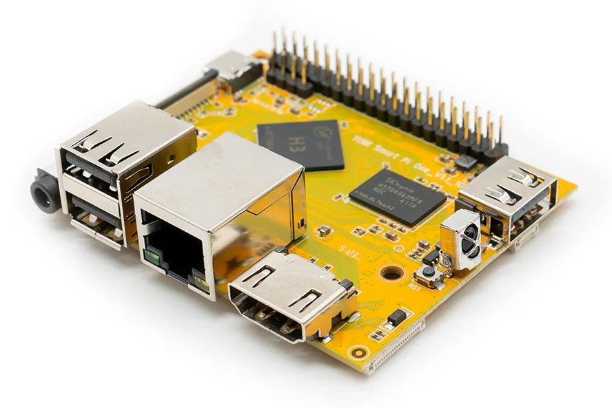

# 1.2 Getting Started with the Smart Pi One



## Introduction
The **Smart Pi One** is a versatile nano-computer designed for various projects, from home automation to retro gaming. This guide will walk you through the initial setup and essential configurations to get you started.

## Specifications
For detailed specifications of the Smart Pi One, visit the [Specifications Page](https://wiki.yumi-lab.com/SmartPI/SmartPi_One_specifications/).

## 1. Required Materials
Before starting, ensure you have the following:

- A **[Smart Pi One board](https://wanhao-europe.com/collections/yumi-smart-pi-nano-computer-diy/products/yumi-smart-pi-one-1g-ddr3-processeur-h3-allwinner)**
- A compatible power adapter (**5V - 2A or Power delivery**)
- A microSD card ([Minimum of 16GB](https://wanhao-europe.com/collections/yumi-smart-pi-nano-computer-diy/products/carte-micro-sd-16go))
- An HDMI cable (for display)
- A USB keyboard and mouse (for initial setup)
- Internet connection (Wi-Fi or Ethernet)

## 2. Modules Complémentaires
While not required for the initial setup, the following accessories can enhance your Smart Pi One experience:

- [Smart LCD Touch 4.3inch](https://wiki.yumi-lab.com/Yumi_Components/SmartLCD_Touch_4.3inch800x480specifications/) (for a touch interface)
- [Smart Hub](https://wiki.yumi-lab.com/Yumi_Components/SmartHub_specifications/) (for enhanced connectivity)
- [Smart Shield](https://wiki.yumi-lab.com/Yumi_Components/SmartShield_specifications/) (for additional functionalities)

## 3. Printable Cases
To protect and enhance your Smart Pi One, you can print cases. Here are some resources where you can find 3D models:

- [Cults3D - Smart Pi Case](https://cults3d.com/fr/recherche?q=boitier+smart+pi)
- [YUMI STL - 3D Printable Accessories and Parts](https://wiki.yumi-lab.com/Yumi_stl/Printable_Accessories_and_Parts/)

## 4. Preparing the microSD Card
1. **Download the Official Linux Server Image** for Smart Pi One from the [Linux Image Page](https://wiki.yumi-lab.com/SmartPI/SmartPi_Linux/).
2. **Flash the Image** onto the microSD card using software like balenaEtcher. Follow the instructions on the [Micro SD Card Flashing Guide](https://wiki.yumi-lab.com/SmartPI/SmartPi_Linux_flash_sd/).


3. Insert the microSD card into the Smart Pi One.

## 5. Connecting the Hardware
1. Connect the Smart Pi One to a monitor using an HDMI cable.
2. Plug in the USB keyboard and mouse.
3. Connect the power adapter to the board.

## 6. Powering On the Board

1. Turn on the power supply. The board should boot automatically.
2. Follow the on-screen instructions to configure the initial settings for both the root and user accounts, which will appear during the first boot.


> **Note**: If the initial setup for configuring the root and user accounts doesn't appear, you may have missed the first boot and initialization phase. In this case, reflash the SD card, and ensure that the screen and HDMI cable are properly connected before powering on the board to avoid missing the first boot process.

---

## 7. Accessing the Board via SSH
The Smart Pi One has SSH enabled by default. To connect remotely:
1. **Find the IP Address** of the Smart Pi One. You can use a network scanner or check your router’s DHCP settings.
2. From another device, open a terminal and type:
   ```bash
   ssh user@ip_address
   ```
   Replace `user` with your username and `ip_address` with the Smart Pi One’s IP address.


For detailed SSH connection instructions for Windows, Mac, and Linux, refer to the [SSH Connection Guide](https://wiki.yumi-lab.com/SmartPI/SmartPi_Connect_Ssh/).

## 8. System Update
After booting, it’s crucial to update the system to ensure you have the latest security patches and features:
```bash
sudo apt update && sudo apt upgrade -y
```


## 9. Initial Configuration
- **Change Password**: For security, change the default password. Follow the instructions in the [Password Change Guide](https://wiki.yumi-lab.com/SmartPI/SmartPi_Change_Password/).
- **Set the Timezone**: Make sure the timezone is set correctly by following the [Timezone Configuration Guide](https://wiki.yumi-lab.com/SmartPI/SmartPi_ConfigureTimeZone/).
- **Connect to Wi-Fi**: If using Wi-Fi, refer to the [Wi-Fi Connection Guide](https://wiki.yumi-lab.com/SmartPI/SmartPi_Connect_Wifi/) to set it up.

## 10. Basic Commands
Familiarize yourself with essential commands to manage your board effectively. Visit the [Basic Commands Page](https://wiki.yumi-lab.com/SmartPI/SmartPi_Basic_Commands/) for useful commands such as shutting down, rebooting, and file management.

## 11. Explore Advanced Projects
Once you are comfortable with the basics, explore advanced projects:

- **Klipper**: [Setup Klipper ](https://wiki.yumi-lab.com/SmartPI/SmartPi_Klipper/)
- **Retro Gaming**: [Install RetroMi (Optimized )](https://wiki.yumi-lab.com/SmartPI/SmartPi_Retro_Gaming/)

- **Home Automation**: [Set up Home Assistant ](https://wiki.yumi-lab.com/SmartPI/SmartPi_Home_Assistant/)
- **Media Storage**: [Configure OpenMediaVault ](https://wiki.yumi-lab.com/SmartPI/SmartPI_OpenMediaVault/)
- **Media Server**: [Set up Plex Server ](https://wiki.yumi-lab.com/SmartPI/SmartPi_Plex_Server/)
