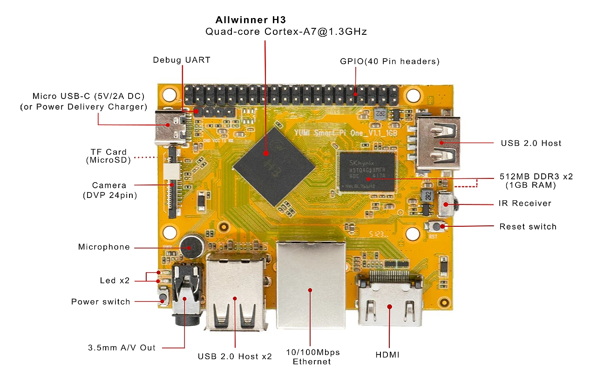
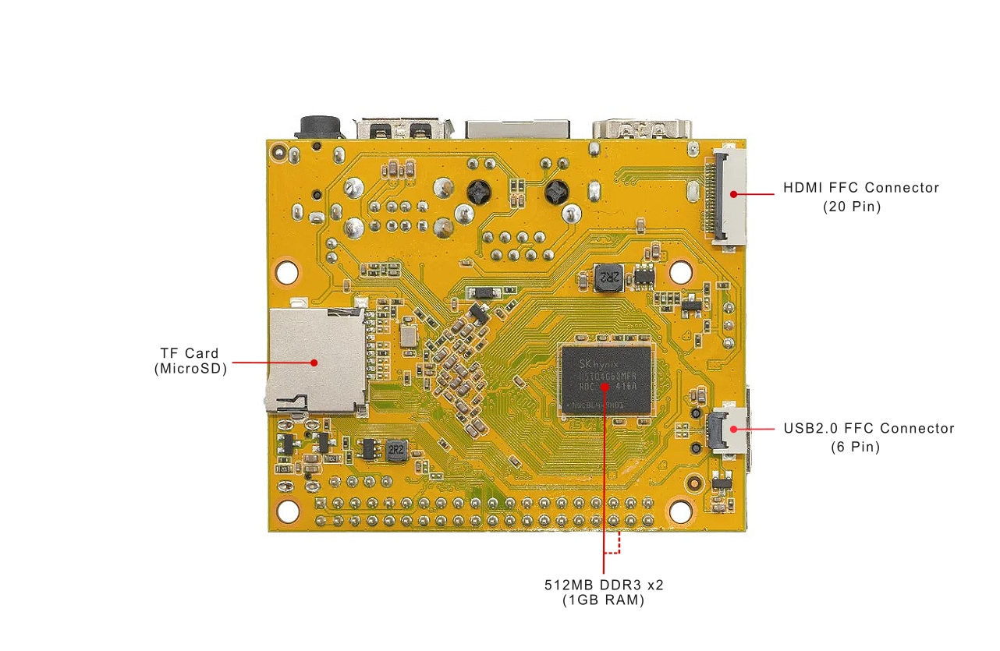
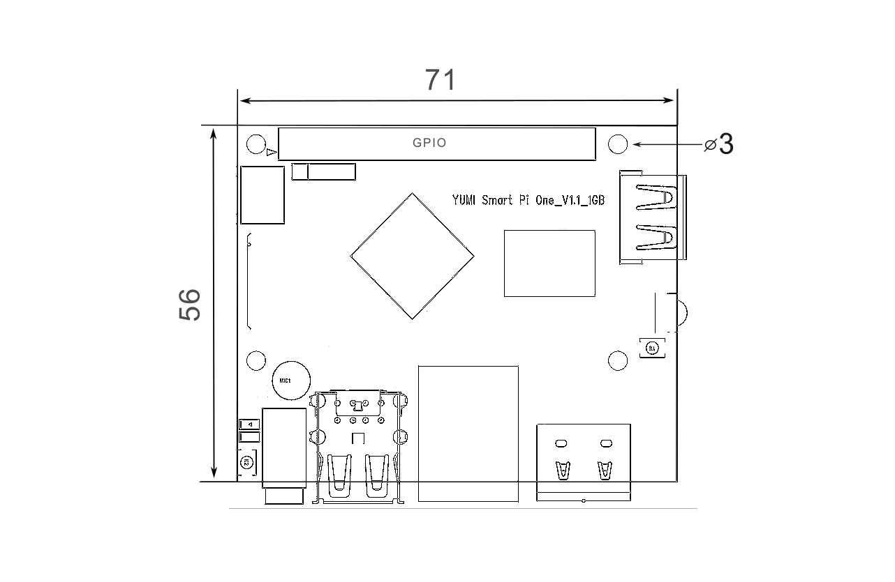

# 1.1 Introduction & Specifications

* The [Smart Pi One](https://wanhao-europe.com/collections/yumi-smart-pi-nano-computer-diy/products/yumi-smart-pi-one-1g-ddr3-processeur-h3-allwinner) uses the Allwinner H3 Soc. It integrates Ethernet, IR receiver, video/audio output and supports HDMI and AVOUT. It can be powered via the MicroUSB port (DC 5V/2A and POWER DELIVERY CHARGER).

* In such a small board it still integrates rich interfaces and ports. HDMI, Ethernet, USB-Host, USB-OTG, DVP camera interface and AVOUT (audio and video) it has an onboard Microphone, IR receiver, a serial debug port and a Raspberry Pi compatible 40 pin GPIO pin header.

## Specifications

* **CPU:** Allwinner H3, Quad-core Cortex-A7-1.3GHz
* **GPU:** Mali400MP2@600MHz，Supports OpenGL ES2.0
* **DDR3 RAM:** 1GB
* **Connectivity:** 10/100M Ethernet
* **Audio:** 3.5mm audio jack/Via HDMI
* **Microphone**: Onboard microphone
* **IR Receiver:** Onboard IR receiver
* **USB Host:** USB 2.0 x 3 Type A
* **MicroSD Slot:** 1
* **MicroUSB:** for data transmission and power input, OTG
* **Video Output:** HDMI 1.4 1080P, CVBS
* **DVP Camera Interface:** 24pin, 0.5mm pitch FPC seat
* **Debug Serial Port:** 4Pin, 2.54mm pitch pin header
* **LED:** Power led & Status led
* **GPIO:** 2.54mm spacing 40pin, compatible with Raspberry Pi's GPIO. It includes UART, SPI, I2C, IO etc
* **User Key:** GPIO Key x 1, Reset x 1
* **PC Size:** 72 mm x 60 mm
* **Power Supply:** DC 5V/2A or  POWER DELIVERY CHARGER 
* **Working Temperature:** -30℃ to 70℃
* **Weight:** 33g
* **OS/Software:** YumiOS, Debian 12(Armbian), Ubuntu(Armbian)

# 1.2 Software Features

* <B>DEBIAN SERVER :</B> [Yumi-smartpi1-bookworm-server-2024-03-02-2050](https://www.dropbox.com/scl/fo/aalul2sy5xriflqh0v038/h/SMART%20PI%20ONE/DEBIAN%2012/Yumi-smartpi1-bookworm-server-2024-03-02-2050.img.xz.zip?rlkey=x6zccvwdrtmwndpmnx9447bpg&dl=0)
* <B>DEBIAN 12 Desktop :</B> [Yumi-smartpi1-bookworm-desktop-2024-03-02-2050](https://www.dropbox.com/scl/fo/aalul2sy5xriflqh0v038/h/SMART%20PI%20ONE/DEBIAN%2012/Yumi-smartpi1-bookworm-desktop-2024-03-02-2050.img.xz.zip?rlkey=x6zccvwdrtmwndpmnx9447bpg&dl=0)
* <B>UBUNTU SERVER :</B> [Yumi-smartpi1-jammy-server-2024-03-02-2050](https://www.dropbox.com/scl/fo/aalul2sy5xriflqh0v038/h/SMART%20PI%20ONE/UBUNTU/Yumi-smartpi1-jammy-server-2024-03-02-2050.img.xz.zip?rlkey=x6zccvwdrtmwndpmnx9447bpg&dl=0)
* <B>YUMIOS </B> : [SMART Pi ONE distribution for managing Klipper 3D printers with Mainsail](https://github.com/Yumi-Lab/YumiOS)

# 1.3 Layout
 
**[Top view]**

 
**[Bottom view]**

# 1.4 Diagram

### <b>GPIO Pin Spec</b>
<dl><dd><dl><dd><table class="wikitable" border="1">

<tr>
<td>Pin# </td>
<td> Name </td>
<td> Linux gpio </td>
<td>Pin#  </td>
<td> Name </td>
<td> Linux gpio
</td></tr>
<tr style="background-color:#F6F8FA">
<td>1    </td>
<td> SYS_3.3V   </td>
<td>     </td>
<td>2     </td>
<td> VDD_5V </td>
<td>
</td></tr>
<tr>
<td>3    </td>
<td> I2C0_SDA/GPIOA12   </td>
<td>     </td>
<td>4     </td>
<td> VDD_5V </td>
<td>
</td></tr>
<tr style="background-color:#F6F8FA">
<td>5    </td>
<td> I2C0_SCL/GPIOA11  </td>
<td>     </td>
<td>6     </td>
<td> GND    </td>
<td>
</td></tr>
<tr>
<td>7    </td>
<td> GPIOG11    </td>
<td> 203 </td>
<td>8     </td>
<td> UART1_TX/GPIOG6 </td>
<td> 198
</td></tr>
<tr style="background-color:#F6F8FA">
<td>9    </td>
<td> GND        </td>
<td>     </td>
<td>10    </td>
<td> UART1_RX/GPIOG7 </td>
<td> 199
</td></tr>
<tr>
<td>11   </td>
<td> UART2_TX/GPIOA0  </td>
<td> 0      </td>
<td>12    </td>
<td> GPIOA6 </td>
<td> 6
</td></tr>
<tr style="background-color:#F6F8FA">
<td>13   </td>
<td> UART2_RTS/GPIOA2 </td>
<td> 2      </td>
<td>14    </td>
<td> GND </td>
<td>
</td></tr>
<tr>
<td>15   </td>
<td> UART2_CTS/GPIOA3 </td>
<td> 3      </td>
<td>16    </td>
<td> UART1_RTS/GPIOG8 </td>
<td> 200
</td></tr>
<tr style="background-color:#F6F8FA">
<td>17   </td>
<td> SYS_3.3V         </td>
<td>        </td>
<td>18    </td>
<td> UART1_CTS/GPIOG9 </td>
<td> 201
</td></tr>
<tr>
<td>19   </td>
<td> SPI0_MOSI/GPIOC0 </td>
<td> 64     </td>
<td>20    </td>
<td> GND              </td>
<td>
</td></tr>
<tr style="background-color:#F6F8FA">
<td>21   </td>
<td> SPI0_MISO/GPIOC1 </td>
<td> 65     </td>
<td>22    </td>
<td> UART2_RX/GPIOA1  </td>
<td> 1
</td></tr>
<tr>
<td>23   </td>
<td> SPI0_CLK/GPIOC2 </td>
<td> 66     </td>
<td>24    </td>
<td> SPI0_CS/GPIOC3   </td>
<td> 67
</td></tr>
<tr style="background-color:#F6F8FA">
<td>25   </td>
<td> GND              </td>
<td>        </td>
<td>26    </td>
<td> SPDIF-OUT/GPIOA17 </td>
<td> 17
</td></tr>
<tr>
<td>27   </td>
<td> I2C1_SDA/GPIOA19/PCM0_CLK/I2S0_BCK </td>
<td> 19     </td>
<td>28    </td>
<td> I2C1_SCL/GPIOA18/PCM0_SYNC/I2S0_LRCK </td>
<td> 18
</td></tr>
<tr style="background-color:#F6F8FA">
<td>29   </td>
<td> GPIOA20/PCM0_DOUT/I2S0_SDOUT          </td>
<td> 20     </td>
<td>30     </td>
<td> GND             </td>
<td>
</td></tr>
<tr>
<td>31   </td>
<td> GPIOA21/PCM0_DIN/I2S0_SDIN         </td>
<td> 21     </td>
<td>32     </td>
<td> GPIOA7          </td>
<td> 7
</td></tr>
<tr style="background-color:#F6F8FA">
<td>33   </td>
<td> GPIOA8           </td>
<td> 8      </td>
<td>34     </td>
<td> GND             </td>
<td>
</td></tr>
<tr>
<td>35   </td>
<td> UART3_CTS/SPI1_MISO/GPIOA16    </td>
<td> 16   </td>
<td>36     </td>
<td> UART3_TX/SPI1_CS/GPIOA13    </td>
<td> 13
</td></tr>
<tr style="background-color:#F6F8FA">
<td>37   </td>
<td> GPIOA9           </td>
<td> 9      </td>
<td>38     </td>
<td> UART3_RTS/SPI1_MOSI/GPIOA15 </td>
<td> 15
</td></tr>
<tr>
<td>39   </td>
<td> GND              </td>
<td>        </td>
<td>40     </td>
<td> UART3_RX/SPI1_CLK/GPIOA14   </td>
<td> 14
</td></tr></table></dd></dl></dd></dl>

### <b>Debug Port（UART0）</b>

<dl><dd><dl><dd><table class="wikitable" border="1">

<tr>
<td>Pin# </td>
<td> Name
</td></tr>
<tr style="background-color:#F6F8FA">
<td>1    </td>
<td> GND
</td></tr>
<tr>
<td>2    </td>
<td> VDD_5V
</td></tr>
<tr style="background-color:#F6F8FA">
<td>3    </td>
<td> UART_TXD0/GPIOA4
</td></tr>
<tr>
<td>4    </td>
<td> UART_RXD0/GPIOA5/PWM0
</td></tr></table></dd></dl></dd></dl>

### <b>DVP Camera IF Pin Spec</b>

<dl><dd><dl><dd><table class="wikitable" border="1">

<tr>
<td>Pin# </td>
<td> Name      </td>
<td> Description
</td></tr>
<tr style="background-color:#F6F8FA">
<td>1, 2 </td>
<td> SYS_3.3V  </td>
<td> 3.3V power output, to camera modules
</td></tr>
<tr>
<td>7,9,13,15,24 </td>
<td> GND </td>
<td> Gound, 0V
</td></tr>
<tr style="background-color:#F6F8FA">
<td>3    </td>
<td> I2C2_SCL </td>
<td> I2C Clock Signal
</td></tr>
<tr>
<td>4    </td>
<td> I2C2_SDA  </td>
<td> I2C Data Signal
</td></tr>
<tr style="background-color:#F6F8FA">
<td>5    </td>
<td> GPIOE15  </td>
<td> Regular GPIO, control signals output to camera modules
</td></tr>
<tr>
<td>6    </td>
<td> GPIOE14 </td>
<td> Regular GPIO, control signals output to camera modules
</td></tr>
<tr style="background-color:#F6F8FA">
<td>8    </td>
<td> MCLK      </td>
<td> Clock signals output to camera modules
</td></tr>
<tr>
<td>10   </td>
<td> NC </td>
<td> Not Connected
</td></tr>
<tr style="background-color:#F6F8FA">
<td>11   </td>
<td> VSYNC </td>
<td> vertical synchronization to CPU　from camera modules
</td></tr>
<tr>
<td>12   </td>
<td> HREF/HSYNC </td>
<td> HREF/HSYNC signal to CPU from camera modules
</td></tr>
<tr style="background-color:#F6F8FA">
<td>14   </td>
<td> PCLK      </td>
<td> PCLK signal to CPU from camera modules
</td></tr>
<tr>
<td>16-23 </td>
<td> Data bit7-0 </td>
<td> data signals
</td></tr></table></dd></dl></dd></dl>

# 1.5 Board Dimension 
 

