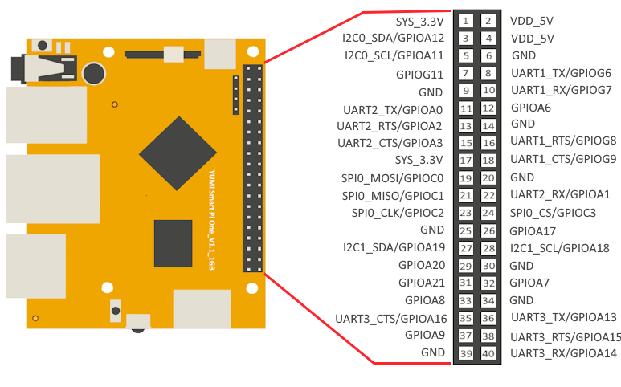

# 1.1 Introduction & Specifications

* The [Smart Pi One](https://wanhao-europe.com/collections/yumi-smart-pi-nano-computer-diy/products/yumi-smart-pi-one-1g-ddr3-processeur-h3-allwinner) uses the Allwinner H3 Soc. It integrates Ethernet, IR receiver, video/audio output and supports HDMI and AVOUT. It can be powered via the MicroUSB port (DC 5V/2A and POWER DELIVERY CHARGER).

* In such a small board it still integrates rich interfaces and ports. HDMI, Ethernet, USB-Host, USB-OTG, DVP camera interface and AVOUT (audio and video) it has an onboard Microphone, IR receiver, a serial debug port and a Raspberry Pi compatible 40 pin GPIO pin header.

## Specifications

* **CPU:** Allwinner H3, Quad-core Cortex-A7-1.3GHz
* **GPU:** Mali400MP2@600MHz，Supports OpenGL ES2.0
* **DDR3 RAM:** 1GB
* **Connectivity:** 10/100M Ethernet
* **Audio:** 3.5mm audio jack/Via HDMI
* **Microphone**: Onboard microphone
* **IR Receiver:** Onboard IR receiver
* **USB Host:** USB 2.0 x 3 Type A
* **MicroSD Slot:** 1
* **MicroUSB:** for data transmission and power input, OTG
* **Video Output:** HDMI 1.4 1080P, CVBS
* **DVP Camera Interface:** 24pin, 0.5mm pitch FPC seat
* **Debug Serial Port:** 4Pin, 2.54mm pitch pin header
* **LED:** Power led & Status led
* **GPIO:** 2.54mm spacing 40pin, compatible with Raspberry Pi's GPIO. It includes UART, SPI, I2C, IO etc
* **User Key:** GPIO Key x 1, Reset x 1
* **PC Size:** 72 mm x 60 mm
* **Power Supply:** DC 5V/2A or  POWER DELIVERY CHARGER 
* **Working Temperature:** -30℃ to 70℃
* **Weight:** 33g
* **OS/Software:** YumiOS, Debian 12(Armbian), Ubuntu(Armbian)

## 1.2 Software Features

**Official Linux Server Image:** [https://wiki.yumi-lab.com/SmartPI/SmartPi_Linux/](https://wiki.yumi-lab.com/SmartPI/SmartPi_Linux/)

# 1.3 Layout
 
**[Top view]**

 
**[Bottom view]**

## 1.4 Diagram

### GPIO Pin Spec

| Pin# | Name | Linux gpio | Pin# | Name | Linux gpio |
|------|------|------------|------|------|------------|
| 1    | SYS_3.3V         |        | 2    | VDD_5V            |        |
| 3    | I2C0_SDA/GPIOA12 |        | 4    | VDD_5V            |        |
| 5    | I2C0_SCL/GPIOA11 |        | 6    | GND               |        |
| 7    | GPIOG11          | 203    | 8    | UART1_TX/GPIOG6   | 198    |
| 9    | GND              |        | 10   | UART1_RX/GPIOG7   | 199    |
| 11   | UART2_TX/GPIOA0  | 0      | 12   | GPIOA6            | 6      |
| 13   | UART2_RTS/GPIOA2 | 2      | 14   | GND               |        |
| 15   | UART2_CTS/GPIOA3 | 3      | 16   | UART1_RTS/GPIOG8  | 200    |
| 17   | SYS_3.3V         |        | 18   | UART1_CTS/GPIOG9  | 201    |
| 19   | SPI0_MOSI/GPIOC0 | 64     | 20   | GND               |        |
| 21   | SPI0_MISO/GPIOC1 | 65     | 22   | UART2_RX/GPIOA1   | 1      |
| 23   | SPI0_CLK/GPIOC2  | 66     | 24   | SPI0_CS/GPIOC3    | 67     |
| 25   | GND              |        | 26   | SPDIF-OUT/GPIOA17 | 17     |
| 27   | I2C1_SDA/GPIOA19/PCM0_CLK/I2S0_BCK | 19 | 28   | I2C1_SCL/GPIOA18/PCM0_SYNC/I2S0_LRCK | 18 |
| 29   | GPIOA20/PCM0_DOUT/I2S0_SDOUT       | 20 | 30   | GND                                  |        |
| 31   | GPIOA21/PCM0_DIN/I2S0_SDIN         | 21 | 32   | GPIOA7                               | 7      |
| 33   | GPIOA8                              | 8  | 34   | GND                                  |        |
| 35   | UART3_CTS/SPI1_MISO/GPIOA16         | 16 | 36   | UART3_TX/SPI1_CS/GPIOA13             | 13     |
| 37   | GPIOA9                              | 9  | 38   | UART3_RTS/SPI1_MOSI/GPIOA15          | 15     |
| 39   | GND                                 |    | 40   | UART3_RX/SPI1_CLK/GPIOA14            | 14     |

### Debug Port（UART0）

| Pin# | Name                     |
|------|--------------------------|
| 1    | GND                      |
| 2    | VDD_5V                   |
| 3    | UART_TXD0/GPIOA4         |
| 4    | UART_RXD0/GPIOA5/PWM0    |

### <b>DVP Camera IF Pin Spec</b>

| Pin#              | Name       | Description                                   |
|-------------------|------------|-----------------------------------------------|
| 1, 2              | SYS_3.3V   | 3.3V power output, to camera modules          |
| 7,9,13,15,24      | GND        | Ground, 0V                                    |
| 3                 | I2C2_SCL   | I2C Clock Signal                              |
| 4                 | I2C2_SDA   | I2C Data Signal                               |
| 5                 | GPIOE15    | Regular GPIO, control signals output to camera modules |
| 6                 | GPIOE14    | Regular GPIO, control signals output to camera modules |
| 8                 | MCLK       | Clock signals output to camera modules        |
| 10                | NC         | Not Connected                                 |
| 11                | VSYNC      | Vertical synchronization to CPU from camera modules |
| 12                | HREF/HSYNC | HREF/HSYNC signal to CPU from camera modules  |
| 14                | PCLK       | PCLK signal to CPU from camera modules        |
| 16-23             | Data bit7-0| Data signals                                  |

## 1.5 Board Dimension 
 

