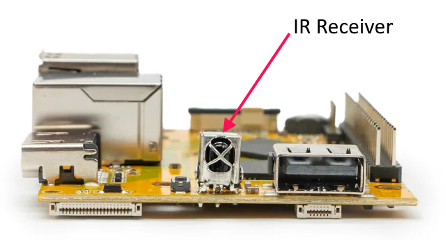
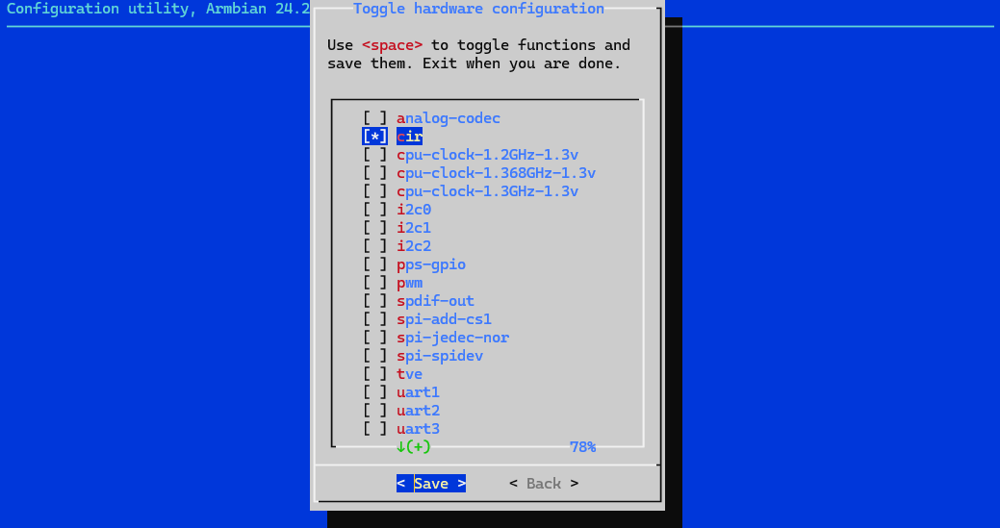
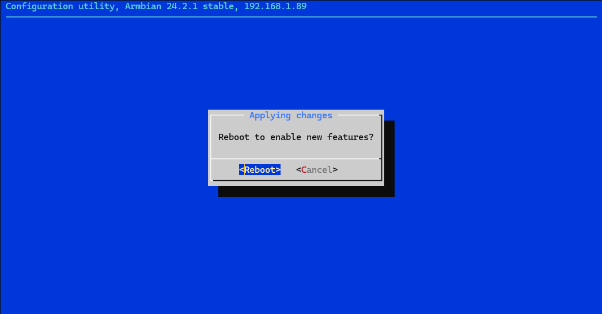
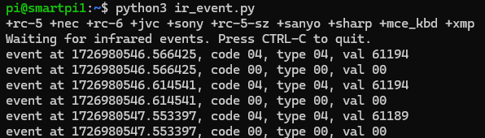
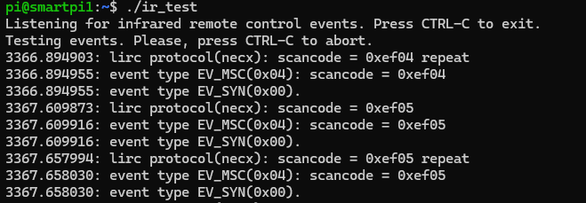

# 1.10 Testing and Using the Infrared Sensor on Smart Pi One

## Introduction
This guide explains how to activate and test the infrared sensor on the Smart Pi One board running Armbian. We will also see how to use this sensor with Python and a more engaging C program.



## Activating the Infrared Sensor

### Step 1: Activate in Armbian-Config
1. Open `Armbian-Config`  via an SSH interface or a terminal window:
   ```bash
   sudo armbian-config
   ```

2. Choose **`System`**:

    

3. Select **`Hardware`**:

    

4. Then **`cir`**,**`Save`** and **`Back`**:

    

5. To finish: **`Reboot`** to apply the changes:

    


### Step 2: Install ir-keytable
Start by installing `ir-keytable`, a tool that allows you to manage the infrared sensor:

```bash
sudo apt-get update
sudo apt-get install ir-keytable
```

### Step 3: Configure Infrared Protocols
To activate the infrared protocols, use the following command:

```bash
echo "+rc-5 +nec +rc-6 +jvc +sony +rc-5-sz +sanyo +sharp +mce_kbd +xmp" | sudo tee /sys/class/rc/rc0/protocols
```

## Testing the Infrared Sensor

To test the infrared sensor using a TV remote or a LED strip remote, follow these steps:

1. Ensure that the infrared sensor is properly connected to the Smart Pi One.

2. Open a terminal and run the following command:
   ```bash
   ir-keytable -t
   ```

3. Point the infrared remote (like your TV or LED strip remote) at the sensor and press a button.

4. Each time a button is pressed, events will appear in the terminal, indicating that the sensor is detecting the infrared signals.

5. You will see different codes for each button press, confirming that the sensor is working properly.

6. To stop the test, press `CTRL-C`.


## Using Python

### Prerequisites
Before starting, ensure you have installed the `python-evdev` module, which allows you to read events from input devices:

```bash
sudo apt-get update
sudo apt-get install python3-evdev python3-dev
```

### Example Python Script

Here’s a complete script to read infrared events from the sensor:

```python
import subprocess
import evdev
from evdev import InputDevice
import time

# Set the IR protocols
subprocess.run("echo '+rc-5 +nec +rc-6 +jvc +sony +rc-5-sz +sanyo +sharp +mce_kbd +xmp' | sudo tee /sys/class/rc/rc0/protocols", shell=True)

# Replace '/dev/input/eventX' with the correct path for your infrared sensor
device_path = '/dev/input/event1'  # Update this line

# Attempt to access the device
device = InputDevice(device_path)

print("Waiting for infrared events. Press CTRL-C to quit.")

try:
    while True:
        event = device.read_one()  # Read a single event
        if event:
            print(event)  # Print the raw event data

except KeyboardInterrupt:
    print("\nScript stopped.")

except Exception as e:
    print(f"An error occurred: {e}")
```

### Creating and Running the Script

1. Open a text editor, such as `nano`, and create the Python file:
   ```bash
   nano ir_event.py
   ```

2. Paste the script into the file and save it.

3. Execute the script with the necessary permissions (you may need to use `sudo`):
   ```bash
   sudo python3 ir_event.py
   ```
    

## Using a C Program

### Example C Program

Here’s a more engaging example in C that will listen for infrared events and print a message when specific keys are pressed:

```c
#include <stdio.h>
#include <stdlib.h>
#include <string.h>
#include <unistd.h>

int main() {
    char command[100];

    snprintf(command, sizeof(command), "ir-keytable -t");

    printf("Listening for infrared remote control events. Press CTRL-C to exit.\n");

    // Use a system call to execute ir-keytable in a loop
    while (1) {
        system(command);
        sleep(1);  // Add a small delay to avoid overwhelming the output
    }

    return 0;
}
```

### Compilation and Execution

1. Open a text editor, such as `nano`, to create the C file:
   ```bash
   nano ir_test.c
   ```

2. Paste the C program into the file and save it.

3. Compile the program with:
   ```bash
   gcc -o ir_test ir_test.c
   ```

4. Run the program:
   ```bash
   ./ir_test
   ```
    

You now have all the information needed to activate, test, and use the infrared sensor on the Smart Pi One board. Whether using Python or C, you can easily interact with your remote control.