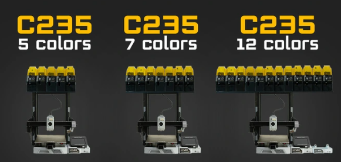

# 1.2 Technical Specifications

The **YUMI C Series** is a range of 3D printers.  
This page provides access to the technical specifications and drawings.  

---

## Technical Documentation (PDF)

[Download PDF — YUMI C Series Technical Drawings](pdf/YUMI_C_SERIES_TECHNICAL_DRAW.pdf)