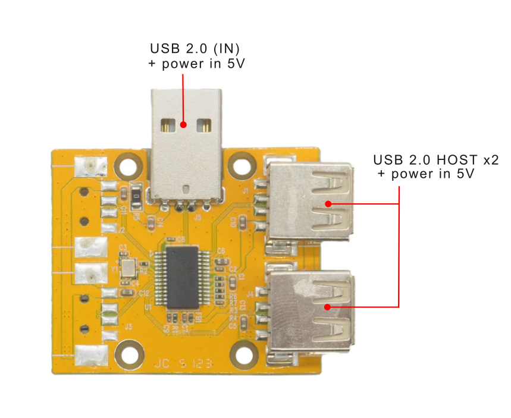
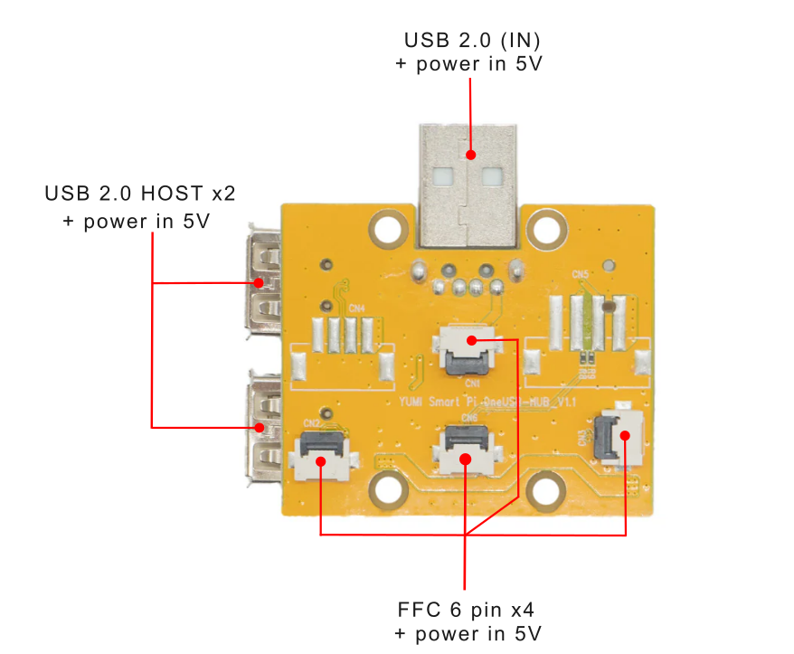
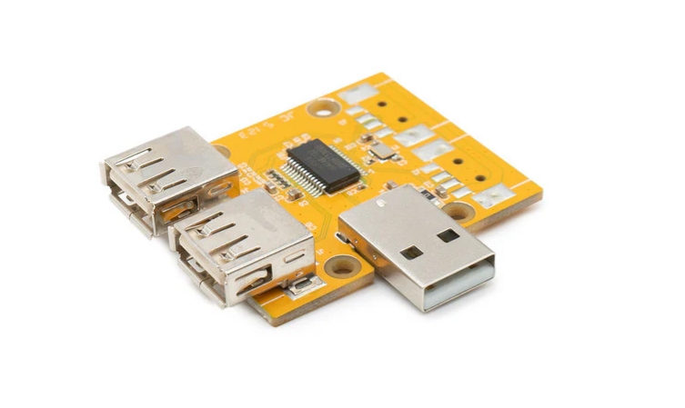

# 1.2 Smart Hub
 
**[Top view]**

 
**[Bottom view]**

## 1.2.1 Product Description
The YUMI SMART HUB 1 to 4 revolutionizes the management of power and connectivity for your devices. With an innovative configuration including 1 USB 2.0 input, 2 standard USB 2.0 outputs and 2 USB 2.0 outputs in 6pin FFC format, this hub stands out for its ability to inject 5V into all USB ports, whether from the inputs or exits. This unique feature not only powers the SMART PI ONE, but also all connected devices, providing unprecedented flexibility in energy management.

### Applications
* Power and connect multiple USB devices without worry of power management.
* Flexible configuration of your workspace thanks to the possibility of remote use.
* Ideal solution for SMART PI ONE users looking to maximize the performance of their device while simplifying power management.

### Compatibility
* Compatible with SMART PI ONE and all USB 2.0 powered devices.
* Expanded functionality with YUMI SMART SHIELD for transformation into a USB-C port.
* For those looking for an efficient and versatile solution for powering and connecting multiple devices, the YUMI SMART HUB 1 to 4 is the ideal tool. Maximize your productivity and  simplify the management of your devices with this innovative USB hub.

## 1.2.2 Product Parameters
* **Product Size :** -
* **Weight :** -
