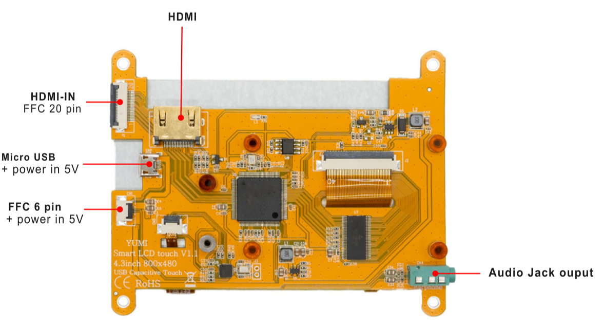

# 1.1 Smart LCD Touch 4.3inch

 
**[Top view]**

 
**[Bottom view]**

## 1.1.1 Product Description

* 4.3"standard display, 800x480 resolution, maximum HDMI resolution 1920X1080 is supported
* Capacitive touch screen, support 1 point touch 
* It is compatible with SMART PI, Raspberry Pi, ORANGE PI, NANO PI, BANANA PI
* It can also be used as a general-purpose HDMI display, connecting computers, TV boxes, Microsoft Xbox360, SONY PS4, Nintendo Switch and so on
* Work as a PC monitor, support Win7, Win8, Win10 system 5 point touch (XP and older version system: single-point touch), free drive
* Support HDMI audio output,Backlight brightness can be adjusted
* CE, RoHS certification

## 1.1.2 Product Parameters
* **Size:**	4.3 inches (inch)
* **Resolution:**  800x480
* **Touch:** Capacitive Single point 
* **Video:** 1 x de type HDMI ou 1 FFC 20pin
* **Audio:** 3.5mm audio jack/Via signal HMDI
* **Power/USB:** Micro USB type C OR FFC 6 pin (USB TOUCH)
* **nothing FFC:** 20pin and 6pin included 
* **Working Temperature:** -10~+40℃
* **Product Size:** 106.0 mm x 85 mm
* **Weight:** 88g

## 1.1.3 Board Dimension 

 
**[Board dimension view]**

## 1.1.4 How to use as PC monitor

* Connect the computer HDMI output signal to the LCD HDMI interface by using the HDMI cable.
* Connect the LCD's micro USB C Touch interface to the micro USB port of the device

## 1.1.5 How to use as Smart Pi One

* Connect the HDMI output signal to the LCD HDMI-IN interface by using the FFC 20 PIN.
* Connect the USB interface to LCD's USB Touch interface by using the FFC 6 PIN.

 
**[FFC 6 & 20 pin view]**

