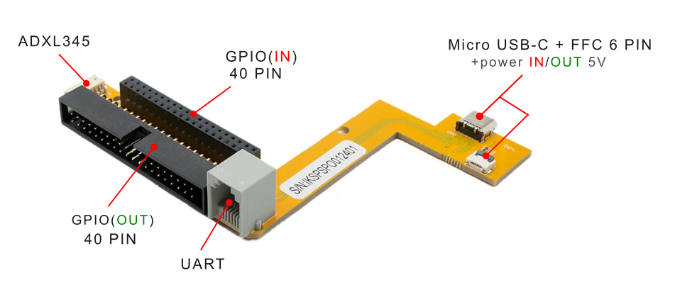
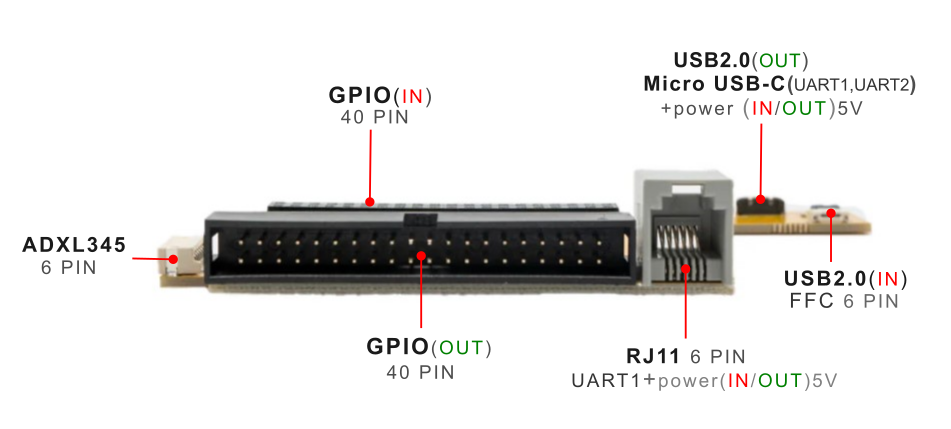

# 1.3 Smart Shield

**[Top view]**

**[Side view]**

## 1.2.1 Product Description
[The YUMI SMART SHIELD](https://wanhao-europe.com/en/collections/yumi-retro-gaming/products/yumi-smart-smart-shield-compatible-smart-pi-one) introduces dedicated USB-C power connectivity, capable of doubling the power available on the SMART PI ONE for unprecedented performance.
Offsetting your GPIO by 45°, thus offering improved accessibility and more intuitive management of your projects. In addition to this ergonomic innovation. 

### Applications
Ideal for developers, DIY enthusiasts, and educators looking to fully exploit the potential of SMART PI ONE. Whether for automation or robotics projects, or simply to explore the possibilities offered by the addition of sensors and actuators, the YUMI SMART SHIELD opens new avenues of creation and innovation.

The YUMI SMART SHIELD is the essential accessory for those who want to push the capabilities of the SMART PI ONE to the maximum, simplifying interfacing with sensors and offering a robust and flexible power solution.

### Compatibility
 * GPIO 40 pin compatible with Raspberry Pi's GPIO
 * With the YUMI - ADXL345 Sensor: Incorporates a specific connector for the YUMI - ADXL345 sensor, facilitating interfacing and expanding the capabilities of the SMART PI ONE without additional effort.
 * USB-C power input to double the power on the SMART PI ONE, ensuring stable and efficient power for your most demanding projects.
 

## 1.2.2 Product Parameters
* **GPIO:** 2.54mm spacing input 40 pin/Output 40 pin (by 45°) compatible with Raspberry Pi's GPIO
* **USB2.0 FFC 6 PIN:** input for data transmission, in power input/ouput 5V
* **MicroUSB-C:** for data transmission, UART1, UART2 and power input/ouput 5V
* **RJ11 6PIN**: UART1 and power input/ouput 5V
* **ADXL345**: 6PIN
* **Product Size:** 11.5 mm x 84 mm
* **Weight:** 23g