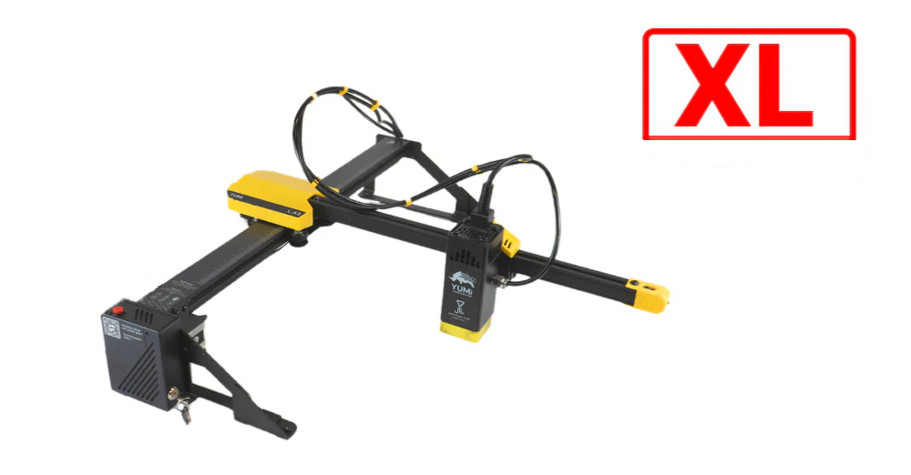

# 1.1 Yumi L Series
### (L-A4 / L-A3 / L-A2 | 2.5W / 5.5W / 10W / 20W)

The **YUMI Laser** series is the first truly versatile laser engraver range designed in France.  
Compact, modular, and powerful, these machines combine large working areas, multiple laser head options, and a rich ecosystem of upgrades to suit beginners, hobbyists, and professionals alike.

---

## Available Models

<b>YUMI L-A4</b> 
<b>10 × 297 mm working area</b>

  
<b>YUMI L-A3</b>  
<b>420 × 297 mm working area</b>

  
<b>YUMI L-A2</b> 
  <b>420 × 594 mm working area</b>

--- 

# Quick Start

### [1.2 Overview & Specifications](Yumi_L_Series_Overview.md)
Introduction to the YUMI Laser series, details on available models, interchangeable laser modules ,and full technical specifications.  

### [1.3 Safety Guidelines](Yumi_L_Series_Safety.md)
Laser safety instructions, prohibited materials, ventilation requirements, and fire prevention measures.  

### [1.4 Assembly & First Setup](Yumi_L_Series_Assembly.md)
Step-by-step guide assembling, and preparing your YUMI Laser for first use.  

### [1.5 LightBurn Setup and Usage](Yumi_L_Series_LightBurn.md)
Installing and configuring LightBurn for YUMI Laser and setting up materials.  

### [1.6 LaserGRBL Setup and Usage](Yumi_L_Series_LaserGRBL.md)
How to install and configure LaserGRBL with YUMI Laser, load files, and adjust engraving/cutting settings.  

### [1.7 Wireless Control](Yumi_L_Series_Wireless.md)
How to control the YUMI Laser over Wi-Fi via the web interface.  

### [1.8 Accessories & Upgrade Packs](Yumi_L_Series_Accessories.md)
Detailed breakdown of optional modules and kits: rotary, honeycomb bed, extra heads, touchscreen, risers, enclosure.  

# 1.9 Troubleshooting
List of common issues, causes, and solutions for YUMI Laser operation.  

- [Laser Does Not Turn On](Yumi_L_Series_Troubleshooting.md#191-laser-does-not-turn-on)
- [Laser Fires but Does Not Engrave or Cut](Yumi_L_Series_Troubleshooting.md#192-laser-fires-but-does-not-engrave-or-cut)
- [Uneven Engraving or Cutting](Yumi_L_Series_Troubleshooting.md#193-uneven-engraving-or-cutting)
- [Wi-Fi Connection Issues](Yumi_L_Series_Troubleshooting.md#194-wi-fi-connection-issues)
- [Software Cannot Detect the Laser](Yumi_L_Series_Troubleshooting.md#195-software-cannot-detect-the-laser)
- [ Burning or Excessive Charring on Material](Yumi_L_Series_Troubleshooting.md#196-burning-or-excessive-charring-on-material)

## Purchase YUMI Laser

You can order your YUMI Laser directly from our official store:  
**[Buy YUMI Laser on Wanhao Europe](https://wanhao-europe.com/collections/laser/products/yumi-l-a4-laser-pour-gravure-et-decoupe-pre-commande?variant=48130514157908)**

