# 1.10 Accessories & Upgrade Packs

The **YUMI Laser Series** supports a wide range of optional accessories and upgrade kits, allowing you to expand functionality, improve results, and tailor the machine to your specific projects.

---

## 1.10.1 Upgrade Kits

### Upgrade Kit for YUMI L-A3 / A2

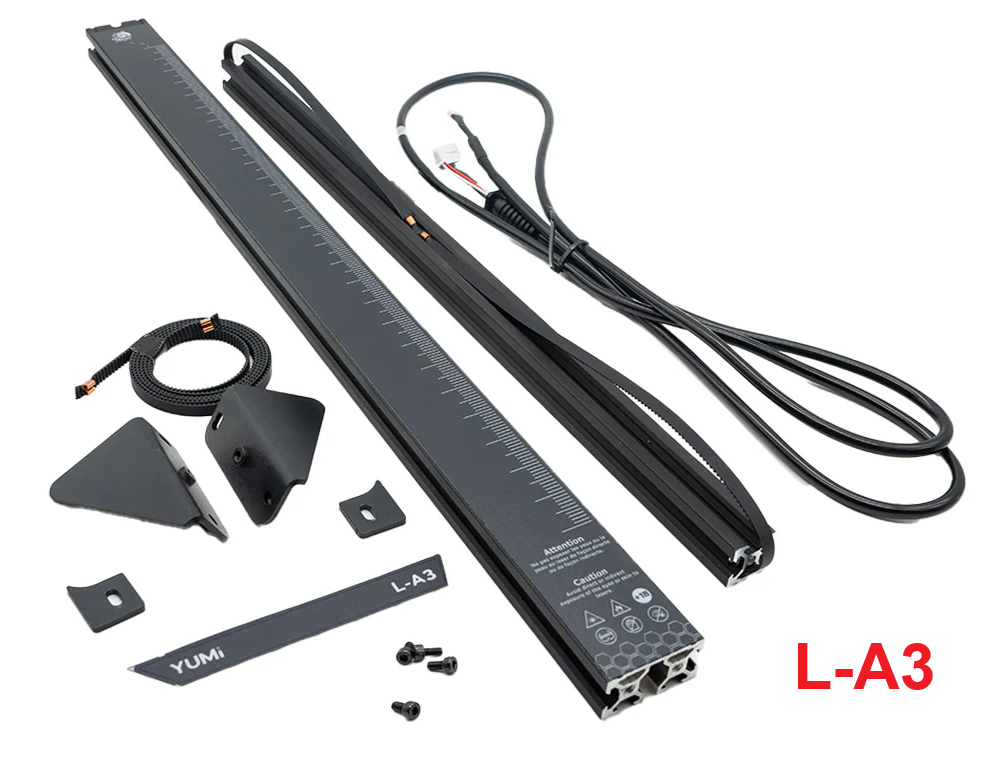 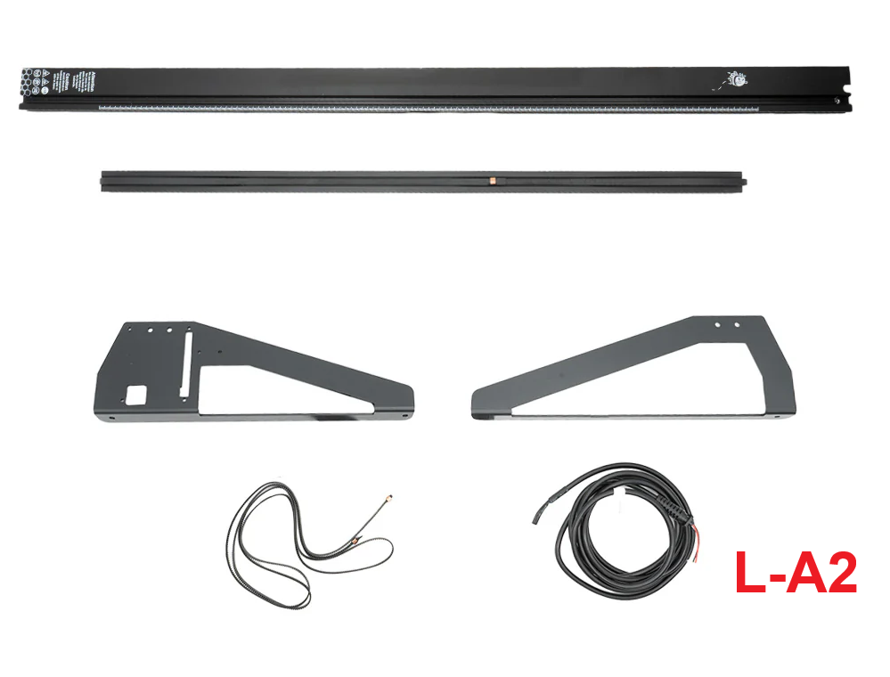

**Purpose**: Expand your YUMI L-A4 to larger formats for more versatile projects.

**Features**:

* **Extended Surface**: Upgrade your A4 laser to A3 (297 × 420 mm) or A2 (594 × 420 mm)
* **Stability Improvement**: Includes extended riser feet to maintain precision on larger formats
* **Belt Replacement Kit**: New X and Y belts for the extended workspace
* **High-Quality Components**: Ensures the same precision and reliability as your original machine

**Benefits**: Unlock larger projects without compromising on engraving quality. Expand your creative potential today.

**Purchase link**: [Buy Upgrade Kit](https://wanhao-europe.com/collections/upgrade-laser-1/products/yumi-l-a3-upgrade-pack?variant=511772251589963)

---

## 1.10.2 Performance & Support Accessories

### YUMI - Air Assist Pump MAX

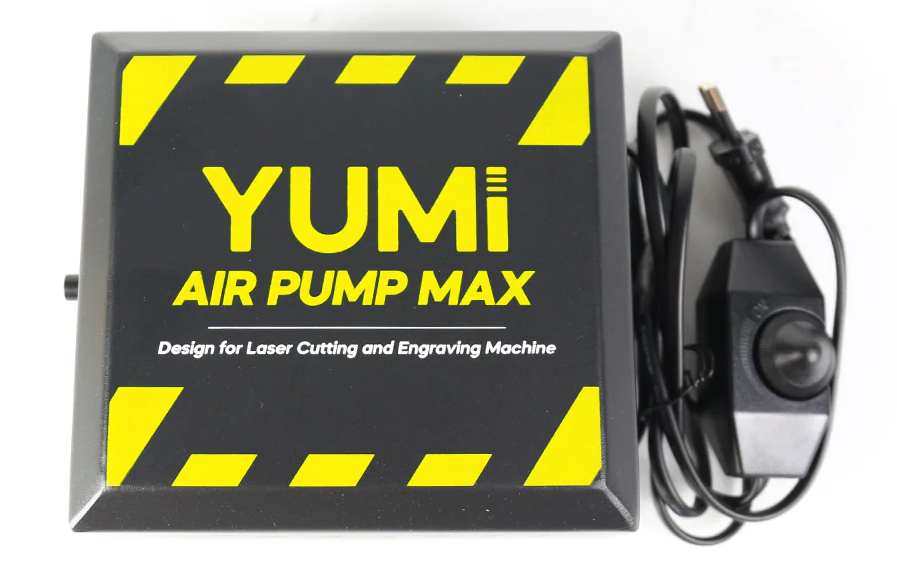

**Purpose**: Maintain optimal laser performance and prevent overheating.

**Features**:

* Integrated **water or air pump** depending on model
* Ensures consistent cooling for long engraving sessions
* Supports **Air Assist**, improving cutting and engraving quality
* Easy plug-and-play installation

**Purchase link**: [Buy Air Assist Pump](https://wanhao-europe.com/collections/upgrade-laser-1/products/pompe-a-air-30l-min-pour-laser-yumi-l-a4-l-a3)

---

### Honeycomb Cutting Bed

**Purpose**: Improves cutting quality by minimizing burn marks and ensuring better airflow.

**Compatibility**:

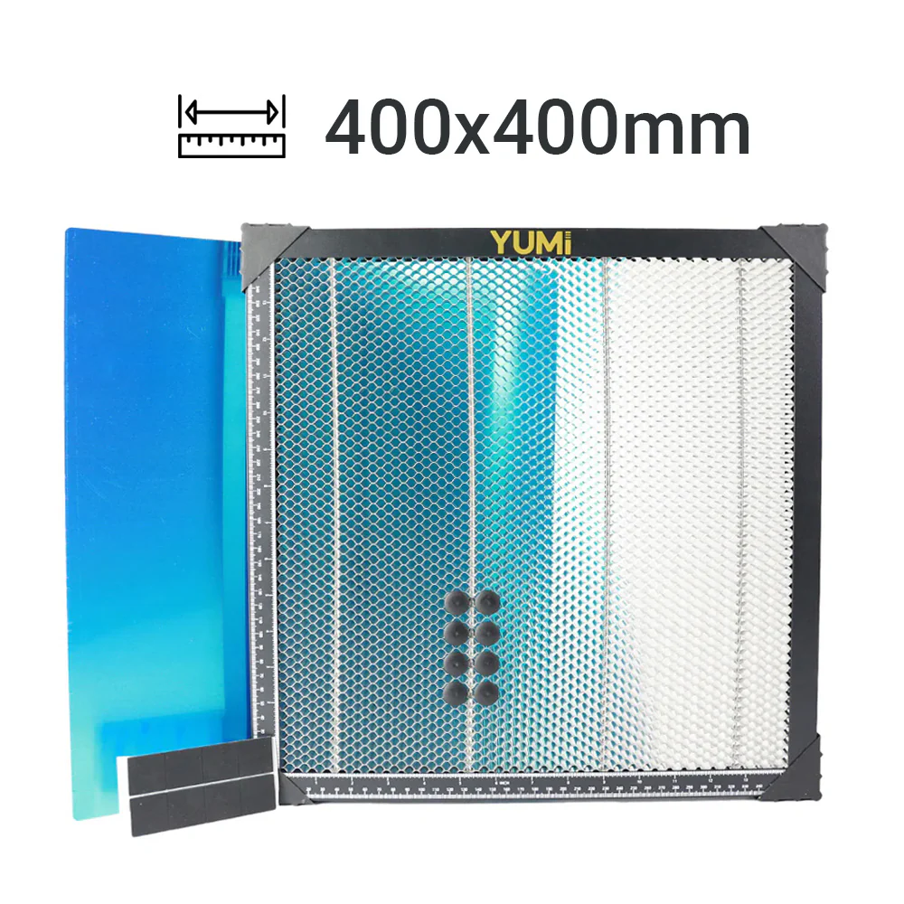

* A4 model bed size: 210 × 297 mm

* A3 model bed size: 420 × 297 mm

* A2 model bed size: 420 × 594 mm

**Features**:

* Aluminum honeycomb design
* Reduced back reflection
* Magnetic hold for thin materials

**Purchase link**: [Buy Honeycomb Bed](https://wanhao-europe.com/collections/upgrade-laser-1/products/plateau-de-travail-honey-comb-pour-laser-yumi-l-a4-l-a3?variant=50422470213972)

---

### Extra Laser Heads

**Purpose**: Upgrade or replace your existing laser module for higher power or different engraving effects.

**Available modules**:

* 2.5W – fine engraving on delicate materials

  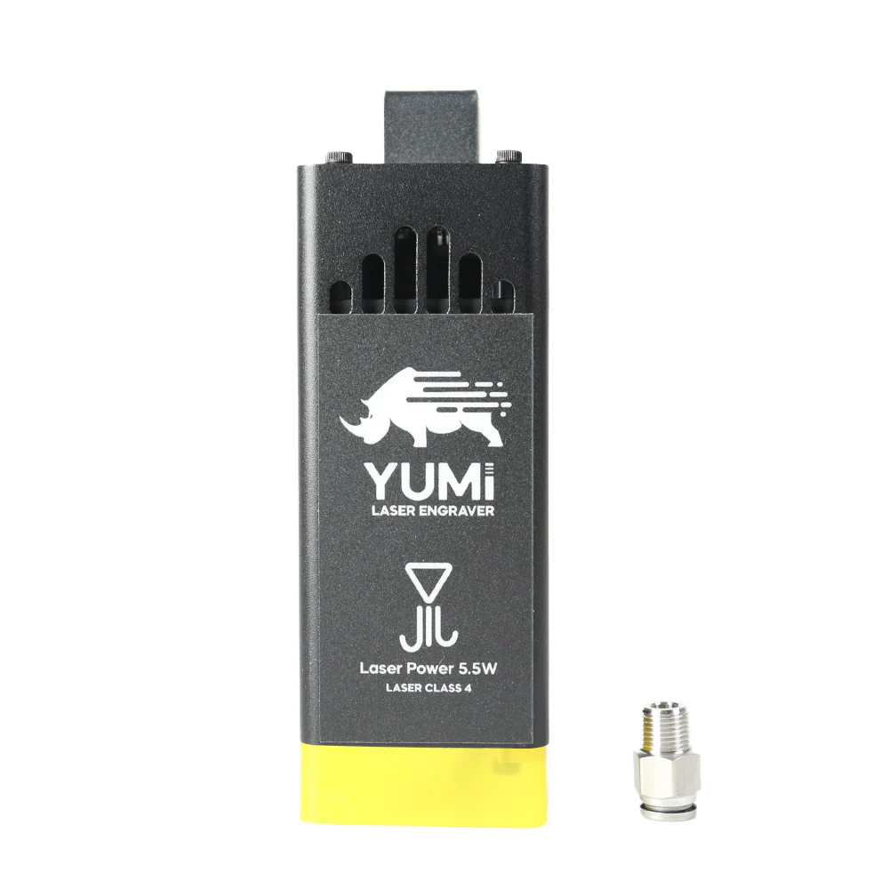

* 5.5W – general-purpose engraving & cutting

  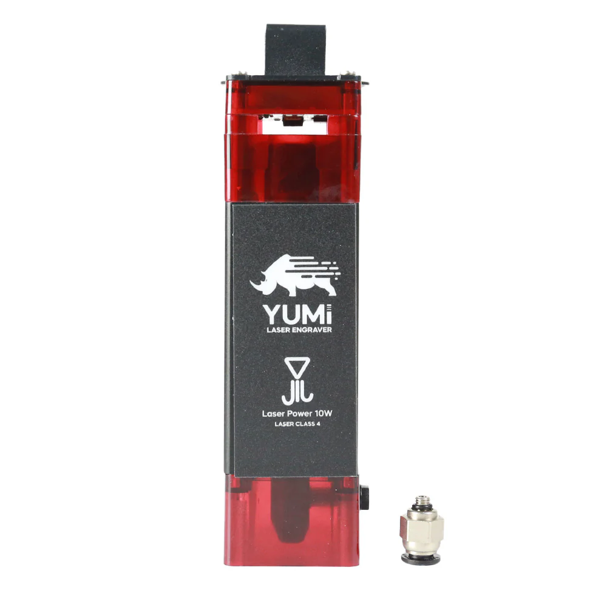

* 10W – faster cutting, thicker materials

  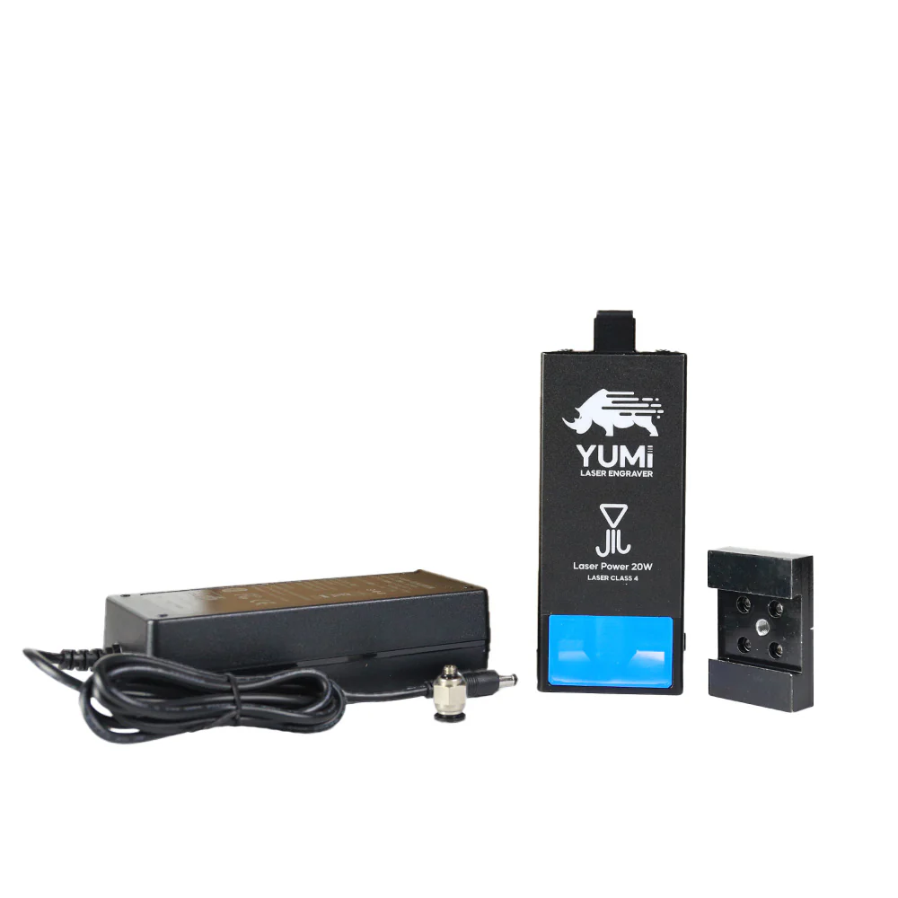

* 20W – heavy-duty cutting and high-speed engraving

  - **Purchase link**: [Buy Laser Head - 5w](https://wanhao-europe.com/collections/upgrade-laser-1/products/module-laser-5-5w-yumi-l-a4-l-a3-pre-commande)
  - **Purchase link**: [Buy Laser Head - 10W](https://wanhao-europe.com/collections/upgrade-laser-1/products/module-laser-10w-yumi-l-a4-l-a3-pre-commande)
  - **Purchase link**: [Buy Laser Head - 20W](https://wanhao-europe.com/collections/upgrade-laser-1/products/copie-de-yumi-l-a4-laser-pour-gravure-et-decoupe-pre-commande?variant=52177025958228)

---

## 1.10.3 Optional Modules

### Rotary Module

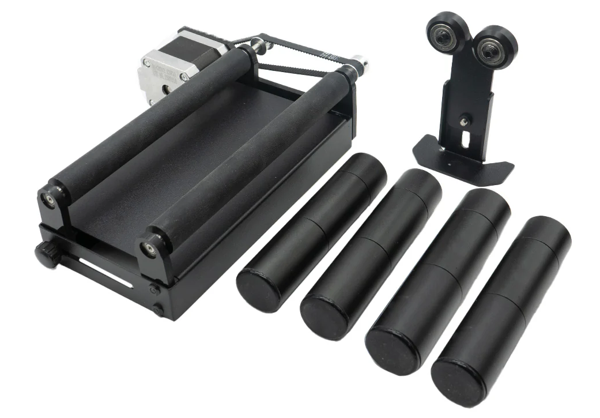

**Purpose**: Engrave cylindrical objects (bottles, glasses, mugs) with precision.

**Compatibility**: All YUMI Laser models (L-A4, L-A3, L-A2)

**Features**:

* Adjustable roller distance for various diameters
* Smooth, slip-resistant rollers
* Easy plug-and-play connection

**Purchase link**: [Buy Rotary Module](https://wanhao-europe.com/collections/upgrade-laser-1/products/module-de-rotation-pour-laser-yumi-l-a4-l-a3)

---

### Touchscreen Control Panel

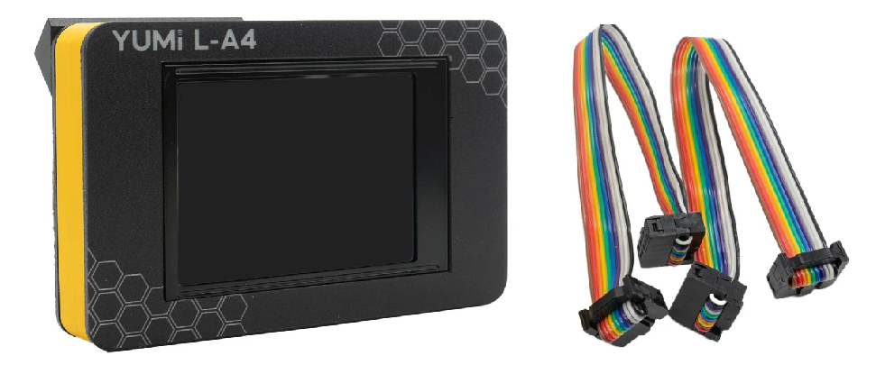

**Purpose**: Standalone control without a PC, with intuitive UI.

**Features**:

* File selection from microSD or USB
* Laser parameter adjustments
* Real-time preview

**Purchase link**: [Buy Touchscreen](https://wanhao-europe.com/collections/upgrade-laser-1)

---

### Riser Feet

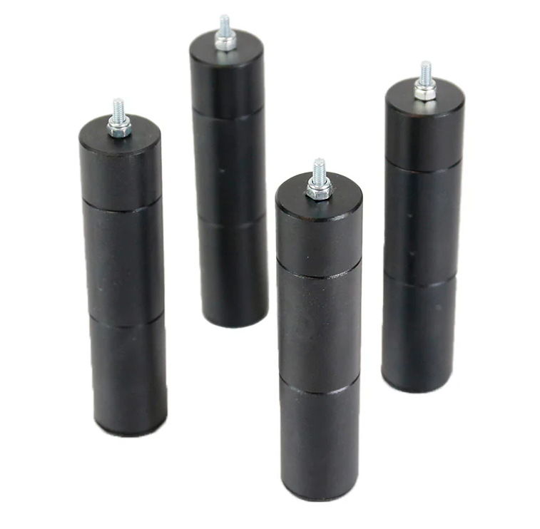

**Purpose**: Increase the engraving height to fit taller objects or rotary module.

**Compatibility**: YUMI L-A4 and YUMI L-A3 only

**Features**:

* Quick installation
* Anti-slip pads for stability

**Purchase link**: [Buy Riser Feet](https://wanhao-europe.com/collections/upgrade-laser-1)

---

## 1.10.4 Safety & Cleanliness

### Enclosure & Fume Extraction

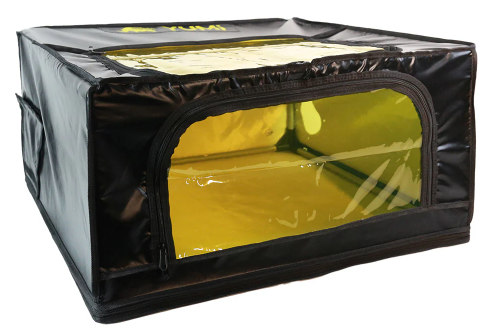

**Purpose**: Safety and cleanliness — protect eyes, reduce smell and fumes.

**Compatibility**: YUMI L-A4 and YUMI L-A3 only

**Features**:

* Flame-retardant materials
* Built-in ventilation port

**Purchase link**: [Buy Enclosure](https://wanhao-europe.com/collections/upgrade-laser-1/products/enclos-de-protection-pour-laser-yumi-l-a4-l-a3)

