# 1.5 LightBurn Setup and First Engraving

**LightBurn** is one of the most powerful and user-friendly software tools for controlling your YUMI Laser.  
This guide will walk you through setting up LightBurn for your specific YUMI L Series model (L-A4, L-A3, L-A2) and laser module (2.5W, 5.5W, 10W, 20W), and launching your first engraving job.

---

## 1 - Install LightBurn

- Download LightBurn from the official website: [https://lightburnsoftware.com](https://lightburnsoftware.com)  
- Install it on your computer (Windows, macOS, Linux supported).

---

## 2 - Connect Your YUMI Laser

- Power on your YUMI Laser.  
- Connect it to your computer via **USB cable**.  
- Insert the included **MicroSD card** if you wish to load files directly without USB control.  

---

## 3 - Add the YUMI Laser to LightBurn

- Open **LightBurn** → go to **Devices** → click **Find my Laser**.  
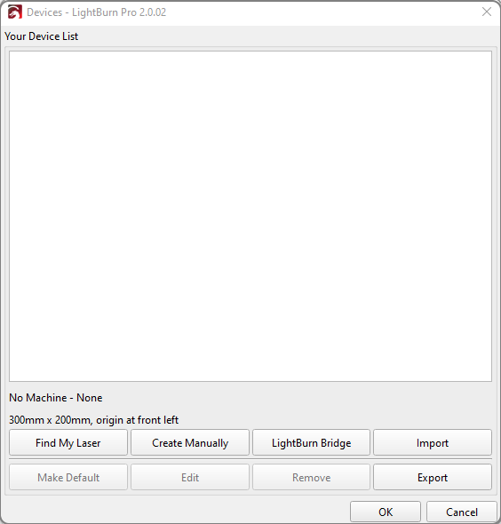

- The **Device Discovery Wizard** opens → click **Next**.  
- LightBurn scans and detects your machine (e.g., `GRBL (210 mm x 297 mm) at COM3, 115200 baud`).  
- Select it → click **Add Device**.  
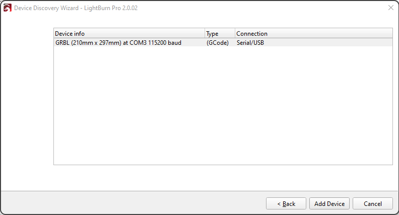

- Replace the default name (`GRBL`) with e.g. `YUMI-LA4-2.5W`.  
- Set **Machine Units** to `mm/min`.  
- Enter the **work area dimensions** for your model:  

   | Model  | Width (mm) | Height (mm) |
   |--------|------------|-------------|
   | L-A4   | 210        | 297         |
   | L-A3   | 420        | 297         |
   | L-A2   | 420        | 594         |

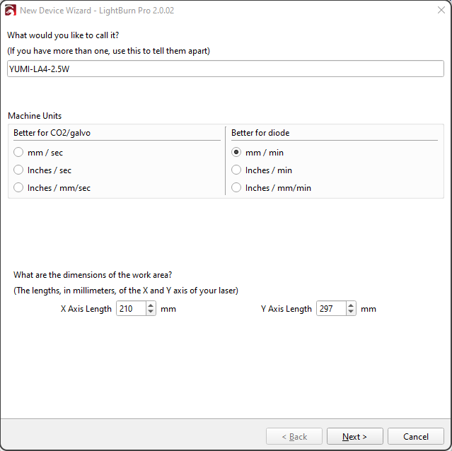

- Click **Next** → choose **Front Left** as origin.  
- Disable **Auto-home on startup**.  

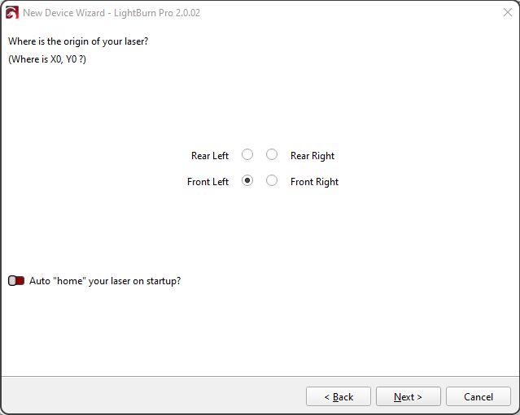

- Click **Finish**.  

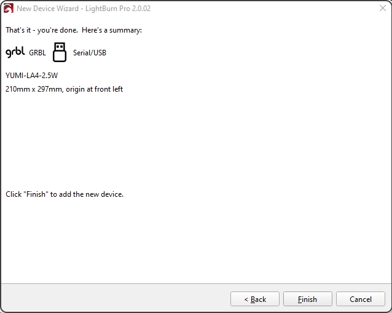

---

## 4 - Import a Test Design

- Create or import a design (text, SVG, or image). 

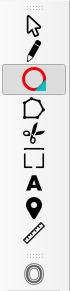

- Place it inside the workspace area. 

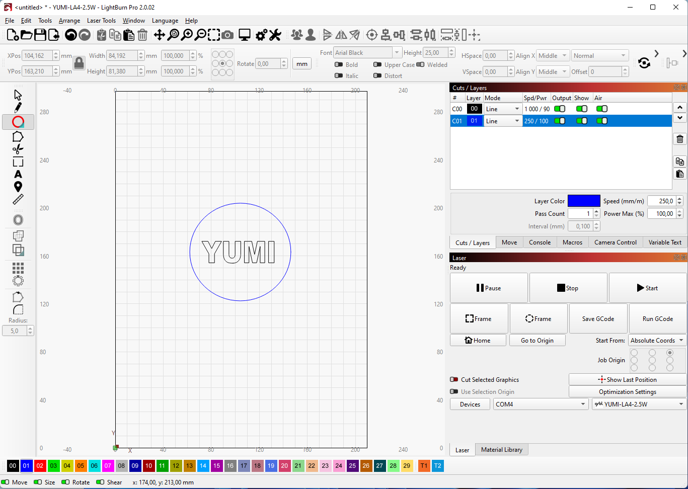

- Set the **Layer**:  
  - **Line** → outline engraving  
  - **Fill** → filled engraving  
- Adjust parameters:  
  - Speed (mm/min)  
  - Max Power (%)  
  - Pass Count  

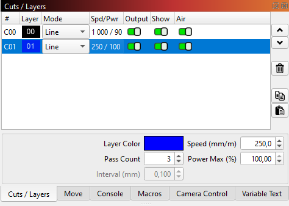 

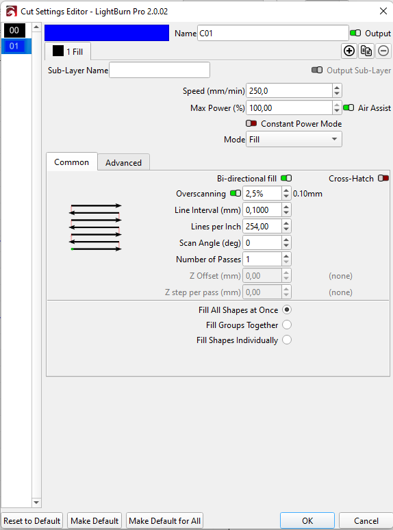

---

## 5 - Configure the Laser Module Power

- **2.5W** → fine engraving, 10–40% power  
- **5.5W** → general use, 20–70%  
- **10W** → faster engraving, 30–90%  
- **20W** → high speed/thick cuts, 50–100%  

  Always start low, then increase if needed.

---

## 6 - Position & Focus the Laser

- Move the laser head manually over the workpiece.  
- Place the **5 mm spacer** on the surface.  

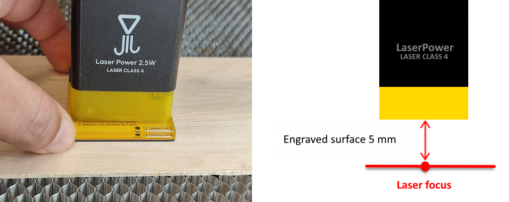

- Loosen the fixing screws of the laser module.

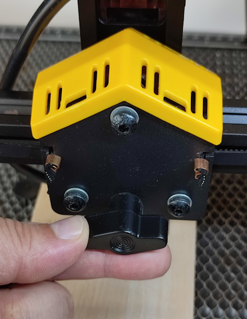 

- Slide the laser down until it touches the spacer.
- Remove the spacer and tighten the screws. 

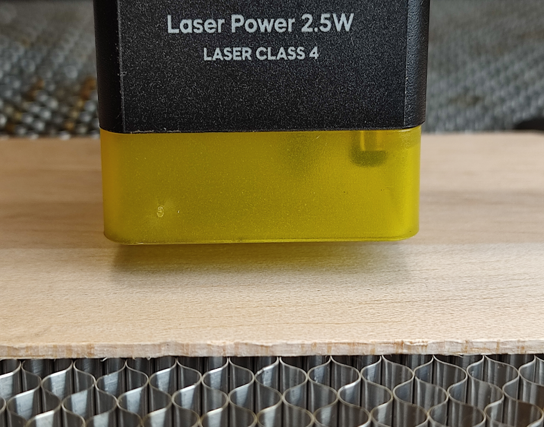

---

## 7 - Enable Air Assist (Optional)

- If equipped, turn on **Air Assist** for better cut quality and less burning.  

---

## 8 - Launch the First Engraving

- In LightBurn, click **Frame** to preview area.  

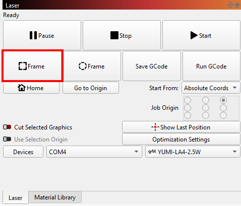 

- Click **Start** to begin engraving.  

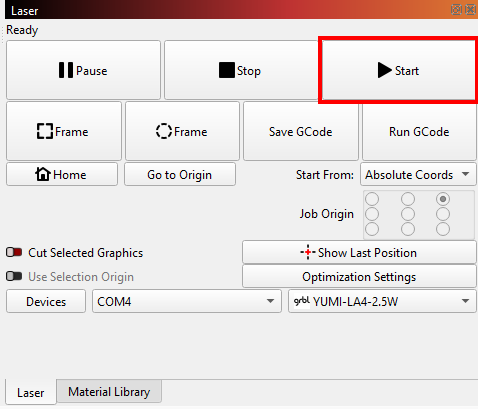
