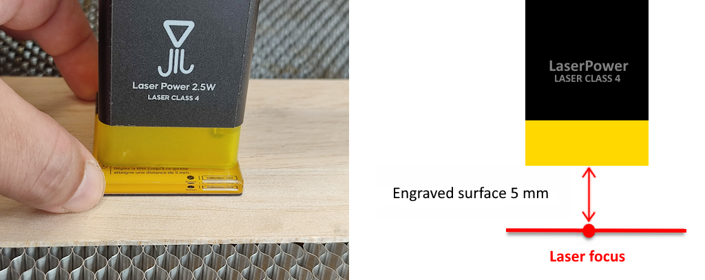
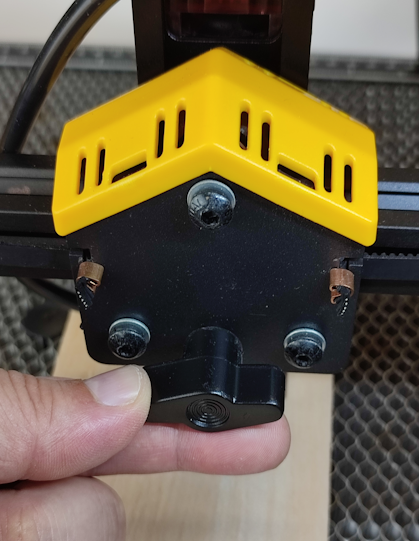
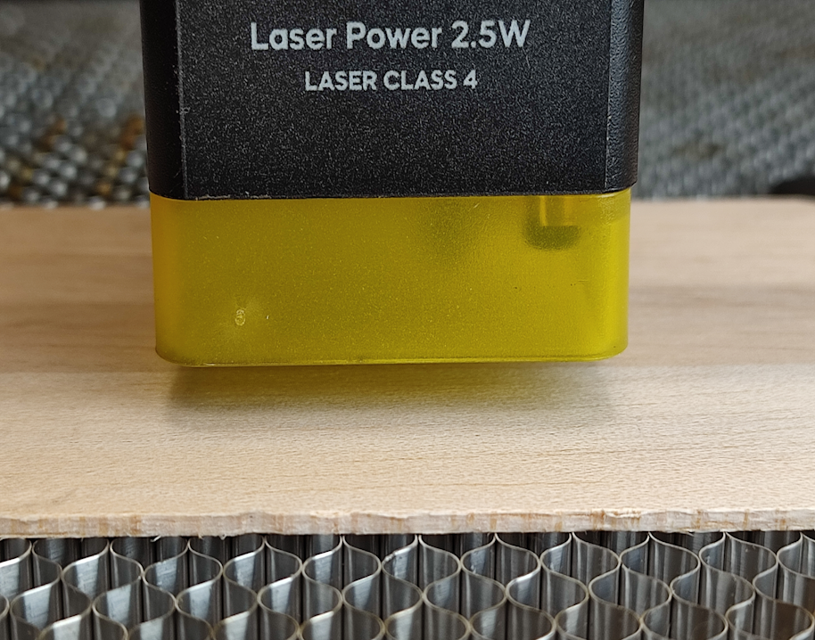

# 1.8 OpenBurn Laser Setup and First Engraving

**OpenBurn Laser** is a free laser engraving and cutting software for Windows, developed by M3D-FORMATION.  
It is a **free alternative to LightBurn** with a similar, intuitive interface, and works with all GRBL-based machines such as the YUMI Laser (L-A4 / L-A3 / L-A2).

**Main features:**

- Compatible with GRBL / Arduino-based laser machines
- JPEG / PNG image import and resizing
- Vector drawing tools: rectangles, circles, lines, hexagons, and text
- Multiple machine profiles
- **Frame** function to preview the engraving area before starting
- Automatic updates

---

## 1.8.1 - Install OpenBurn Laser

- Download OpenBurn Laser for free from the official website: [https://www.m3d-formation.com/openburn/](https://www.m3d-formation.com/openburn/){ target=_blank }  
- Run the installer (`OpenBurn_Laser_Setup.exe`) on your Windows computer (OpenBurn Laser is Windows-only).  
- The software checks automatically for new versions at startup.

---

## 1.8.2 - Connect Your YUMI Laser

- Power on your YUMI Laser.  
- Connect it to your computer via **USB cable**.  
- Wait for Windows to recognize the device.  
- In OpenBurn Laser, select the correct **COM port** and connect (baud rate: `115200`).

---

## 1.8.3 - Create a Machine Profile for Your Model

OpenBurn Laser supports multiple machine profiles, so you can save one profile per machine or laser module.

- Create a new profile and enter the **work area dimensions** for your model:

| Model | Width (mm) | Height (mm) |
|-------|------------|-------------|
| L-A4  | 210        | 297         |
| L-A3  | 420        | 297         |
| L-A2  | 420        | 594         |

- Give the profile a clear name, e.g. `YUMI-LA4-2.5W`.

---

## 1.8.4 - Import or Create a Design

- Import a **JPEG** or **PNG** image to engrave, and resize it as needed.  
- Or create a design directly with the built-in drawing tools: **rectangles, circles, lines, hexagons, and text**.  
- Place the design inside the workspace area.

---

## 1.8.5 - Set Laser Power

- Laser power is expressed as a percentage of the maximum PWM value.  
- Recommended starting values:  
  - **2.5W** → 10–40%  
  - **5.5W** → 20–70%  
  - **10W** → 30–90%  
  - **20W** → 50–100%  

  Always start low and increase gradually to avoid burning materials.

---

## 1.8.6 - Position & Focus the Laser

- Move the laser head manually over the workpiece.  
- Place the **5 mm spacer** on the surface.  

- Loosen the fixing screws of the laser module.

 

- Slide the laser down until it touches the spacer.
- Remove the spacer and tighten the screws. 

---

## 1.8.7 - Frame the Engraving Area

- Use the **Frame** function: the laser head traces the outline of your design at low power, so you can check the positioning **without marking the material**.  
- Adjust the material position and repeat the frame until the alignment is correct.

---

## 1.8.8 - Start Engraving

- Verify speed, power, and focus.  
- Click **Start** to begin engraving.  
- Stay near the machine and monitor the process for safety.  
