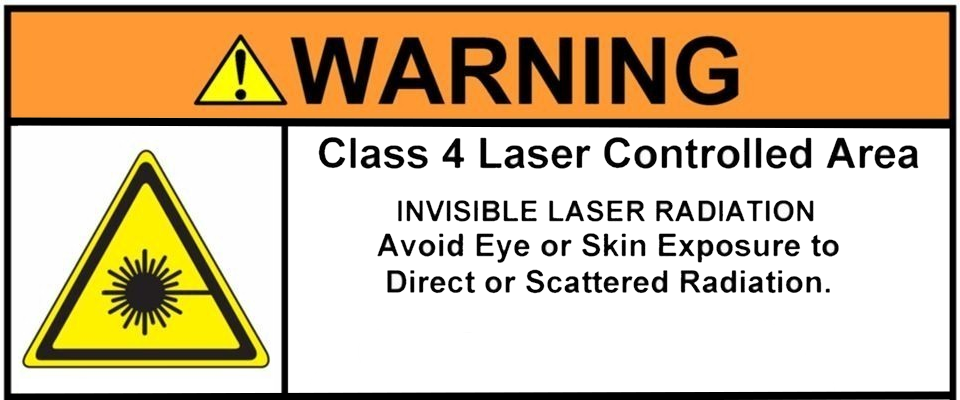

# 1.3 Safety Guidelines

Operating a laser engraver involves certain risks.
The **YUMI L Series (Laser)** is designed with safety in mind, but safe operation still depends on following proper guidelines.

  

---

## 1.3.1 General Safety Rules

* Always wear **appropriate laser safety glasses** for the wavelength of your module (e.g. 445 nm with an optical density O.D. ≥ 4).
* Never look directly into the laser beam.
* Never leave the laser unattended while it is operating.
* Keep the work area clean, dry, and free of flammable materials.
* Operate the laser in a **well-ventilated environment**.
* Keep children and pets away from the machine when in use.
* Do not override or bypass any built-in safety mechanisms.
* Use warning signs to indicate when the laser is in operation.
* Ensure the operating room has controlled access (solid doors, no direct view of the laser beam).
* Avoid aiming the laser beam at reflective surfaces.

---

## 1.3.2 Material Restrictions

Certain materials can produce **toxic fumes or dangerous reactions** when cut or engraved.
Do **not** process the following:

* **PVC** (polyvinyl chloride) – releases corrosive chlorine gas that damages optics and voids warranty.
* **Vinyl** – similar hazards as PVC.
* **ABS** – melts and produces toxic fumes.
* **Fiberglass** – emits hazardous fumes due to epoxy resin.
* **Beryllium-containing alloys** – highly toxic.
* **Polycarbonate (Lexan)** – easily ignites and cuts poorly.
* **HDPE** – melts and ignites easily.
* **Polystyrene foam** – melts and burns.
* **Polypropylene** – melts and burns, producing hard droplets.
* **Coated carbon fiber** – emits noxious fumes.
* **Any unknown material** without verifying its compatibility with laser use (consult Safety Data Sheet).

---

## 1.3.3 Ventilation Requirements

* Use the laser in a **well-ventilated room** or with an **active fume extraction system**.
* Recommended: an enclosure with exhaust fan vented outdoors.
* If no direct exhaust, use an air purifier with a carbon filter.
* Avoid inhaling fumes generated during engraving or cutting.

---

## 1.3.4 Fire Prevention

* Keep a **CO₂ or dry powder fire extinguisher** nearby at all times.
* Alternatively, keep a “fire extinguisher ball” near the machine for automatic flame suppression.
* Do not leave the laser unattended during operation.
* Clean the cutting bed regularly from debris and flammable materials.
* Do not remove materials until fully cooled.
* Avoid using highly flammable or explosive materials.
* Prevent cables (USB, 24V power) from touching the laser beam.

---

## 1.3.5 Electrical Safety

* Use only the **original power adapter** supplied with the YUMI Laser.
* Avoid running cables across walkways or sharp edges.
* Disconnect power before cleaning, moving, or performing maintenance.

