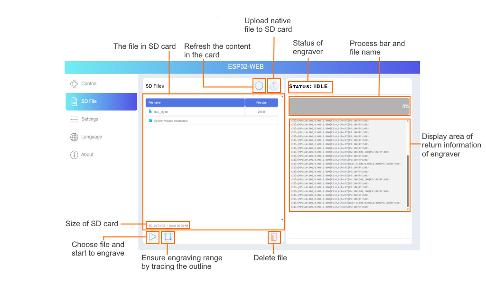

# 1.7 Wireless Control

The **YUMI L Series (Lasers)** can be controlled over Wi-Fi without a physical display, using a PC, smartphone, or tablet.
This section explains how to connect the laser to Wi-Fi, and how to access the **Web Control Interface**.

---

## 1.7.1 Connection Methods

### Method 1 – Serial Command via USB

1. **Install USB Driver (if needed)**

* The MKS DLC32 controller uses a **CH340 USB-to-serial chip**.
* Some PCs (especially Windows) require the driver to be installed so the laser can be detected as a COM port.
* **Download CH340 driver:** [CH340G USB Driver](https://github.com/makerbase-mks/MKS-DLC32/raw/main/MKS-DLC32-main/firmware/tool/CH340G_USB.zip)
* On Windows, check the assigned COM port in *Device Manager*.
* On Linux/macOS, the driver is usually included by default.

2. **Connect to the Laser**

* Open **LaserGRBL**, **LightBurn**, or another serial console.
* Select the laser’s COM port and connect at **115200 baud**.

3. **Send Wi-Fi Credentials** (replace with your own network details):

```
[ESP100]Your_WiFi_Name
[ESP101]Your_WiFi_Password
[ESP115]ON
```

  

4. **Retrieve IP Address**

* In most cases, once the Wi-Fi connection is successful, the controller will **automatically display the IP address** in the console or software window.

  

* If the IP is not shown automatically, you can request it manually by sending the command:

  ```
  [ESP111]
  ```

  

* The laser will then return its assigned IP address (e.g., `192.168.0.105`).

  

---

### Method 2 – Setup via SD Card (dlc\_cfg.txt)

1. Insert the SD card into your computer.

2. Create or edit the file **dlc\_cfg.txt** (the filename must be exactly this).

3. Add your Wi-Fi credentials, for example:

```
//--WIFI configuration---//
[ESP110]STA
[ESP131]8080	
//wifi name
[ESP100]Your_WiFi_Name(SSID)
//wifi password
[ESP101]Your_WiFi_Password
```

* Do not modify other parameters.

4. Save the file and insert the SD card into the controller.

5. Power cycle the device.

* Update takes \~10 seconds.
* After reboot, the laser connects to Wi-Fi automatically (in about 5 seconds).

6. Retrieve the IP address:

* From your router’s DHCP list, or
* By sending `[ESP111]` once via USB.

  

---

### Method 3 – Using MKS Laser Tool

1. **[Download MKS Laser Tool](https://github.com/makerbase-mks/MKS-DLC32/raw/main/MKS-DLC32-main/firmware/tool/MKSLaserTool_setupV1.0.6.zip)**.

2. Connect the laser via USB and select the detected COM port.

  

  

3. Enter Wi-Fi SSID and password, then click **Connect Wi-Fi**.

  

4. The software displays the assigned IP address.

  

---

## 1.7.2 Accessing the Web Control Interface

Once the laser is connected to Wi-Fi and the IP address is obtained:

1. Open your web browser.

2. Enter the laser’s IP address (e.g., `http://192.168.1.70`).

  

3. The **Web Control Panel** appears.

  


## 1.7.3 Web Control Panel Features

Below are examples of the Web Control Panel showing key functions:

Main Controls

Move the laser head manually

Adjust laser power and speed

Start/stop jobs


File Management (SD Card)

Upload, select, and delete files

Monitor job progress in real-time



---

## 1.7.3 Tips for Stable Wireless Use

* Keep the laser close to your Wi-Fi router
* Avoid congested Wi-Fi channels
* For large files, USB transfer is more reliable

