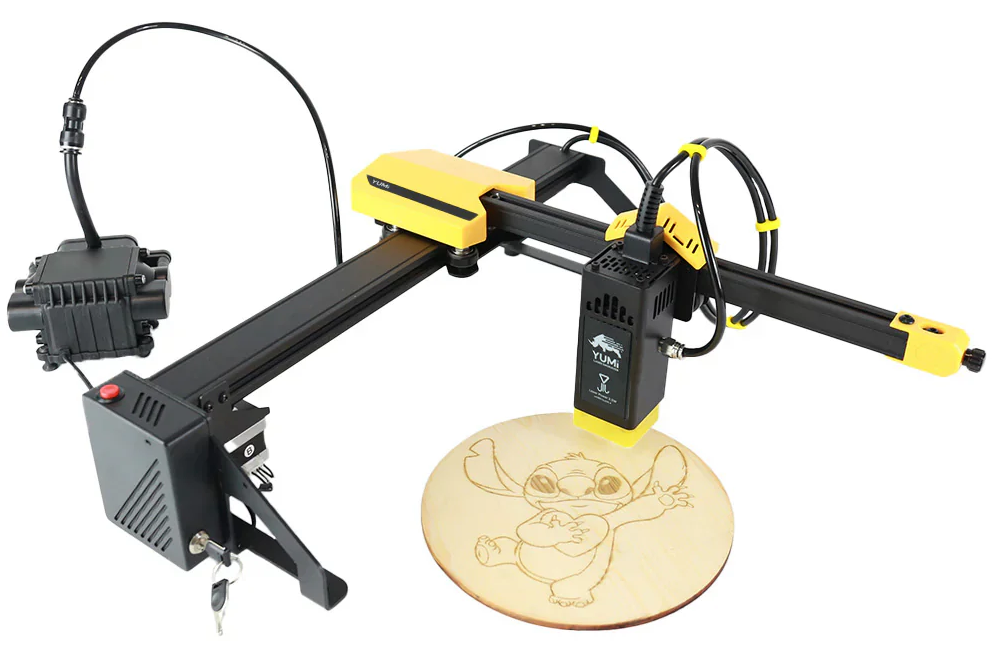

# YUMI Laser Series (L-A4 / L-A3 / L-A2 | 2.5W / 5.5W / 10W / 20W)

The **YUMI Laser** series is the first truly versatile laser engraver range designed in France.  
Compact, modular, and powerful, these machines combine large working areas, multiple laser head options, and a rich ecosystem of upgrades to suit beginners, hobbyists, and professionals alike.

Available models:
- **YUMI L-A4** – 210 × 297 mm working area
- **YUMI L-A3** – 420 × 297 mm working area
- **YUMI L-A2** – 420 × 594 mm working area

---

## Key Features
- **Designed & engineered in France**
- **Interchangeable laser modules**: 2.5W / 5.5W / 10W / 20W – precise, uniform engraving with the freedom to upgrade power as needed
- **Large-format working areas** while keeping a compact, portable design
- **Air Assist included (30 L/min)** for cleaner cuts and engravings
- **Low noise level** for comfortable operation
- **Compatible software**: LaserGRBL and LightBurn
- **Material versatility**: engrave wood, glass, leather, food, acrylic, ceramic, coated metals, paper, silicone, and more; cut MDF, acrylic, basswood, etc.

---

### [1.1 Overview & Specifications](Yumi_Laser_Overview.md)
Introduction to the YUMI Laser series, details on available models, interchangeable laser modules, upgrade options, and full technical specifications.  

### [1.2 Safety Guidelines](Yumi_Laser_Safety.md)
Laser safety instructions, prohibited materials, ventilation requirements, and fire prevention measures.  

### [1.3 Assembly & First Setup](https://www.dropbox.com/scl/fi/padqpqt2lru4ei1qlo9q2/LA4-Notice-V0.8.pdf?rlkey=9mbpopw79ce0kvnbask1epanf&e=1&st=e0222g5e&dl=1)
Step-by-step guide for unpacking, assembling, and preparing your YUMI Laser for first use.  

### [1.4 LightBurn Setup and Usage](Yumi_Laser_Wireless.md)
Installing and configuring LightBurn for YUMI Laser, importing the correct device profile, and setting up materials.  

### [1.5 LaserGRBL Setup and Usage](Yumi_Laser_LaserGRBL.md)
How to install and configure LaserGRBL with YUMI Laser, load files, and adjust engraving/cutting settings.  

### [1.6 Wireless Control](Yumi_Laser_Wireless.md)
How to control the YUMI Laser over Wi-Fi via the web interface or the Lighting Burner mobile app.  

### [1.7 Accessories & Upgrade Packs](Yumi_Laser_Accessories.md)
Detailed breakdown of optional modules and kits: rotary, honeycomb bed, extra heads, touchscreen, risers, enclosure/extraction, lens & focus accessories.  

### [1.8 Troubleshooting](Yumi_Laser_Troubleshooting.md)
List of common issues, causes, and solutions for YUMI Laser operation.  

