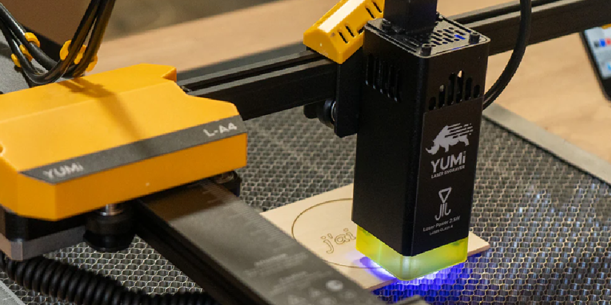

# YUMI Laser Series (L-A4 / L-A3 / L-A2 | 2.5W / 5.5W / 10W / 20W)

The **YUMI Laser** series is the first truly versatile laser engraver range designed in France.  
Compact, modular, and powerful, these machines combine large working areas, multiple laser head options, and a rich ecosystem of upgrades to suit beginners, hobbyists, and professionals alike.

## Available Models

  
**YUMI L-A4**  
**210 × 297 mm working area**

  
**YUMI L-A3**  
**420 × 297 mm working area**

  
**YUMI L-A2**  
**420 × 594 mm working area**

# Quick Start

### [1.1 Overview & Specifications](Yumi_Laser_Overview.md)
Introduction to the YUMI Laser series, details on available models, interchangeable laser modules, upgrade options, and full technical specifications.  

### [1.2 Safety Guidelines](Yumi_Laser_Safety.md)
Laser safety instructions, prohibited materials, ventilation requirements, and fire prevention measures.  

### [1.3 Assembly & First Setup](Yumi_Laser_Assembly.md)
Step-by-step guide assembling, and preparing your YUMI Laser for first use.  

### [1.4 LightBurn Setup and Usage](Yumi_Laser_LightBurn.md)
Installing and configuring LightBurn for YUMI Laser, importing the correct device profile, and setting up materials.  

### [1.5 LaserGRBL Setup and Usage](Yumi_Laser_LaserGRBL.md)
How to install and configure LaserGRBL with YUMI Laser, load files, and adjust engraving/cutting settings.  

### [1.6 Wireless Control](Yumi_Laser_Wireless.md)
How to control the YUMI Laser over Wi-Fi via the web interface or the Lighting Burner mobile app.  

### [1.7 Accessories & Upgrade Packs](Yumi_Laser_Accessories.md)
Detailed breakdown of optional modules and kits: rotary, honeycomb bed, extra heads, touchscreen, risers, enclosure/extraction, lens & focus accessories.  

# Troubleshooting
List of common issues, causes, and solutions for YUMI Laser operation.  

## Purchase YUMI Laser

You can order your YUMI Laser directly from our official store:  
**[Buy YUMI Laser on Wanhao Europe](https://wanhao-europe.com/collections/laser/products/yumi-l-a4-laser-pour-gravure-et-decoupe-pre-commande?variant=48130514157908)**

