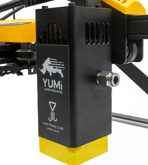

# 1.3 Assembly & First Setup

This section explains how to assemble, and prepare your YUMI Laser for its first use.  
The complete illustrated assembly instructions are available in PDF format.

   

---

## Assembly Manual (PDF)

Click here to download the official assembly guide:  
[**YUMI Laser Assembly Guide**](https://www.dropbox.com/scl/fi/padqpqt2lru4ei1qlo9q2/LA4-Notice-V0.8.pdf?rlkey=9mbpopw79ce0kvnbask1epanf&e=1&st=e0222g5e&dl=1)

---

## Assembly Checklist

1. **Unpack all components**  
   - Check that all parts match the inventory list in the manual.
   - Inspect each item for shipping damage.

2. **Frame Assembly**  
   - Follow the sequence in the PDF guide to assemble the aluminum frame.
   - Ensure all screws are tightened evenly, but avoid over-tightening.

3. **Install Laser Module**  
   - Mount the selected laser head (2.5W / 5.5W / 10W / 20W).
   - Connect the laser cable to the control board.

4. **Install Accessories**  
   - Attach Air Assist pump and tubing (included).
   - Install honeycomb bed or rotary module if used.

   

5. **Connect Power & USB**  
   - Plug in the supplied 12V adapter.
   - Connect USB cable to your computer if controlling via software.

---

## First Power-On

- Turn on the main power switch on the socket and then turn the safety key..
- Ensure that **Air Assist** is working (you should hear airflow).
- The laser head should remain off until commanded by the software.

---

## Safety Reminder

- Wear laser safety glasses before testing.
- Keep flammable materials away from the working area.
- Never operate the machine unattended.

