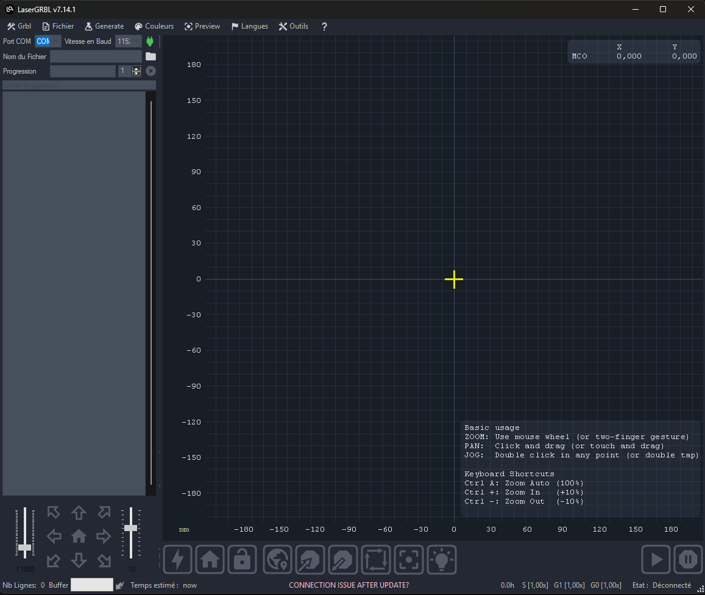
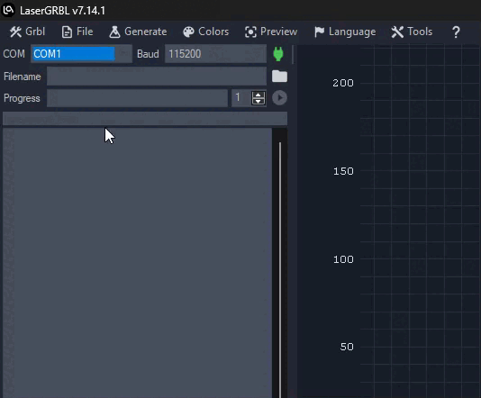
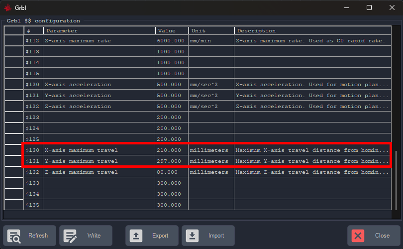
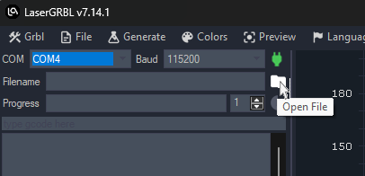
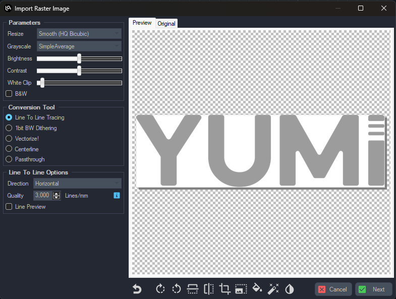
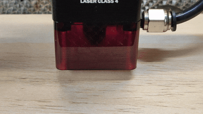

# 1.6 LaserGRBL Setup and First Engraving

**LaserGRBL** is a free, open-source software designed to control GRBL-based laser engravers such as the YUMI Laser.  
This guide explains how to configure LaserGRBL for your model (L-A4 / L-A3 / L-A2), select the laser power module, and perform your first engraving.

---

## 1 - Install LaserGRBL

- Download LaserGRBL from the official website: [https://lasergrbl.com](https://lasergrbl.com)  
- Install it on your Windows computer (LaserGRBL is Windows-only).

---

## 2 - Connect Your YUMI Laser

- Power on your YUMI Laser.  
- Connect it to your computer via **USB cable**.  
- Wait for Windows to recognize the device.  

---

## 3 - Configure LaserGRBL for Your Model

- Open **LaserGRBL**.  

- At the top left, select the correct **COM port** and **baud rate**:  
  - Baud rate: `115200`  
- Click **Connect**.  

- Set the Work Area Size in **Grbl Configuration**:  
  - Go to `Grbl > Grbl Configuration`.  
  - Adjust: **X-axis maximum travel** and **Y-axis maximum travel**.  
  - Click **Write** → **Close**.  

#### Work Area Dimensions per Model

| Model | **X-axis (mm)** | **Y-axis (mm)** |
|-------|-----------------|-----------------|
| L-A4  | 210             | 297             |
| L-A3  | 420             | 297             |
| L-A2  | 420             | 594             |

---

## 4 - Load a Test File

- Click **File** next to the **Open File** field and select a test file (`.nc`, `.svg`, or `.bmp`). 

- For images, use the **Import Raster Image** function. 

 

- Choose the **engraving method** (*Line to Line*, *Dithering*, etc.).  

---

## 5 - Set Laser Power

- In LaserGRBL, laser power is expressed as a percentage of the maximum PWM value.  
- Recommended starting values:  
  - **2.5W** → 10–40%  
  - **5.5W** → 20–70%  
  - **10W** → 30–90%  
  - **20W** → 50–100%  

  Always start low and increase gradually to avoid burning materials.

---

## 6 - Position & Focus the Laser

- Move the laser head manually over the workpiece.  
- Place the **5 mm spacer** on the surface.  

- Loosen the fixing screws of the laser module.

 

- Slide the laser down until it touches the spacer.
- Remove the spacer and tighten the screws. 

---

## 7 - Position the Workpiece

- Click **Move to Center** → laser moves to design center.  
- Click **Light Laser** → weak beam shows engraving center. Adjust material if needed. 

- Click **Profile Scan** → laser scans the outline. Adjust until alignment is correct. Adjust the material again if needed and Use **Wrap Around** until the outline matches.

---

## 8 - Enable Air Assist (Optional)

- If equipped, turn on **Air Assist** to improve cutting quality and reduce burn marks.  

---

## 9 - Start Engraving

- Verify speed, power, and focus.  
- Click **Start** to begin engraving.  
- Stay near the machine and monitor the process for safety.  
