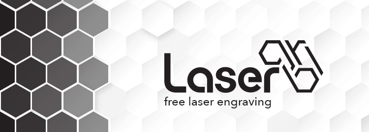
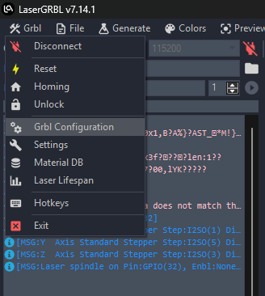
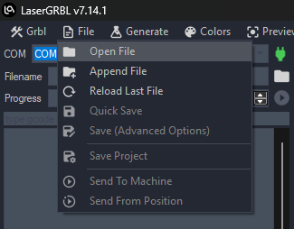

# 1.5 LaserGRBL Setup and First Engraving

**LaserGRBL** is a free, open-source software designed to control GRBL-based laser engravers such as the YUMI Laser.  
This guide explains how to configure LaserGRBL for your model (L-A4 / L-A3 / L-A2), select the laser power module, and perform your first engraving.

---

## 1. Install LaserGRBL

- Download LaserGRBL from the official website: [https://lasergrbl.com](https://lasergrbl.com)
- Install it on your Windows computer (LaserGRBL is Windows-only).

---

## 2. Connect Your YUMI Laser

1. Power on your YUMI Laser.
2. Connect it to your computer via **USB cable**.
3. Wait for Windows to recognize the device.

---

## 3. Configure LaserGRBL for Your Model

1. Open **LaserGRBL**.

2. At the top left, select the correct **COM port** and **baud rate**:
   - **Baud rate**: `115200`
3. Click **Connect**.

4. Set the Work Area Size in **Grbl Configuration**

Open **Grbl Configuration** (`Grbl > Grbl Configuration`) and set the **work area size** according to your YUMI model.  

You must adjust the following parameters:  

- **X-axis maximum travel**  
- **Y-axis maximum travel**  

After entering the correct values, click **Write** and then **Close**.  

#### Work Area Dimensions per Model

| Model | **X-axis (mm)** | **Y-axis (mm)** |
|-------|-----------------|-----------------|
| L-A4  | 210             | 297             |
| L-A3  | 420             | 297             |
| L-A2  | 420             | 594             |

## 4. Set Laser Power

- In LaserGRBL, laser power is expressed as a percentage of the maximum PWM value.
- Recommended starting values per module:
  - **2.5W** → 10–40%
  - **5.5W** → 20–70%
  - **10W** → 30–90%
  - **20W** → 50–100%

> Always start low and increase gradually to avoid burning materials.

---

## 5. Load a Test File

1. Click on the **folder icon** next to the **Filename** field and select a simple test file (`.nc`, `.svg`, or `.bmp`). 

2. For images, use the **Import Raster Image** function.

3. Adjust the **engraving method** (e.g., *Line to Line*, *Dithering*, etc.) according to your needs.  

---

## 6. Position & Focus the Laser

1. Move the laser head using the **jog controls**.
2. Adjust the focus with the supplied focusing tool or manual adjustment knob.
3. Enable **Air Assist** if available.

---

## 7. Launch the First Engraving

1. Click **Frame** to preview the engraving area without firing the laser.
2. Click **Start** to begin engraving.
3. Stay nearby to monitor progress.

---

## 8. Save Your Settings

- Save material-specific settings using the **Material Profiles** feature for future reuse.

