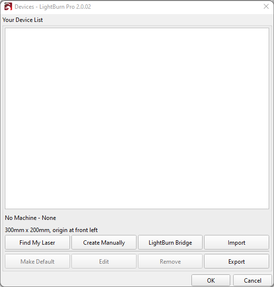
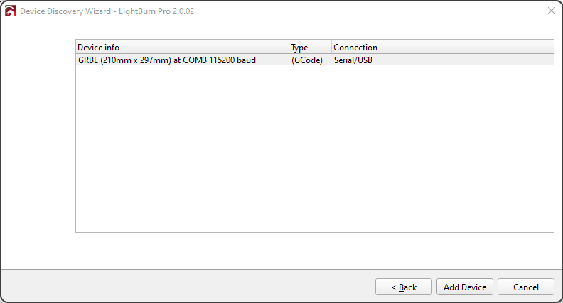
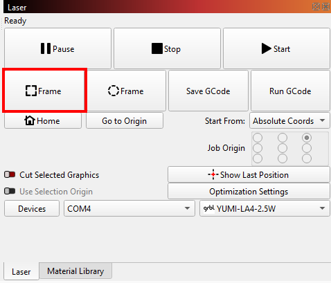

# 1.4 LightBurn Setup and First Engraving

**LightBurn** is one of the most powerful and user-friendly software tools for controlling your YUMI Laser.  
This guide will walk you through setting up LightBurn for your specific YUMI model (L-A4, L-A3, L-A2) and laser module (2.5W, 5.5W, 10W, 20W), and launching your first engraving job.

---

## 1. Install LightBurn

- Download LightBurn from the official website: [https://lightburnsoftware.com](https://lightburnsoftware.com)
- Install it on your computer (Windows, macOS, Linux supported).

---

## 2. Connect Your YUMI Laser

1. Power on your YUMI Laser.
2. Connect it to your computer via **USB cable**.
3. Insert the included **MicroSD card** if you wish to load files directly without USB control.

---

## 3. Add the YUMI Laser to LightBurn

1. Open **LightBurn**.  
2. Go to **Devices** → click **Find my Laser**.  

3. The **Device Discovery Wizard** opens.  
   - Click **Next**.  
   - LightBurn will scan and detect your machine (for example: `GRBL (210 mm x 297 mm) at COM3, 115200 baud`).  
   - Select it and click **Add Device**.  

4. In the next window:  
   - Replace the default name (`GRBL`) with your laser name (e.g., `YUMI-LA4-2.5W`).  
   - Set **Machine Units** to `mm/min`.  
   - Verify or adjust the **work area dimensions** according to your model:  

   | Model  | Width (mm) | Height (mm) |
   |--------|------------|-------------|
   | L-A4   | 210        | 297         |
   | L-A3   | 420        | 297         |
   | L-A2   | 420        | 594         |

   - Update the values in **X Axis Length** and **Y Axis Length** if needed.  
   - Click **Next**.  

5. In the **Laser Origin** window:  
   - Choose **Front Left** as the origin.  
   - Disable **Auto-home your laser on startup**.  
   - Click **Next**.  

6. Click **Finish** to add the new device.  

Your YUMI Laser is now ready to use in LightBurn.  

---

## 4. Import a Test Design

1. Create a simple design (text or shape) in LightBurn, or import an image/SVG.

2. Place the design within the workspace (make sure it fits inside your model’s work area).

3. Set the **Layer**:
   - **Line** for outline engraving
   - **Fill** for filled engraving

---

## 5. Configure the Laser Module Power

  - 2.5W: Use for fine engraving, **low power (10–40%)** recommended.
  - 5.5W: General engraving & light cutting, **20–70%**.
  - 10W: Faster engraving & cutting thin materials, **30–90%**.
  - 20W: High-speed engraving & cutting thicker materials, **50–100%**.

> Always start with lower power and increase gradually to avoid burning the material.

---

## 6. Position & Focus the Laser

1. Move the laser head **manually** over the workpiece.  
2. Place the **fixed-focus spacer** (5 mm) on the surface. 

3. Loosen the fixing screws of the laser module.  

4. Slide the laser down until it touches the spacer.  
5. Remove the spacer and tighten the screws.  

---

## 7. Launch the First Engraving

1. In LightBurn, click **Frame** to preview the working area without firing the laser.

2. Click **Start** to begin engraving.

3. Monitor the job and be ready to stop it if needed.

