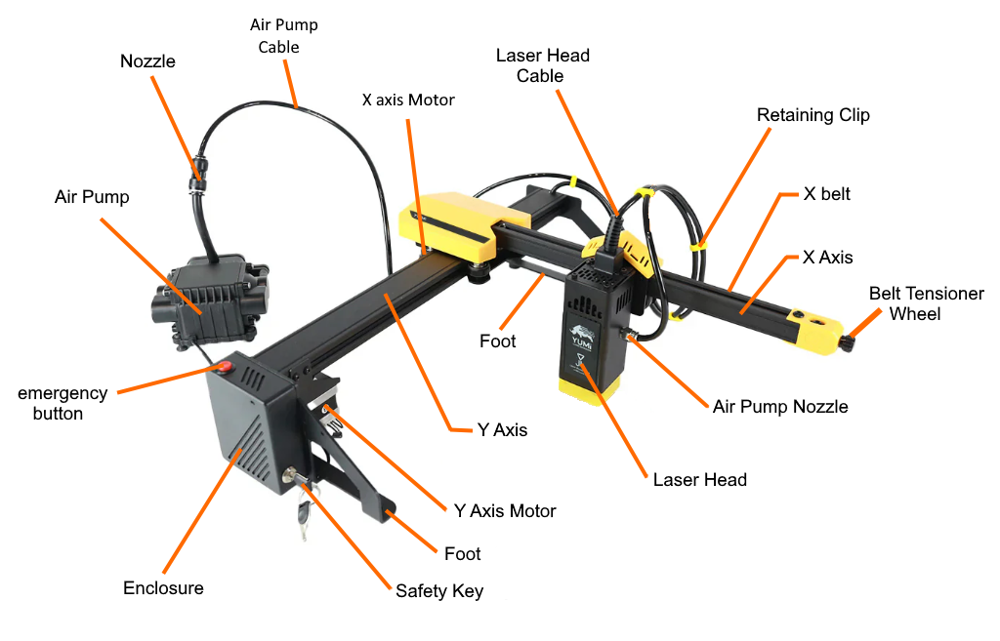

# 1.2 Overview & Specifications

The **YUMI Laser Series** is a modular, high-precision engraving and cutting solution designed in France.  
Available in multiple sizes and laser powers, it combines portability, performance, and flexibility for beginners, hobbyists, and professionals.

---

## Available Models & Working Areas

| Model        | Working Area      |
|--------------|-------------------|
| **L-A4**     | 210 × 297 mm      |
| **L-A3**     | 420 × 297 mm      |
| **L-A2**     | 420 × 594 mm      |

---

## Interchangeable Laser Modules

The YUMI Laser supports **hot-swappable laser heads** for different project requirements:

| Power Module | Typical Use Cases |
|--------------|------------------|
| **2.5W**     | Fine engraving on wood, leather, paper, coated metals; light marking |
| **5.5W**     | Deeper engraving, thin-material cutting (paper, card) |
| **10W**      | Faster engraving, improved cutting on thin woods/acrylics |
| **20W**      | High-throughput engraving, cutting thicker materials |

> All laser heads deliver **precise, uniform engraving** and can be upgraded at any time.

---

## Materials Compatibility

**Engraving:**  
Wood, glass, leather, food, acrylic, ceramic, **coated metals**, paper, silicone, etc.  

**Cutting:**  
MDF, acrylic, basswood (balsa), and similar thin sheets.  
*(Cut performance depends on material, thickness, optics, air assist, and speed/power settings.)*

---

## Key Features

- **Designed & engineered in France**
- **Large-format working areas** with a compact, portable design
- **Air Assist included (30 L/min)** for cleaner cuts and engravings
- **Low noise level** for comfortable operation
- **Software compatibility**: LaserGRBL and LightBurn
- **Rich accessory ecosystem**: rotary module, honeycomb bed, touchscreen, risers, enclosure, lens kits

---

## Technical Specifications

| Parameter         | Specification |
|-------------------|---------------|
| **Product Name**  | YUMI L-A4 / YUMI L-A3 / YUMI L-A2 |
| **Working Area**  | L-A4: 210 × 297 mm · L-A3: 420 × 297 mm · L-A2: 420 × 594 mm |
| **Processor**     | 32-bit |
| **Laser Modules** | 2.5W / 5.5W / 10W / 20W |
| **Air Assist**    | Yes, 30 L/min pump included |
| **Software**      | LaserGRBL, LightBurn |
| **Connectivity**  | USB, MicroSD card (side access) |
| **Power Supply**  | 12V adapter included |
| **Noise Level**   | Low |
| **Design**        | Compact & portable |

