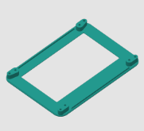
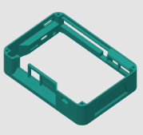
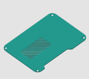
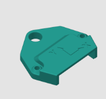
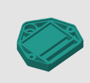
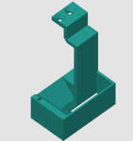
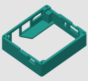

# **3D Printable Accessories and Parts**

Welcome to this page where you can download STL files to print various accessories and upgrades for your 3D printer.

---

## **1. SmartPad Case (3 Parts)**

Print a custom multi-part case for your SmartPad.

- **Available Files**: 

  

  [SMART PAD top-v1.stl](<../../stl/yumi_SmartPad/SMART PAD top-v1.stl>) - 
  [SMART PAD top-v2.stl](<../../stl/yumi_SmartPad/SMART PAD top-v2.stl>)  

  

  [SMART PAD middle-v1.stl](<../../stl/yumi_SmartPad/SMART PAD middle-v1.stl>)

  

  [SMART PAD bottom-v1.stl](<../../stl/yumi_SmartPad/SMART PAD bottom-v1.stl>)

---

## **2. ADXL Sensor Case (ADXL345)**

Print this case to protect and easily mount your ADXL345 sensor.

- **Available Files**:  

  

  [ADXL Case Top (V2)](<../../stl/yumi_adxl/yumi-adxl case down-V2.stl>)

  
  
  [ADXL Case Bottom (V2)](<../../stl/yumi_adxl/yumi-adxl case down-V2.stl>)

---

## **3. Dual Color Purge System (D12)**

This purge system is designed to optimize color changes on your D12 printer.

- **Download STL Files**:  
[D12_purge](../../stl/D12_purge/PURGE_D12_v2.stl)

---

## **4. SmartPione Board Case**

A compact case designed to protect the SmartPione electronic board.

- **Available Files**:  
  [Middle Smart pi one mini case V1 middle part.stl](<../../stl/yumi_SmartCase/Smart_pi_one/Smart pi one mini case V1 middle part.stl>)

